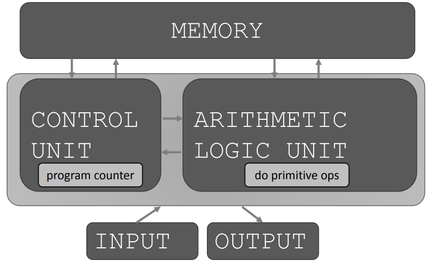
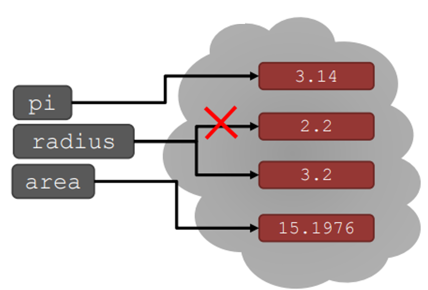

= Module 01: 계산이란?

== Today

* 강의 정보
* Computation 이란 무엇인가
* Python 기본
* Mathetatical Operation
* Python 변수와 타입
* 참고: ** 슬라이드와 코드 파일을 강의전에 살펴볼 것
** 강의 전에 다운로드
** 강의중에 코드를 반드시 실행해 볼 것
** 실습을 반드시 수행하고 컴퓨터에서 답을 얻을 것

== Practice

[source, mermaid]
----
flowchart TD
    A(Problem Solviong) --> B(Knowlegde of Concepts)
    B --> C(Programming Skills)
    C --> A
----

== Topics

* **데이터 구조(Data structure)**로 knowledge를 표현
* 계산으로서의 **반복(iteration) 및 재귀(recursive)**
* 프로시저와 데이터 **추상화(abstraction)**
* 객체 분류와 메소드를 사용하여 시스템을 **조직(Organize)하고 모듈화(Modulation)**
* **알고리즘**의 분류, 정렬과 검색
* 알고리즘의 **복잡도**

== 컴퓨터는 어떤 일을 하는가?
* 기본적으로:
** **계산**을 수행함: 1초에 수십 억 번의 계산을 수행
** 결과를 **기억**: 수백 Tera byte의 저장 공간을 가짐
* 어떤 종류의 계산을 수행하는가?
** 프로그래밍 언어에 미리 **포함된(built-in)** 계산
** 프로그래머가 **정의한** 계산
* 컴퓨터는 이야기 하지 않은 것을 알지 못함

== Knowledge의 종류
* **선언적 knowledge(declarative knowledge)**는 "사실의 상태"
* 명령적 knowlegde(imparative knowledge)는 "레시피" 또는 "how-to"
** IDE(Integrated Development Environment)를 열고
** 1에서 n 사이의 무작위 숫자를 선택
** 번호를 확인

== Numeric 예제
* 숫자 x의 제곱근은 y * y = x와 같음
* 숫자 x의 제곱근을 구하는 방법
** g라는 추측으로 시작
** 만약 g * g가 x의 제곱근 조건을 만족하면, 계산을 멈추고 g가 답이라고 말함
** 아니면, g와 x를 g의 평균으로 새로운 추측
** 새 추측을 사용하여 제곱근 조건을 만족할 때 까지 반복

[%header, cols="1,1,1,2", width=60%]
|===
|g|g * g|x / g|(g + x / g) / 2
|3|9|16 / 3|4.17
|4.17|17.36|3.387|4.0035
|4.0035|16.0277|3.997|4.000002
|===

== 레시피란?

1. 간단한 **단계**의 순서
2. 각 단계가 언제 실행되는지를 지정하는 **제어 프로세스의 흐름**
3. **언제 멈출지**를 결정하는 것

[source]
----
1 + 2 + 3 = 알고리즘!
----

== 기계로서의 컴퓨터

* 기계적 프로세스에서 레시피를 캡처하는 방법
** **고정 프로그램(fixed program)** 컴퓨터
*** 계산기
** **저장된 프로그램(Stored program)** 컴퓨터
** 명령을 저장하고 실행

== Basic machine architecture

== Stored program 컴퓨터

* 컴퓨터 내부에 **저장된 일련의 명령**
** 미리 정의된 기본 명령어 세트로 구성
1. 산술과 논리
2. 간단한 테스트
3. 데이터 이동

* 특별현 프로그램(인터프리터) **각 명령(insturction)을 순서대로 실행**
** 테스트를 사용하여 시퀀스를 통해 제어 흐름을 변경
** 완료되면 중지

== Basic Primitives

* Turing은 6개의 기본 요소를 사용하여 **무엇이든 계산**할 수 있음을 증명
* 최신 프로그래밍 언어에는 보다 편리한 기본 요소 세트가 있음
* **새로운 기본 요소**를 생성하기 위해 메서드를 추상화할 수 있음

* 한 언어로 계산 가능한 모든 것은 다른 프로그래밍 언어에서도 계산 가능함

== 레시피 만들기

* 프로그래밍 언어는 일련의 **기본 동작(primitive operation)**을 제공
* **Expression**은 복잡하지만, 프로그래밍 언어의 기본 요소를 합법적으로 조합한 것
* expression과 computation은 프로그래밍 언어에서 value와 meaning을 가짐

== Aspects of Languages

* Primitive constructs
** 영어: 단어로 이루어짐
** 프로그래밍 언어: 숫자, 문자열, 단순 연산자로 이루어짐

== Aspects of Languages

* **Syntax**
** 영어
*** `"cat dog boy"`` -> 구문상 유효하지 않음
*** `"cat hugs boy"`` -> 구문상 유효함
** 프로그래밍 언어
*** `"Hi"5``-> 구문상 유효하지 않음
*** `3.2*5` -> 구문상 유효함

== Aspects of Languages

* **static semantics**는 구문적으로 유효한 문자열이 되었다는 것을 의미
** 영어 +
*** `I are hungry` -> 구문적으로 유효하지만 정적 구문적으로는 유효하지 않음
** 프로그래밍 언어
*** `3.2*5` -> 구문적으로 유효
*** `3+hi` -> 정적 구문적으로 오류

== Aspects of Languages

* **semantics**는 정적 의미 오류 없이 구문적으로 올바른 기호 문자열과 관련된 의미
** 영어: `"Flying planes can be dangerous"` 에는 많은 의미가 있을 수 있음
** 프로그래밍 언어: 단 하나의 의미를 가지지만 프로그래머가 의도한 것이 아닐 수도 있음

== 문제 발생 부분

* **Syntatic 오류**
** 흔하고 쉽게 잡힐 수 있음
* **static semantic 오류**
** 일부 언어에서는 프로그램을 실행하기 전에 이를 확인함
** 예측할 수 없는 동작이 발생할 수 있음
* semantic 오류는 없지만 **프로그래머가 의도한 것과 다른 의미**
** 프로그램이 충돌하고 실행이 중지됨
** 프로그램이 영원히 실행됨
** 프로그램이 답변을 제공하지만 예상과 다름

== Python 프로그램

* **프로그램**은 일련의 정의와 명령
** 연산(evaluated) 정의
** 쉘(shell)에서 Python 인터프리터가 실행하는 명령
* **명령(commands - statement)**은 인터프리터에게 어떤 일을 하도록 지시함
** shell에 직접 입력하거나 shell로 읽어 들여 연산(evaluation)할 수 있는 파일에 저장할 수 있음

== 객체 (Objects)

* 프로그램은 **데이터 객체**를 조작합니다.

* 객체에는 프로그램이 객체에 수행할 수 있는 작업의 종류를 정의하는 **Type**이 있습니다.
*◦ 아나는 인간이기 때문에 걷기, 영어 말하기 등이 가능합니다.
*◦ 츄바카는 우키라서 걸을 수 있어요, "으아아아아아" 등
* 객체는
** Scalar(세분할 수 없음)
** non-scalar(액세스할 수 있는 내부 구조가 있음)

== 스칼라 객체(Scalar Objects)

* `int` - 정수를 표현 (예: `5`)
* `float` - 실수를 표현 (예: `3.27`)
* `bool` - `True` 또는 `False` 값을 가지는 `Boolean`을 표시
* `NonType` - 단일 `None` 값을 가지는 특별한 타입
* `type()` 으로 객체의 타입을 볼 수 있음

[source, python]
----
>>> type(5)
int
>>> type(3.0)
float
----

=== 타입 변환 (Cast)

* **객체를 다른 타입으로 변환**할 수 있음
* 정수 `3`을 `float(3)`으로 float `3.0`으로 변환
* `int(3.9)`는 float `3.9`를 정수 `3`으로 표시

== 콘솔에 출력

* 코드의 output을 사용자에게 보여주기 위해 `print` 명령을 사용

[source, python]
----
In  [11]: 3+2
Out [11]: 5

In  [12]: print(3+2)
5
----

== Expressions

* **객체와 연산자를 접합**하여 expression 형성
* expression에는 타입이 있는 **value**가 있음
* 단순 구문의 syntax +
  `<object> <operator> <object>`

== float와 int 작업

* `i + j` -> **합(sum)** 결과 타입: 모두가 정수이면 int, 하나라도 float면 float
* `i = j` -> **차(difference)** 결과 타입: 모두가 정수이면 int, 하나라도 float면 float
* `i * j` -> **곱(product)** 결과 타입: 모두가 정수이면 int, 하나라도 float면 float
* `i / j` -> **몫(division)** 결과 타입:  float

* `i % j` -> **나머지(remainder)**
* `i ** j` -> `i`의 `j` **제곱(power)**

== 단순 연산

* Python에게 이러한 작업을 먼저 수행하도록 지시하려면 괄호`(`와 `)` 사용
* 괄호 없는 연산자 우선순위
** **
** *
** /
** `+` 및 `–` expression에 표시된 대로 왼쪽에서 오른쪽으로 실행됨

== 변수에 값 바인딩

* 동등 기호( `=` )를 사용하여 변수에 값을 바인딩

[source, python]
----
pi = 3.14159
pi_approx = 22/7
----

* 값은 컴퓨터의 메모리에 저장됨
* 할당(assignment)은 이름에 값을 바인딩 함
* 변수의 이름을 사용하여 값을 돌려 받음

== Expression 추상화

* expression의 값에 **이름을 지정**하는 이유는?
* 값 대신 **이름을 재사용**
* 나중에 코드를 변경하기 쉽다

[source, python]
----
pi = 3.14159
radius = 2.2
area = pi * (radius**2)
----

== 프로그래밍 vs. 수학

* 프로그래밍에서는, "x를 해결" 하지 않음

[source, python]
----
pi = 3.14159
radius = 2.2
# area of circle
area = pi * (radius**2)
radius = radius + 1
radius += 1
----

== 바인딩 변경

* 새 할당문을 사용하여 변수 이름을 다시 바인딩할 수 있음
* 이전 값은 여전히 메모리에 저장되어 있지만 이에 대한 핸들은 손실됨
* 면적 값은 컴퓨터에 다시 계산을 지시할 때까지 변경되지 않음

[source, python]
----
pi = 3.14159
radius = 2.2
area = pi * (radius**2)
radius = radius + 1
----

