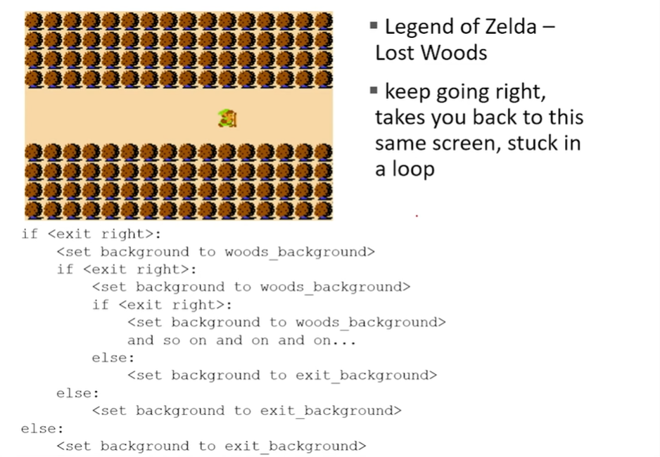

= Module 02: 분기와 반복

== 기억 할 것들

* Syntax와 sementics
* scala objects
* simple operators
* expressions, variables and values

== 오늘 할 것들

* string object type
* branching and conditionals
* indentation
* iteration and loops

== STRINGS

* 문자, 특수 문자, 빈칸, 숫자
* **따옴표(quotation marks) 또는 작은 따옴표(single quotes)**로 싸임 +
h1 = "hello there"
* 문자열 **접합(concatenate)** +
name = "ana"
greet = hi + name
greeting = hi = " " + name

* Python 문서에 정의된 대로 문자열에 대해 어떤 **작업(operation)**을 수행 +
silly = hi + " " + name * 3

== INPUT/OUTPUT: `print`

* 콘솔로 무언가를 내보낼 때 사용
* 키워드는 **print**

[source, python]
----
x = 1
print(x)
x_str = str(x)
print("my fav num is", x, ".", "x = ", x)
print("my fav num is" + x_str + :". " "x = " + x_str)
----

== INPUT/OUTPUT: `input("")`

* 따옴표 안이 있는 무엇이든 출력
* 사용자가 무언가를 입력하고 Enter를 누르는 경우
* 해당 값을 변수에 할당

[source, python]
----
text = input("Type anything...")
print(5 * text)
----

* input은 **string을 주므로** 숫자로 작업할 경우 반드시 변환해야 함

[source, python]
----
num = int(input("Type a number... "))
print(5 * num)
----

== `int`, `float`, `string` 비교 연산

* i와 j는 변수 이름
* 아래 연산들은 Boolean으로 계산됨

[source, python]
----
i > j
i >= j
i < j
i <= j
i == j
i != j
----

== LOGIC OPERATORS ON bools

* `a` 와 `b` 가 변수 이름인 경우 (boolean 값)

----
not a   -> True if a is False
         False if a is True
a and b -> True if both are True
a or b  -> True if either or both are True
----

|===
|A | B | A and B | A or B

|True |True |True |True
|True |False |False |True
|False|False |False |True
|False|False |False |False
|===

== COMPARISON EXAMPLE

[source, python]
----
pset_time = 15
sleep_time = 8
print(sleep_time > pset_time)
derive = True
drink = False
both = drink and derive
print(both)
----

== MAP

== CONTROL FLOW (제어 흐름)

[source, python]
----
if <condition>:
    <expression>
    <expression>
    ...
----

[source, python]
----
if <condition>:
    <expression>
    <expression>
    ...
else:
    <expression>
    <expression>
    ...
----

[source, python]
----
if <condition>:
    <expression>
    <expression>
    ...
elif <condition>:
    <expression>
    <expression>
    ...
else:
    <expression>
    <expression>
    ...
----

* `<condition>` 은 `True` 또는 `False` 값
* `<condition>` 이 `True` 일 경우 블록 내의 식을 계산

== INDENTATION

* Python에서 중요함
* 코드 블록을 표시하는 방법

[source, python]
----
x = float(input("Enter a number for x: "))
y = float(input("Enter a number for y:" ))

if x == y:
    print("x and y are equal")
    if (y != 0):
        print("therefore, x / y is", x / y)
elif x < y:
    print("x is smaller")
else:
    print("y is smaller")
print("thanks!")
----

== `=` VS `==`

[source, python]
----
x = float(input("Enter a number for x: "))
y = float(input("Enter a number for y:" ))

if x = y:
    print("x and y are equal")
    if (y != 0):
        print("therefore, x / y is", x / y)
elif x < y:
    print("x is smaller")
else:
    print("y is smaller")
print("thanks!")
----

== CONTROL FLOW: `While` Loops

[source, python]
----
while <condition>:
    <expression>
    <expression>
----

* <condition>은 boolean을 계산
* 만약 <condition>이 True이면, while 코드 블록의 모든 절차를 수행
* <condition>을 다시 체크
* <condition>이 False일때 까지 반복

== `while` LOOP 예제

----
You are in the Lost Forest
****************
****************
 :)
****************
****************
Go left or right? right
----

`PROGRAM`

[source, python]
----
n = input("You're in the Lost Forest. Go left or right? ")
while n == "right":
    n = input("You're in the Lost Forest. Go left or right? ")
print("You got out of the Lost Forest!")
----

== COLTROL FLOW: `while` and `for` LOOPS

* 숫자를 순서대로 반복

[source, python]
----
# more complicated with while loop
n = 0
while n < 5:
    print(n)
    n = n + 1

# shortcut with for loop
for n in range(5):
    print(n)
----

== CONTROL FLOW: `for` LOOPS

[source, python]
----
for <variable> in range(<some_num):
    <expression>
    <expression>
----

* 반복의 각각의 경우에서, `<variable>` 의 값을 가져옴
* 첫 번째 반복에서, `<variable>` 은 가장 작은 값에서 시작
* 다음 반복에서, `<variable>` 은 이전 값에서 1을 더한 값을 가져옴
* 기타 등등

== `range (start, stop, step)`

* 기본 값은 `start = 0`, `step = 1`,
* 반복은 `stop - 1` 값이 될때까지 반복

[source, python]
----
mysum = 0
for i in range(7, 10):
    mysum += i
print(mysum)

mysum = 0
for i in range(5, 11, 2):
    mysum += i
print(mysum)
----

== `break` STATEMENT

* 반복이 무엇이든, 즉시 반복을 빠져나감
* 코드 블록내의 남은 expression을 무시
* 현재의 반복만 빠져나감

[source, python]
----
while <condition_1>:
    while <condition_2>:
        <expression_a>
        break
        <expression_b>
    <expression_c>
----

[source, python]
----
mysum = 0
for i in range(5, 11, 2):
    mysum += i
    if mysum == 5:
        break
        mysum += 1
print(mysum)
----

* 프로그램에서 어떤 일이 일어나는가?

== `for` VS `while` LOOPS

`for` loops

* 반복 회수를 **알고 있는 경우**
* `break` 로 **반복을 일찍 멈출 수 있음**
* **counter**를 사용
* `while` 반복을 사용하여 `for` 반복을 재작성 할 수 있음

`while` loops

* 반복 횟수가 지정되지 않은 경우
* `break` 로 반복을 일찍 멈출 수 있음
* **반드시 초기화 된 counter를 사용**하고, 반복 안에서 반드시 증가해야 함
* `for` 반복을 사용하여 `while` 반복을 재 작성하기는 어려움