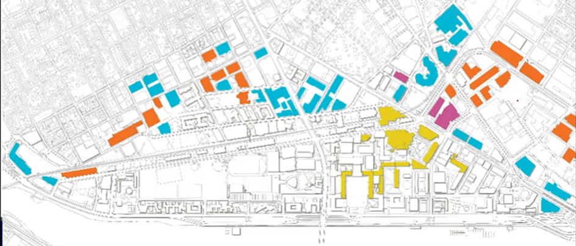
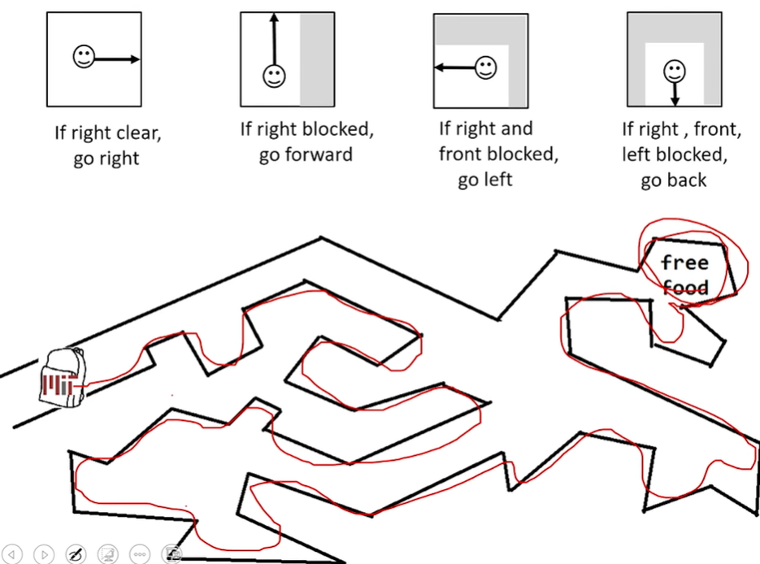

좋아요. 시작합시다, 여러분. 좋은 오후입니다. 60001의 두 번째 강의와 600의 두 번째 강의에 오신 것을 환영합니다. 그러니 언제나 그렇듯이 강의를 따라가고 싶으시면 매 수업 최소 한 시간 전에 제가 제공할 슬라이드와 코드를 다운로드하시기 바랍니다.

그럼 지난번에 우리가 한 일을 간단히 요약해 보겠습니다. 지난번에 우리는 컴퓨터가 무엇인지에 대해 조금 이야기했습니다. 그리고 지난 강의의 주요 내용은 실제로 컴퓨터는 명령받은 대로만 수행한다는 것입니다. 그렇죠? 그래서 자발적으로 스스로 결정을 내리지는 않을 것입니다. 프로그래머로서 당신은 프로그램을 작성함으로써 당신이 원하는 것이 무엇인지 말해야 합니다. 좋아요. 그래서 우리는 간단한 객체에 대해 이야기했습니다. 그리고 이 물건들은 종류가 달랐습니다. 그래서 우리는 정수, 부동소수점, 부울을 보았습니다. 그런 다음 우리는 그들과 함께 몇 가지 간단한 작업을 수행했습니다.

오늘 우리는 문자열이라는 새로운 유형의 개체를 살펴보겠습니다. 그런 다음 프로그래밍 도구 상자에 더욱 강력한 기능을 소개하겠습니다. 그래서 우리는 프로그램 내에서 분기하는 방법과 작업을 만드는 방법, 즉 프로그램 내에서 컴퓨터가 특정 작업을 반복하도록 만드는 방법을 살펴보겠습니다.

== STRINGS

* 문자, 특수 문자, 빈칸, 숫자
* 따옴표(quotation marks) 또는 작은 따옴표(single quotes)로 싸임 +
h1 = "hello there"
* 문자열 접합 +
name = "ana"
greet = hi + name
greeting = hi = " " + name

* Python 문서에 정의된 대로 문자열에 대해 일부 작업을 수행 +
silly = hi + " " + name * 3

좋아요. 그럼 문자열부터 살펴보겠습니다. 따라서 문자열은 새로운 객체 유형입니다. 지금까지 우리는 정수인 정수, 소수인 부동 소수점, 참과 거짓인 부울을 보았습니다. 따라서 문자열은 문자의 시퀀스가 됩니다. 그리고 이 캐릭터는 무엇이든 될 수 있습니다. 문자, 숫자, 특수 문자 및 공백이 될 수 있습니다. 그리고 문자열 객체를 따옴표로 묶어서 Python에 대해 이야기하고 있음을 알립니다. 따라서 이 경우 값이 h-e-l-l-o space t-h-e-r-e인 객체를 생성합니다.

그리고 Python은 그것이 문자열 객체라는 것을 알고 있습니다. 왜냐하면 우리가 그것을 따옴표로 묶었기 때문입니다. 큰따옴표일 수도 있고 작은따옴표일 수도 있지만 일관성을 유지한다면 문제가 되지 않습니다. 그리고 이 객체를 hi라는 변수에 바인딩합니다. 그리고 우리는 할당 연산자인 등호를 사용하여 이를 사용하고 있습니다. 따라서 이제부터 우리가 이 변수 hi를 참조할 때마다 Python은 '아, 값이 무엇인지 알아요. 문자열입니다'라고 말할 것입니다.

그래서 오늘은 문자열에 대해 할 수 있는 두 가지 작업, 즉 두 가지 작업에 대해 알아보겠습니다. 하나는 그것들을 연결하는 것입니다. 그리고 연결은 실제로 이 더하기 연산자를 사용하기 위한 멋진 단어일 뿐입니다. 즉, 문자열을 하나로 묶는 것을 의미합니다. 그래서 hi라는 원래 변수가 있고 name이라는 새 변수를 만듭니다. 그리고 그 안에서 변수 이름에 문자열 a-n-a를 할당하겠습니다. 그리고 hi와 name, 두 변수 사이에 더하기 연산자를 사용하면 Python은 이 두 변수의 값을 보고 그냥 합치게 됩니다.

좋아요. Spider로 옮깁니다. 이것은 슬라이드에 나온 예일 뿐입니다. 그럼 무슨 일이 일어나는지 봅시다. 그래서 변수 hi, 변수 이름이 있고 이 둘을 함께 연결하는 것뿐입니다. 그런 다음 그것을 인쇄해 보겠습니다. 따라서 코드를 실행하면 "hello Thereana"가 인쇄되는 것을 볼 수 있습니다. 공간이 없습니다. 그리고 연결 연산자인 더하기가 암시적으로 공백을 추가하지 않기 때문에 공백이 없습니다. 다시 한 번, 컴퓨터가 지시한 대로만 수행하는 또 다른 예입니다. 공백을 추가하려면 실제로 수동으로 공백을 삽입해야 합니다. 이것이 바로 8번째 줄입니다. 그리고 이 줄에서는 변수 hi의 값을 공백과 연결합니다. 따옴표 안에 넣었다는 점에 주목하세요. 그냥 공간. 그리고 이름으로.

따라서 해당 값을 인쇄해 보면 이것이 거기에 있는 쓰레기 인사라는 것을 알 수 있습니다. 이제 우리는 제대로 된 인사를 하게 됐죠? 이것이 바로 문자열 간의 연결입니다.

그리고 문자열과 관련하여 우리가 살펴볼 또 다른 것은 star operator입니다. 이것이 여기 10행에 있는 것입니다. 따라서 Python에서는 문자열과 숫자 사이에 곱셈을 나타내는 star operator를 사용할 수 있습니다. 그리고 그렇게 하면 Python은 해당 문자열을 해당 횟수만큼 반복하는 것으로 해석합니다. 따라서 이 경우에는 우스꽝스러운 인사말을 만들고 "안녕하세요"인 hi 값을 공백과 이름을 연결합니다. 여기서 주목하세요. 저는 괄호를 사용하여 Python에게 이 연산을 먼저 수행한 다음 그 결과에 3을 곱하라고 지시합니다. 따라서 이를 인쇄하면 공백에 제 이름이 3배로 곱해지고, 그것은 "hello there"와 연결될 것입니다. 그래서 그것이 바로 거기에 print된 것입니다.

지난 강의에서 우리는 print에 관해 조금 이야기를 나누었습니다. 오늘은 print와 관련된 몇 가지 뉘앙스에 대해 이야기해보겠습니다. 따라서 인쇄를 사용하여 사용자와 상호 작용합니다. 사용자에게 내용을 인쇄하는 프로그램을 작성하는 것은 멋진 일입니다. 여기서 핵심 단어는 print입니다. 그리고 print 후에 괄호를 넣습니다. 그리고 괄호 안에는 사용자에게 보여주고 싶은 내용을 입력합니다.

그래서 이 작은 프로그램에서 저는 x라는 변수를 만들었습니다. 값 1을 할당한 다음 1을 인쇄합니다. 여기서는 캐스팅 중입니다. 그래서 저는 숫자 1, 즉 정수 1을 취하고 그것을 문자열로 캐스팅할 것입니다. 잠시 후에 그 이유를 알게 될 것입니다.

== INPUT/OUTPUT: print

* 콘솔로 무언가를 내보낼 때 사용
* 키워드는 **print**

[source, python]
----
x = 1
print(x)
x_str = str(x)
print("my fav num is", x, ".", "x = ", x)
print("my fav num is" + x_str + :". " "x = " + x_str)
----

그래서 저는 여기서 몇 가지 사실을 여러분께 알려드리고 싶습니다. 그래서 첫 번째 print에서는 여기저기서 쉼표를 사용하고 있습니다. 그리고 두 번째 print에서는 플러스를 사용하고 있습니다. 따라서 정의에 따르면 print 내부에 쉼표를 사용할 수 있습니다. print의 괄호 안에. 그리고 쉼표를 사용하면 Python은 쉼표가 있는 두 값 사이에 자동으로 공백을 추가합니다. 그래서 "my fav num is"이 첫 번째입니다. 두 번째는 쉼표 뒤에 오는 것입니다. x를 봅시다. 따라서 쉼표를 사용하면 Python이 자동으로 공백을 삽입합니다.

때로는 원할 수도 있고 그렇지 않을 수도 있습니다. 이를 원하지 않으면 연결 작업인 플러스를 사용할 수 있습니다. 그리고 작은 조각들을 모두 더해 하나의 큰 끈을 만들 수 있습니다. 쉼표를 사용하는 경우 항목, 즉 쉼표 사이에 있는 개체가 모두 문자열일 필요는 없습니다. 이것이 쉼표를 사용하는 것의 장점입니다. 하지만 단점은 곳곳에 공간이 있다는 것입니다. 더하기 연산자를 사용하면 Python이 지시한 대로 정확하게 수행하지만 모든 것이 문자열 객체여야 한다는 장점이 있습니다. 따라서 "my fav num is"는 문자열 객체입니다. 모든 숫자를 문자열 객체 등으로 변환해야 합니다.

따라서 Spider를 보면... 이것은 동일합니다. 거의 동일한 코드입니다. 그래서 여기에는 어디에도 공백이 없습니다. 여기 첫 번째 줄의 모든 곳에 쉼표가 있는 것을 볼 수 있습니다. 그래서 print하는 모든 항목 사이에 공백을 두겠습니다. 여기 이 줄은 일종의 쉼표와 연결의 조합입니다. 그래서 쉼표를 어디에 사용하느냐에 따라 여분의 공간이 생기게 됩니다. 그리고 여기 이 줄은 어디에서나 연결되어 있습니다. 따라서 이것을 실행하면 첫 번째 줄에 모든 개체 사이의 모든 곳에 공백이 추가되는 것을 볼 수 있습니다. 두 번째는 어딘가에 공백을 추가했습니다. 그리고 공백이 추가된 위치를 추적하여 정확히 확인할 수 있습니다. 그리고 여기 마지막 줄에는 어디에도 공백이 추가되지 않았습니다.

== INPUT/OUTPUT: input("")

* 따옴표 안이 있는 무엇이든 출력
* 사용자가 무언가를 입력하고 Enter를 누르는 경우
* 해당 값을 변수에 할당

[source, python]
----
text = input("Type anything...")
print(5 * text)
----

* input은 string을 주므로 숫자로 작업할 경우 반드시 변환해야 함

[source, python]
----
num = int(input("Type a number... "))
print(5 * text)
----

바로 여기 이 줄에서 사용자가 입력하는 것은 무엇이든 문자열이 됩니다. 그리고 우리는 해당 문자열 개체를 text라는 변수에 바인딩할 것입니다. 이제 내 프로그램에서 이 가변 텍스트를 사용하여 원하는 모든 작업을 수행할 수 있습니다. 이 경우에는 5 * text를 print합니다. 예를 들어 사용자가 "ha"를 입력했다면 "ha"를 5번 인쇄하겠습니다. 사용자가 나에게 5를 줬다면 그 사용자는 무엇이라고 생각합니까? 무엇이 인쇄될 것이라고 생각합니까? 25번 아니면 5번? 엄청난. 예. 정확히. 5 다섯 번.

따라서 콘솔에 내용을 인쇄하는 것도 좋지만 대화형 프로그램 작성의 두 번째 부분은 사용자로부터 입력을 받는 것입니다. 그리고 그것이 더 흥미로운 부분입니다. 따라서 문제 세트 0을 완료했다면 이미 스스로 이해하려고 노력했을 수도 있습니다. 하지만 여기 있습니다. 따라서 사용자로부터 입력을 받는 방법은 입력이라는 명령 기능을 사용하는 것입니다. 그리고 괄호 안에는 사용자에게 표시할 내용을 입력합니다. 따라서 이 예에서는 입력이 있고 여기서는 "아무거나 입력하세요"라고 말했습니다. 그래서 사용자는 여기에서 이 텍스트를 보게 될 것이고, 그러면 프로그램은 멈출 것입니다. 그리고 사용자가 무언가를 입력하고 Enter 키를 누를 때까지 기다립니다. 사용자가 Enter 키를 입력하자마자 사용자가 입력하는 내용은 모두 string이 됩니다. 예를 들어, 사용자가 숫자를 입력하면 해당 숫자의 string이 됩니다. 따라서 사용자가 입력하는 모든 내용은 string로 만들어집니다.

숫자를 문자열로 사용하고 싶지 않은 경우가 많습니다. 그렇죠? 숫자를 숫자로 작업하고 싶죠? 그래서 캐스팅을 해야 합니다. 그리고 우리는 마지막 강의를 배웠습니다. 입력 바로 앞에 이 작은 비트를 넣으면 캐스팅됩니다. 그리고 원하는 유형으로 캐스팅할 수 있습니다. 여기서는 int로 캐스팅했지만 부동 소수점으로 작업하려는 경우 float으로 캐스팅할 수도 있습니다. 그리고 이는 Python이 변환하는 방법을 알고 있는 숫자인 한 사용자가 입력한 모든 것을 숫자 자체로 변환합니다. 따라서 이 경우 사용자가 5를 주면 5를 5번 print하는 대신 5 *5를 print합니다. 이것이 바로 여기에 있는 코드입니다.

첫 번째 부분은 사용자가 무엇이든 입력하도록 하고 555를 입력하는 것입니다. 그런 다음 숫자를 입력할 때 숫자를 캐스팅하므로 연산을 수행합니다. 번호와 함께. 네, 질문입니다.

왜 캐스팅하고 싶으신가요?-- 아. 문제는 왜 문자열로 캐스팅하고 싶습니까? 왜 문자열을 숫자로 변환하고 싶나요?

아, Python은 항상-- 기본적으로 무엇을 입력하든 입력 명령의 정의에 따라 Python은 항상 이를 문자열로 만듭니다. 따라서 숫자로 작업하려면 명시적으로 말해야 합니다. 나는 숫자로 작업할 것입니다. 따라서 숫자 5를 지정하더라도 문자열 5라고 생각하게 됩니다. 네. 이것이 바로 입력이 작동하는 방식입니다.

== int, float, string 비교 연산

* i와 j는 변수 이름
* 아래 연산들은 Boolean으로 계산됨

[source, python]
----
i > j
i >= j
i < j
i <= j
i == j
i != j
----

다음으로 살펴볼 것은 코드에 테스트를 추가할 수 있는 방법입니다. 그리고 코드에 테스트를 추가하기 전에 실제 테스트를 수행할 수 있어야 합니다. 그래서 이것이 비교 연산자가 들어오는 곳입니다. 따라서 여기서는 i와 j가 변수라고 가정해 보겠습니다. 다음 비교는 Boolean을 제공합니다. 그래서 이것은 사실이거나 거짓이라고 말할 것입니다. 이것이 바로 여러분의 시험이 될 것입니다.

따라서 i와 j가 변수인 경우 int와 int, float와 float, 문자열과 문자열을 비교할 수 있습니다. 그리고 int와 float를 서로 비교할 수는 있지만 문자열을 숫자와 비교할 수는 없습니다. 사실, Python에서 그렇게 하려고 한다면 -- 여기 Spider에서 제가 말하려고 하면, 문자가 5보다 큰가요? 여기서 angry text를 받았습니다. 그리고 이것은 Python이 다음의 의미를 이해하지 못한다는 것을 의미합니다. 문자열을 숫자와 어떻게 비교합니까?

좋아요. 따라서 수학에서와 마찬가지로 이러한 일반적인 비교를 수행할 수 있습니다. 어떤 것이 어떤 것보다 크거나, 크거나 같거나, 작거나, 작거나 같다고 말할 수 있습니다. 저는 여러분의 동등(equality)에 주목하고 싶습니다. 따라서 단일 등호는 할당입니다. 따라서 값을 가져와 변수에 할당합니다. 하지만 이중 등호를 사용하는 경우 이는 동등성을 테스트하는 것입니다. 변수 i의 값은 변수 j의 값과 동일합니까? 그리고 그것은 또한 여러분에게 참 또는 거짓이라는 불리언을 제공할 것입니다. 또한 느낌표 같음을 사용하여 부등식을 테스트할 수도 있습니다. 즉, 변수 i의 값이 변수 j의 값과 같지 않습니까? 그렇다면 참이고, 그렇지 않으면 거짓입니다.

좋아요. 이제 우리는 논리적인.. 질문이 있네요.

네, 좋은 질문이에요. 그렇다면 문자열을 보다 큰 문자열과 비교한다는 것은 무엇을 의미할까요? 그래서 그것은 단지 그것들을 사전식으로 비교할 것입니다. 그럼 알파벳에서 먼저 나오나요? 그래서 우리는 그것을 테스트할 수도 있습니다. a가 b보다 크다고 말할 수 있나요? 그리고 그것은 거짓입니다.

[source, python]
----
"a" > "b"
False
----

따라서 b는 a보다 알파벳 늦게 옵니다.

좋아요. 이제 테스트를 수행할 수 있는 방법이 생겼습니다. 이제 테스트를 수행할 수 있는 방법이 있으므로 프로그래밍 도구 상자에 몇 가지 분기를 추가할 수 있습니다. MIT의 지도입니다.

우리 코드에서 분기를 수행하려는 이유를 설명하기 위해 일종의 작은 예를 살펴보겠습니다. 그리고 이 강의가 끝나면 여러분은 제가 설명할 알고리즘을 일종의 코드화할 수 있을 것이라고 생각합니다. 그래서 우리 대부분은 MIT를 미로로 봅니다. 여기 왔을 때 처음으로 그랬어요. 제가 처음 여기에 왔을 때 당연히 무료 음식 메일링 리스트에 가입했습니다. 그리고 MIT는 미로이기 때문에 어디로 가야할지, 무료 음식을 얻는 최단 경로가 무엇인지 전혀 몰랐습니다. 그래서 그것에 대해 생각하는 한 가지 방법은 제가 하고 싶었던 전부는 무료 음식을 얻는 것이었습니다.

그곳에 도달하기 위한 매우 간단한 알고리즘은 "좋아, 나는 오른손을 잡을 것이고, 내 오른손은 항상 벽에 붙어 있도록 할 것입니다"라고 말하는 것입니다. 그리고 저는 오른손을 항상 벽에 붙인 채 캠퍼스를 돌아다닐 예정입니다.

image::./images/image02.png[]

그리고 결국 나는 무료 음식이 있는 곳으로 갈 것이다. 남는 게 없을 수도 있겠죠? 하지만 난 거기 있을 거예요. 따라서 알고리즘은 다음과 같습니다. 만약 내 오른손이 항상 벽에 붙어 있어야 한다면, 내 오른쪽에 벽이 없다면 나는 벽에 닿을 때까지 오른쪽으로 갈 것이라고 말할 것입니다. 그러면 내 오른쪽에 벽이 있어서 앞으로 나아갈 수 있다면 계속해서 앞으로 나아갈 것입니다. 계속해서 앞으로 가다가 내 오른쪽과 앞에 벽이 있으면 나는 돌아서 왼쪽으로 갈 것입니다. 그러다가 내 오른쪽, 앞, 왼쪽에 벽이 있으면 뒤돌아서 돌아갈 거예요.

따라서 이 매우 간단한 알고리즘을 사용하여 저는 항상 벽을 오른쪽으로 유지하는 경로를 따릅니다. 그리고 결국 나는 내가 있어야 할 곳에 이르게 될 것이다. 제가 평범한 영어로 몇 가지 핵심 단어를 사용했다는 점에 주목하세요. 그렇지 않으면 그런 것입니다. 따라서 프로그래밍에는 동일한 구성이 있습니다. 그리고 동일한 종류의 직관적인 단어를 사용하여 Python에게 어떤 작업을 수행하거나 다른 작업을 수행하거나 다른 가능성 중에서 선택하도록 지시할 수 있습니다. 이런 방식으로 우리는 컴퓨터가 우리를 대신해 결정을 내리도록 할 수 있습니다. 그리고 여러분은 컴퓨터가 스스로 결정을 내릴 수 없다고 생각하실 수도 있습니다. 그렇지 않습니다. 프로그래머로서 여러분은 이러한 결정을 프로그램에 반영할 것이며 컴퓨터가 할 일은 결정 지점에 도달하여 "좋아, 이것이 결정 지점입니다. 왼쪽으로 가야 할지 오른쪽으로 가야 할지"라고 말하는 것입니다. ? 아니면 어느 쪽을 선택할까요? 그리고 이런 종류의 결정은 프로그래머인 당신에 의해 만들어집니다. 그리고 컴퓨터는 결정을 내리고 경로를 선택하기만 하면 됩니다.

좋아요. 따라서 프로그래밍에는 프로그램에 제어 흐름을 추가할 수 있는 세 가지 간단한 방법이 있습니다. 그리고 그것은 하나의 결정을 내리고 무언가를 실행할지 아니면 다른 것을 실행할지 선택하는 것입니다. 첫 번째는 간단한 if입니다. 그리고 선형적으로 실행되는 명령문이 있는 프로그램의 경우 if 문에 도달할 때마다 조건을 확인하게 됩니다. 조건은 참 또는 거짓으로 평가될 것입니다.

== CONTROL FLOW (제어 흐름)

[source, python]
----
if <condition>:
    <expression>
    <expression>
    ...
----

[source, python]
----
if <condition>:
    <expression>
    <expression>
    ...
else:
    <expression>
    <expression>
    ...
----

[source, python]
----
if <condition>:
    <expression>
    <expression>
    ...
elif <condition>:
    <expression>
    <expression>
    ...
else:
    <expression>
    <expression>
    ...
----

* <condition>은 True 또는 False 값
* <condition>이 True일 경우 블록 내의 식을 계산

그래서 나는 여기의 조건에 도달했습니다. 그리고 조건이 true이면 이 추가 표현식 세트를 추가로 실행합니다. 그러나 조건이 거짓이면 프로그램을 계속 진행하고 추가 명령 세트를 실행하지 않을 것입니다. Python은 어떤 명령을 실행할지 어떻게 알 수 있나요? 그들은 우리가 코드 블록이라고 부르는 이 내부에 있을 것입니다. 그리고 코드 블록은 들여쓰기로 표시됩니다. 따라서 들여쓰기된 모든 항목은 if 코드 블록의 일부가 됩니다. 일반적으로 공백 4개가 들여쓰기입니다.

좋아요. 이것이 바로 이 추가 작업을 실행할지 여부를 결정하는 코드를 작성하는 방법입니다. 이제 제가 단순히 추가 작업을 실행하는 것이 아니라 이 길을 따르거나 다른 일을 하겠다고 말하는 지점에 도달하고 싶다고 가정해 보겠습니다. 바로 여기입니다. 따라서 if else 구문이 이것이 내 코드라고 말하고 여기에서 결정 지점에 도달했습니다. if 내부 조건이 True이면 여기에서 이 명령문 세트를 실행할 것입니다. 그러나 조건이 true가 아니면 해당 명령문 세트를 실행하지 않고 대신 다른 조건 하에서 실행합니다. 따라서 이 구성을 사용하여 한 세트의 표현식을 사용하거나 다른 표현식 세트를 사용하지만 둘 다 사용하지는 않습니다. 그리고 둘 중 하나를 실행한 후에는 프로그램을 정기적으로 실행하는 작업을 계속할 것입니다.

좋아요. 그래서 우리는 한 가지를 선택할 수 있고, 한 가지 또는 다른 것을 선택할 수 있습니다. 하지만 하나 이상의 선택을 원한다면 어떻게 될까요? 따라서 어떤 숫자가 0과 같다면 이렇게 하고 싶습니다. 1과 같다면 저는 이것을 하고 싶습니다. 2와 같다면 저는 이것을 하고 싶습니다. 이것이 마지막 단어가 등장하는 곳입니다. 그리고 우리는 여기에 elif라는 또 다른 핵심 단어를 도입했습니다. 따라서 이는 else if의 약어를 나타냅니다. 먼저 이 조건이 True인지 확인합니다. 따라서 우리는 프로그램을 진행하면서 결정 지점에 도달했습니다. 조건이 True이면 아마도 이 명령 세트를 실행할 것입니다. 조건이 True가 아니면 아마도 우리는 확인할 것입니다. 조건이 True가 아니면 우리는 다음 조건을 확인할 것입니다. 그것은 바로 여기 elif의 일부입니다. 그리고 그것이 사실이라면 우리는 다른 명령 세트를 실행할 것입니다. 하나 이상의 elif를 가질 수 있습니다. 그리고 어느 것이 사실인지에 따라 다른 명령 세트를 실행하게 됩니다. 그리고 이 마지막 else는 이전 조건 중 어느 것도 True가 아닌 경우 이 마지막 표현식 세트를 수행하는 일종의 잡기입니다.

따라서 이 경우에는 이 세 가지 중 하나, 즉 네 가지 루트 중 하나를 선택하거나 가지고 있는 수만큼 선택하게 됩니다. 그런 다음 선택을 마치면 나머지 지침 세트를 실행하게 됩니다. 따라서 이것이 작동하는 방식은 둘 이상의 조건이 참인 경우 실제로 그 중 하나를 입력하게 되는 것입니다. 그리고 여러분은 참인 첫 번째 것을 입력하게 될 것입니다. 따라서 이러한 코드 블록 중 하나 이상을 입력하지 않을 것입니다. 항상 하나를 입력하고 True로 평가되는 첫 번째 항목을 입력합니다.

== INDENTATION

* Python에서 중요함
* 코드 블록을 표시하는 방법

[source, python]
----
x = float(input("Enter a number for x: "))
y = float(input("Enter a number for y:" ))

if x == y:
    print("x and y are equal")
    if (y != 0):
        print("therefore, x / y is", x / y)
elif x < y:
    print("x is smaller")
else:
    print("y is smaller")
print("thanks!")
----

따라서 들여쓰기를 사용하여 코드 블록을 표시했다는 점에 유의하세요. 그리고 이것이 사실 제가 Python에서 정말 좋아하는 점 중 하나입니다. 그것은 일종의 예쁜 코드와 보기 좋은 코드, 그리고 매우 읽기 쉬운 코드를 작성하도록 강요합니다. 그리고 이로 인해 코드 블록인 모든 항목을 들여쓰기하게 됩니다. 따라서 제어 흐름이 어디에 있는지, 의사 결정 지점이 어디에 있는지 등을 쉽게 확인할 수 있습니다. 따라서 이 특정 예에는 하나의 if 문이 있으며 두 변수가 동일한지 확인합니다. 그리고 if, elif, else가 있습니다. 그리고 이 예에서는 x와 y의 변수에 따라 이 코드 블록이나 이 코드 블록 또는 이 코드 블록을 입력하겠습니다. 그리고 우리는 하나의 코드 블록만 살펴보겠습니다. 그리고 우리는 True인 첫 번째 것을 입력하겠습니다.

== = VS \==

[source, python]
----
x = float(input("Enter a number for x: "))
y = float(input("Enter a number for y:" ))

if x = y:
    print("x and y are equal")
    if (y != 0):
        print("therefore, x / y is", x / y)
elif x < y:
    print("x is smaller")
else:
    print("y is smaller")
print("thanks!")
----

중첩된 조건문이 있을 수 있습니다. 따라서 이 첫 번째 if 안에 또 다른 if가 있습니다. 그리고 이 내부 if는 우리가 첫 번째로 들어갈 때만 확인됩니다. 이 외부 if입니다. 그래도 한 가지 점을 지적하고 싶습니다. 따라서 때로는 동등성을 확인할 때 이중 등호를 수행하는 것을 잊어버릴 수도 있지만 괜찮습니다. 등호 하나만 사용하면 Python에서 오류가 발생합니다. 그리고 구문 오류가 표시되고 이 줄이 강조 표시됩니다. 그러면 거기에 오류가 있다는 것을 알게 될 것입니다. 그리고 동등성을 사용해야 합니다. 왜냐하면 if 내부에서 할당을 사용하는 것은 의미가 없기 때문입니다.

그래서 우리는 분기에 대해 배웠습니다. 그리고 우리는 조건문에 대해 알고 있습니다. 이것을 작은 게임에 적용해 봅시다. 그리고 스포일러, 우리는 그렇게 할 수 없습니다. 우리는 새로운 것에 대해 배워야 할 것입니다.

image::./images/image04.png[]

하지만 1980년대에는 잃어버린 숲이 있는 장면이 있는 멋진 그래픽의 젤다의 전설이 있었습니다. 누구든지 젤다의 열렬한 팬이라면 지나치게 단순화하십시오. 하지만 기본 아이디어는 숲에 들어가면 왼쪽에서 오른쪽으로 들어간다는 것이었습니다. 그리고 오른쪽으로 계속 진행하는 한 동일한 화면이 계속해서 표시됩니다. 그리고 비결은 뒤로 돌아가서 숲을 빠져나가야 한다는 것이었습니다. 매우 간단합니다.

지금까지 우리가 알고 있는 것을 사용하여 이를 코딩할 수 있습니다. 그리고 우리는 이렇게 말할 것입니다. 사용자가 오른쪽으로 나가면 배경을 숲 배경으로 설정합니다. 그렇지 않으면 배경을 종료 배경으로 설정하세요. 이제 사용자를 가정하고 else에서는 작업이 완료됩니다. 사용자가 오른쪽으로 갔다고 가정해 보겠습니다. 글쎄, 당신은 그들에게 숲 배경을 보여주고 이제 다시 어디로 가고 싶은지 물어볼 것입니다. 오른쪽으로 나가면 배경을 숲 배경으로 설정하세요. 그렇지 않으면 배경을 종료 배경으로 설정하는 등의 작업을 수행합니다.

그럼 이 일에는 끝이 없다는 걸 아시겠죠? 사용자가 올바른 방향으로 계속 진행할 수 있는 횟수는 몇 번입니까? 정말 끈질기겠죠? 그리고 그들은 아마도 내가 1,000번 가면 숲에서 나올 것이라고 생각할 것입니다. 아마 1,001개? 아마도. 그래서 이것은 아마도... 얼마나 깊은지 누가 알겠습니까? 이는 중첩된 if입니다. 그래서 우리는 모릅니다. 따라서 지금까지 우리가 알고 있는 것만으로는 이 귀여운 작은 게임을 실제로 코딩할 수 없습니다.

그러나 루프를 입력하십시오. 특히 while 루프입니다. 따라서 무한히 중첩된 if 문이 있을 수 있는 이 코드는 이 세 줄을 사용하여 다시 작성할 수 있습니다. 따라서 사용자가 오른쪽으로 나가는 동안 배경을 숲 배경으로 설정한다고 말합니다. while 루프를 사용하면 루프 내에서 하라고 지시한 작업을 수행하고 조건을 다시 확인한 다음 코드 블록 내에서 해야 한다고 말한 작업을 수행하게 됩니다. 상태를 다시 확인해 보세요. 그런 다음 조건이 참인 한, 거기에서 작은 루프를 계속 수행하게 됩니다. 그리고 조건이 거짓이 되자마자 루프 수행을 중단하고 잠시 후 바로 모든 작업을 수행합니다.

image::./images/image05.png[]

좋아요. 이것이 기본적으로 while 루프가 작동하는 방식입니다. 시간이 있어요. 이것이 핵심 단어입니다. 조건은 참 또는 거짓으로 평가되는 것입니다. 그리고 다시 한번, 들여쓰기된 코드 블록이 있는데, 이는 Python에게 조건이 참인 한 내가 하고 싶은 표현식이 있다는 것을 알려줍니다. 따라서 조건이 true이므로 코드 블록의 모든 표현식을 평가합니다. 표현식의 끝(코드 블록의 끝)에 도달하면 조건을 다시 확인합니다. 그래도 사실이라면 계속해서 표현을 하게 됩니다. 다시 확인해보세요.

여기 작은 게임이 있습니다. 그리고 이 코드로 우리는 젤다의 잃어버린 숲을 코드화할 수 있었습니다. 그런데 원본 Zelda보다 더 나쁜 그래픽은 제가 여기에 코딩한 것입니다. 그래서 다음과 같은 내용을 인쇄합니다. "당신은 잃어버린 숲에 있습니다. 왼쪽이나 오른쪽으로 가세요." 그리고 내 프로그램은 "당신은 잃어버린 숲에 있습니다. 왼쪽이나 오른쪽으로 가십시오."라고 말할 것입니다. 사용자 입력을 받게 됩니다. 사용자가 계속 오른쪽으로 입력하는 동안 이 텍스트를 보여주고 다시 물어보세요. 그래서 여기서 다시 입력하라고 하여 다시 묻습니다. 그리고 그게 다야. 그러면 사용자로부터 계속해서 입력을 받게 됩니다. 그리고 사용자가 오른쪽을 입력하지 않고 왼쪽을 입력할 경우 이 루프를 종료하고 "You've got out of the Lost Forest"를 인쇄하게 됩니다.

[source, python]
----
n = input("You are in the Lost Forest\n****************\n****************\n :)\n****************\n****************\nGo left or right? ")
while n == "right" or n == "Right":
    n = input("You are in the Lost Forest\n****************\n******       ***\n  (╯°□°）╯︵ ┻━┻\n****************\n****************\nGo left or right? ")
print("\nYou got out of the Lost Forest!\n\o/")
----

그래서 이것을 보여줘야 합니다. 왜냐하면 제가 그것에 너무 많은 시간을 소비했기 때문입니다. 하지만 저는 슬라이드에 있는 코드를 개선하기로 결정했습니다. 그리고 저는 여러분이 이를 개선할 수 있는 방법을 여기에 썼습니다. 따라서 코드를 실행하면 "당신은 잃어버린 숲에 있습니다. 왼쪽이나 오른쪽으로 가세요." 그래서 왼쪽이라고 말하면 예, 잃어버린 숲에서 나왔습니다. 하지만 오른쪽으로 가면 막히겠죠? 나무 몇 그루를 쓰러뜨렸어요. 여기에는 더 이상 나무가 없는 것을 볼 수 있습니다. 나는 테이블을 만든 다음 그것을 뒤집어 놓았습니다.

그래서 당신이 그것을 시도하고 싶다면 이것에 대한 확장은--여기 코멘트에 이것을 넣었습니다--카운터를 사용해보십시오. 사용자가 처음 두 번 올바르게 입력하면 슬픈 표정을 지으세요. 하지만 사용자가 두 번 이상 입력하면 나무를 잘라서 테이블을 만들고 뒤집도록 하세요. 루프가 발생하는지 확인하기 위해 자신을 테스트하고 싶다면 귀여운 작은 확장입니다.

== COLTROL FLOW: `while` and `for` LOOPS

* 숫자를 순서대로 반복

[source, python]
----
# more complicated with while loop
n = 0
while n < 5:
    print(n)
    n = n + 1
----

좋아요. 지금까지 우리는 while 루프를 사용하여 사용자 입력을 요청했습니다. 실제로 사용자가 무언가를 몇 번이나 입력할지 알 수 없기 때문에 while 루프를 사용하는 것이 합리적입니다. while 루프를 사용하여 일종의 카운터를 유지하고 무언가를 계산하는 코드를 작성할 수 있습니다. 하지만 그렇게 한다면, 처리해야 할 두 가지 사항이 있습니다. 첫 번째는 이 루프 카운터의 일종의 초기화인 첫 번째 줄입니다. 두 번째는 루프 카운터를 증가시키는 이 줄입니다.

두 번째가 중요한 이유는... 여기서 우리의 상태를 살펴보겠습니다. 따라서 n은 5보다 작습니다. 여기에 이 줄이 없다면 절대 n을 증가시키지 않을 것입니다. 따라서 루프를 통과할 때마다 계속 0을 인쇄하게 됩니다. 그리고 당신은 무한 루프를 갖게 될 것입니다. 하지만 저는 보여드리고 싶습니다. 무한 루프가 있다고 해도 세상의 끝은 아닙니다. 그래서 저는 다음과 같이 말할 수 있습니다. 사실이라면 0을 인쇄하세요. 그래서 이것은 내 프로그램에 무한 루프를 제공할 것입니다. 그리고-- 윽. 좋아요.

[source, python]
----
while True:
    print("p")
----

그러니 문자 p를 계속해서 인쇄하고 있다는 점에 주목하세요. 그리고 더 이상 방치하면 컴퓨터 속도가 느려질 것입니다. 그래서 Control-C나 Command-C를 누르겠습니다. 그리고 프로그램의 인쇄가 중단됩니다. 따라서 프로그램에 무한 루프가 발생하는 경우를 대비하여 콘솔로 가서 Control-C를 누르십시오. 그러면 컴퓨터 속도가 느려지는 것을 막을 수 있습니다.

좋아요. 따라서 이 예제로 돌아가서, while 루프 내에서 카운트업을 정렬하기 위해 카운터 변수를 사용하는 경우 먼저 카운터 변수를 초기화해야 한다고 말한 것입니다. 그런 다음 이를 증가시키려면, 그렇지 않으면 무한 루프에 빠지게 됩니다. 조금 지루한 느낌이 듭니다. 그리고 똑같은 일을 하는 지름길도 있습니다.

[source, python]
----
for n in range(5):
    print(n)
----

따라서 이 네 줄은 for 루프라고 불리는 새로운 유형의 루프를 사용하여 바로 여기 두 줄로 다시 작성할 수 있습니다. 따라서 for 루프는 일부 루프 변수에 대해 말합니다. 이 경우에는 이름을 n으로 지정했습니다. 원하는 대로 이름을 지정할 수 있습니다. 범위 5에서-- 우리는 조금 후에 범위가 무엇을 의미하는지로 다시 돌아올 것입니다-- n을 인쇄하세요. 따라서 루프를 돌 때마다 n의 값이 무엇인지 출력하게 됩니다. 범위 5는 실제로 내부적으로 0부터 시작하여 5에서 1을 뺀 숫자로 이어지는 일련의 숫자를 생성합니다.

따라서 시퀀스는 0, 1, 2, 3, 4가 됩니다. 처음 루프를 통과할 때 n이 0과 같다고 말할 것입니다. 또는 내부적으로 이런 일이 발생합니다. N은 0의 값을 얻습니다. n을 인쇄할 것입니다. 그러면 다시 정상으로 돌아가게 됩니다. N은 값 1을 얻습니다. 그런 다음 내부에 있는 모든 것을 실행하게 됩니다. 따라서 1을 인쇄할 것입니다. 그런 다음 이를 시퀀스의 다음 값으로 증가시킬 것입니다. 2등등을 인쇄하게됩니다.

== CONTROL FLOW: `for` LOOPS

[source, python]
----
for <variable> in range(<some_num):
    <expression>
    <expression>
----

* 반복의 각각의 경우에서, `<variable>`의 값을 가져옴
* 첫 번째 반복에서, `<variable>`은 가장 작은 값에서 시작
* 다음 반복에서, `<variable>`은 이전 값에서 1을 더한 값을 가져옴
* 기타 등등

이것이 for 루프의 일반적인 모습입니다. 그래서 우리는 루프 변수에 대해 - 다시 말하지만, 원하는 대로 이름을 지정할 수 있습니다. - 범위 내에 숫자가 있습니다. 많은 일을 해보세요. 그리고 다시, 이것은 for 루프 코드 블록의 일부입니다. 따라서 파이썬에게 이것이 당신이 해야 할 일임을 알리기 위해 들여쓰기를 해야 합니다. 따라서 숫자 범위를 사용하는 경우 값 0을 가져오는 변수로 시작합니다. 값이 0인 변수를 사용하면 이러한 모든 표현식을 실행하게 됩니다. 코드 블록의 모든 표현식이 완료되면 다음 값으로 넘어갑니다. 따라서 1. 변수의 값이 1인 모든 표현식을 실행한 다음 숫자에서 1을 뺀 값이 나올 때까지 계속해서 실행합니다.

즉, 그런 식으로 범위를 사용하는 것은 약간 제한적입니다. 왜냐하면 범위의 괄호 안에 있는 모든 값은 항상 0에서 시작하여 숫자에서 1을 뺀 값으로 끝나기 때문입니다. 때로는 사용자 정의 값으로 시작하는 프로그램을 작성하고 싶을 수도 있습니다. 0에서 시작하지 마십시오. 아마도 5에서 시작할 수도 있습니다. 어쩌면 마이너스 10에서 시작할 수도 있습니다. 그리고 때로는 어울리지 않는 프로그램을 작성하고 싶을 수도 있습니다. 숫자가 1일 것이라고 기대하지 말고 건너뛸 수도 있습니다. 숫자, 두 숫자마다 또는 세 숫자마다 이동하는 식으로 진행됩니다.

따라서 필요에 따라 범위를 맞춤 설정할 수 있습니다. 당신이 그것을 제공해야 할 한 가지는 중지입니다. 따라서 괄호 안에 중지를 나타내는 값 하나만 지정하면 됩니다. 그리고 기본적으로 start의 값은 0이고 step의 값은 1입니다. 괄호 안에 두 가지를 지정하면 시작과 중지를 지정하게 됩니다. 따라서 첫 번째는 시작이고 두 번째는 중지입니다. 그리고 단계는 기본적으로 이 값 1을 얻습니다. 그리고 괄호 안에 세 가지를 지정하면 시작, 중지, 단계 순서를 지정하게 됩니다. 그리고 여러분은 항상 시작 값에서 시작하여 다음에서 멈출 것입니다. 즉, 시작 값에서 시작하여 정지 -1이 될 때까지 갈 것입니다. 이것이 일련의 숫자입니다.

따라서 여기 첫 번째 코드에서 mysum은 0 값을 얻게 됩니다. 그리고 for 루프가 있게 됩니다. 우리는 두 개의 숫자를 제공하기 때문에 7부터 시작하겠습니다. 그리고 두 개의 숫자를 지정하면 단계가 1인 시작과 중지를 나타냅니다. 따라서 7에서 시작합니다. 단계가 1이면 다음 값은 8입니다. 그 다음 값은 무엇인가요? 1씩 증가한다면? 9. 그리고 우리는 정지 마이너스 1까지 갈 것이므로 실제로 10을 선택하지는 않을 것입니다. 따라서 이 루프 변수 i는 루프를 처음 통과할 때 값 7을 갖게 됩니다. 따라서 mysum은 0 더하기 7이 될 것입니다. 이것이 코드 블록 내부에 있는 모든 것입니다.

다음에 루프를 통과할 때 나는 값 8을 얻습니다. 따라서 for 루프 내에서 내 합계는 이전 값인 7에 8을 더한 값을 얻습니다. 좋습니다. 다음에 루프를 통과할 때 내 합계는 7 더하기 8 더하기 9의 값을 얻습니다. 분명히 이 값을 이전 값으로 바꿉니다. 그래서 15. 10을 거치지 않기 때문에 여기서 멈춥니다. 그리고 우리는 7 더하기 8 더하기 9의 값이 될 내 합계를 인쇄할 것입니다. 응? 좋아요. 응.

정수여야 합니까? 좋은 질문입니다. 우리는 그것을 시험해 볼 수 있습니다. 실제로 내 머리 꼭대기에서 바로 확신할 수 없습니다. 따라서 Spider로 이동하여 다음과 같이 말할 수 있습니다. 여기 이 예를 들어보겠습니다.

따라서 7.1, 10.3이라고 말할 수 있습니다. 예. 그래서 그들은 정수여야 합니다. 좋아요. 이것이 바로 그 예입니다. 그리고 그걸 지우자. 이 특정 예에는 시작, 중지 및 단계가 있습니다. 여기서는 다른 모든 값을 사용하겠습니다. 그럼 5부터 시작하겠습니다. 다음 값이 무엇인지 알려주세요. 우리가 다른 모든 것을 취한다면. 7번, 그 다음 9번, 그리고 11번을 하는 건가요, 안 하는 건가요? 훌륭한. 멋진. 응. 그래서 우리는 마지막 마이너스 1로 갈 것입니다. 좋습니다.

== `break` STATEMENT

* 반복이 무엇이든, 즉시 반복을 빠져나감
* 코드 블록내의 남은 expression을 무시
* 현재의 반복만 빠져나감

[source, python]
----
while <condition_1>:
    while <condition_2>:
        <expression_a>
        break
        <expression_b>
    <expression_c>
----

따라서 때로는 루프를 일찍 종료하려는 코드를 작성할 수도 있습니다. 숫자의 모든 순서를 살펴보고 싶지는 않습니다. 아마도 내부에 루프를 일찍 종료하려는 조건이 있을 수 있습니다. while 루프 내에서 조건이 거짓이 되기 전에 루프를 종료하고 싶을 수도 있습니다. 이것이 바로 break 문이 들어오는 곳입니다. 그래서 break는 다음과 같이 작동합니다. Python은 이 break 문을 보자마자 이렇게 말할 것입니다. 좋아요, 현재 내가 있는 루프를 살펴보겠습니다. 루프 내에서 그 이후의 표현식은 평가하지 않습니다. . 그리고 즉시 루프를 종료하겠습니다. 그래서 이 동안, 이 동안, 이 표현 하나를 평가하고 있는데 갑자기 브레이크가 보입니다.

표현식 b는 평가되지 않습니다. 그리고 break는 자신이 속한 가장 안쪽 루프에서 즉시 종료됩니다. 따라서 조건 2를 갖는 이 while 루프는 break가 발견되는 가장 안쪽 루프입니다. 따라서 우리는 여기에서 가장 안쪽 루프에서 종료하겠습니다. . 그리고 우리는 표현식 c를 평가하고 있습니다. 그리고 우리는 표현식 c를 평가하고 있습니다. 왜냐하면 표현식 c는 외부 while 루프의 일부이기 때문입니다. 이것과 같은 수준입니다. 그리고 이것들은 내부 while 루프의 일부입니다.

좋아요. 마지막으로 말하고 싶은 것은 for 루프와 while 루프 사이의 약간의 비교입니다. 그렇다면 언제 둘 중 하나를 사용하시겠습니까? 이는 문제 세트에 유용할 수 있습니다. 따라서 반복 횟수를 알 때 일반적으로 for 루프를 사용합니다. While 루프는 예를 들어 사용자 입력을 받고 있는데 사용자 입력을 예측할 수 없을 때 매우 유용합니다. 특정 작업을 몇 번이나 수행할지 알 수 없습니다. for 루프와 while 루프 모두 중단을 사용하여 루프를 일찍 종료할 수 있습니다. for 루프는 이 카운터를 사용합니다. 이는 for 루프 내부에 내재되어 있습니다. while 루프에서는 카운터를 순서대로 사용할 수 있습니다. while 루프를 사용하여 개수를 계산할 수 있습니다. 그러나 while 루프 전에 카운터를 초기화해야 합니다. 그리고 루프 내에서 이를 증가시키는 것을 기억해야 합니다. 그렇지 않으면 무한 루프에 빠질 수도 있습니다. 우리는 for 루프의 첫 번째 예로 while이 while 루프로 다시 작성될 수 있지만 그 반대가 반드시 참인 것은 아니라는 점을 살펴보았습니다. 이에 대한 반례는 바로 사용자 입력입니다. 따라서 특정 작업을 몇 번이나 수행할지 알 수 없습니다. 괜찮은. 엄청난. 오늘은 그게 다야.