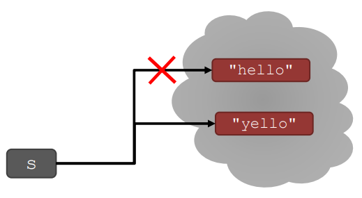
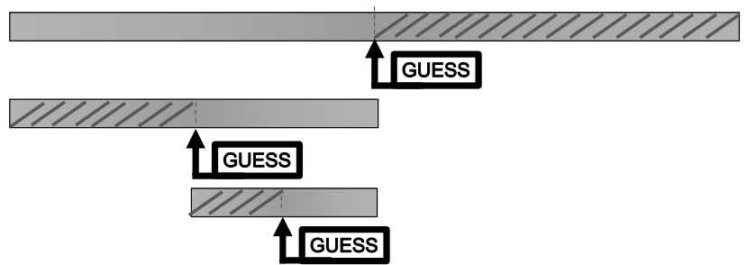

= Module 03: 문자열 조작, 추측 및 확인, 근사치, 이등분

== 지난 시간에...

* strings
* 분기 - if/elif/else
* while loops
* for loop

== Agenda

* 문자열 조작
* guess와 check 알고리즘
* 근사해 알고리즘
* 이등분 메소드

== STRINGS

* 대소문자가 구분되는 문자(characters)의 **순서**로 생각할 수 있음
* ==, >, < 등으로 비교할 수 있음
* `len()` 은 괄호안의 string의 **길이**를 알아내는데 사용하는 함수

[source, python]
----
s = "abc"
len(s) -> 3을 연산함
----

== STRINGS

* 대 괄호(square brakets)을 사용하여 문자열을 indexing 하여 index/position에 해당하는 값을 가져옴

[source, python]
----
s      = "abc"
index:   0 1 2 <- index는 항상 0에서 시작함
index:  -3-2-1 <- 마지막 요소의 index는 항상 -1

s[0] -> "a"를 가져옴
s[1] -> "b"를 가져옴
s[2] -> "c"를 가져옴
s[3] -> 범위를 벗어난 index, error
s[-1] -> "c"를 가져옴
s[-2] -> "b"를 가져옴
s[-3] -> "a"를 가져옴
----

== STRINGS

* `[start:stop:step]` 을 사용하여 문자열을 쪼갤 수(slice) 있음
* 두 숫자를 주면, `[start:stop],step=1` 이 기본 값
* 숫자를 생략하고 콜론(:)만 남길 수 있음

[source, python]
----
s = "abcdefgh"
s[3:6]      -> "def", s[3:6:1]과 같음
s[3:6:2]    -> "df"
s[::]       -> "abdcdfgh", s[0:len(s):1]과 같음
s[::-1]     -> "hgfedcba", s[-1:-(len(s) + 1:-1)]과 같음
s[4:1:-2]   -> "ec"
----

== STRINGS
* string은 "immutable" - 변경될 수 없음

[source, python]
----
s = "hello"

s[0] = 'y'              -> error
s = 'y' + s[1:len(s)]   -> 하용함. s는 새 객체에 바인딩 됨
----

== for 반복

* `for` 반복은 값 집합을 반복하기 위한 **반복 변수(loop variable)**을 가지고 있음

[source, python]
----
for var in range(4):    -> var는 값 0, 1, 2, 3 에서 반복
    <expressions>       -> 각각의 var 값과 함께 실행되는 식

for var in range(4, 6): -> var는 값 4, 5 에서 반복
    <expressions>
----

* `range` 는 숫자를 반복하는 방법이지만, for 반복 변수는 숫자 뿐 아니라 **모든 값 집합을 반복**할 수 있음

== STRINGS AND LOOPS

* 아래의 두 코드 조각은 같은 일을 수행함
* 아래의 코드가 보다 "파이썬다움"

[source, python]
----
 s = "abcdefgh"

for index in range(len(s)):
    if s[index] == 'i' or s[index] == 'u':
        print("There is an i or u")

for char in s:
    if char == 'i' or char == 'u':
        print("There is an i or u")
----

== CODE EXAMPLE: Robot cheerleaders

[source, python]
----
an_letters = "aefhilmnorsxAEFHILMNORSX"

word = input("I will cheer for you! Enter a word:")
times = int(input("Enthuiasm level (1:10): "))

for char in word:
    if char in an_letters:
        print("Give me an " + char + "! " + char)
    else:
        print("Give me a " + char + " ! " + char)

print("What does that spell?")
for i in range(times):
    print(word, "!!!")
----

== EXERCISE

[source, python]
----
s1 = "mit u rock"
s2 = "i rule mit"

if len(s1) == len(s2):
    for char1 in s1:
        for char2 in s2:
            if char1 == char2:
                print("common letter")
                break
----

== GUESS-AND-CHECK (추측과 확인)

* 아래의 프로세스는 **exhaustive enumeration(완결 열거)** 이라고 부름
** 문제가 주어졌음...
** 해결을 위한 **값을 추측**할 수 있음
** **값이 올바른지 확인**할 수 있음
** 해결책을 찾거나 모든 값을 추측할 때 까지 계속 추측

== GUESS-AND-CHECK - cube root

[source, python]
----
cube = 8
for guess in range(cube + 1)
    if guess**3 == cube:
        print("Cube root of", cube, "is, guess")
----

[source, python]
----
cube = 8
for guess in range(abs(cube)+1):
    if guess**3 >= abs(cube):
        break
if guess**3 != abs(cube):
    print(cube, 'is not a perfect cube')
else:
    if cube < 0:
        guess = -guess
    print('Cube root of '+str(cube)+' is '+str(guess))
----

== APPROXIMATE SOLUTIONS

* **"충분한(Good Enough)"** 해결
* 추측으로 시작해서 **작은 값**을 사용해 증가
* 만약 `| guess^3^ - cube | >= epsilon` 이면 작은 epsilon을 사용해 추측을 유지

* 증가치를 줄이면   -> 프로그램이 느려짐
* epsilon을 키우면  -> 정확도가 떨어짐

== APPROXIMATE SOLUTIONS - cube root

[source, python]
----
cube = 27
epsilon = 0.01
guess = 0.0
increment = 0.0001
num_guesses = 0

while abs(guess**3 - cube) >= epsilon and guess <= cube:
    guess += increment
    num_guesses += 1

print('num_guesses = ', num_guesses)

if abs(guess**3 - cube) >= epsilon:
    print('Failed on cobe root of', cube)
else:
    print(guess, 'us close to the cube root of', cube)
----

== BISECTION SEARCH

* 각 반복에 대해 절반의 간격
* 새로운 추측은 중간에 있음
* 설명을 위해 게임을 해 봅시다.

== BISECTION SEARCH - cube root

[source, python]
----
cube = 27
epsilon = 0.01
num_glasses = 0
low = 0
high = cube
guess = (high + low) / 2.0

while abs(guess**3 - cube) >= epsilon:
    if guess**3 < cube:
        low = guess
    else:
        high = guess
    guess = (high + low) / 2.0
    num_guesses += 1
print('num_guess =', num_guesses)
print(guess, 'is close to the cobe root of', cube)
----

== BISECTION SEARCH CONVERGENCE

:stem: asciimath

* 검색 공간
** 첫 번째 추측: N/2
** 두 번째 추측: N/4
** k 번째 추측: N/2^k^
* 추측은 stem:[log_2N]으로 수렴됨
* 이분법 검색은 함수 값이 입력에 따라 단조롭게 변할 때 동작함
* 코드는 1보다 큰 cube에서만 작동합니다. 이유는?
* 해볼 것   -> 음수 cube에서도 동작하도록 수정
            -> x < 1에서 동작하도록

== x < 1
* x < 1인 경우 검색 공간은 0에서 x까지이지만 큐브 루트는 x보다 크고 1보다 작습니다.
* x 값에 따라 검색 공간을 선택하도록 코드를 수정합니다.