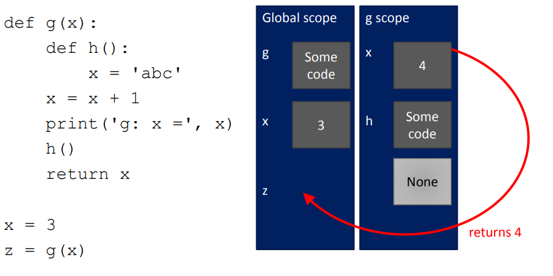

= Module 04: Decomposition, Abstraction, Functions

== 지난 시간에
* while 반복 vs. for 반복
* 두 종류의 반복에 반드시 익숙해져야 한다
* 언제 쓰는지 알아야 한다
* guess-and-check(추측과 확인), approximation method(추측 방법)
* besection method(이분법)을 사용하여 프로그램의 속도를 높임

== 오늘
* 프로그램을 구조화하고 상세를 숨김
* functions(함수)
* specifications(사양)
* 키워드: `return` vs `print`
* scpoe(범위)

== 어떻게 코드를 짜야하는가?

* 지금까지...
** 해당 언어의 메커니즘
** 각 계산에 대해 서로 다른 파일을 작성하는 방법을 알고 있음
** 각 파일은 코드의 일부
** 각 코드는 일련의 명령어
* 이 접근 방식의 문제점
** 작은 문제에 적합함
** 큰 문제를 위해서는... 지저분함
** 세부정보를 추적하기 어려움
** 코드에서, 코드의 각각의 부분에 바른 정보가 제공되는지 어떻게 알 수 있는지?

== Good Programming

* 많은 코드가 반드시 좋은 것은 아니다.
* 좋은 프로그래머는 기능적인 것의 양으로 측정됨
* **함수** 소개
* **decomposition(분해)**와 **abstraction(추상화)**를 달성하는 메커니즘

== 예 - 프로젝터

* 프로젝터는 블랙박스이다
* 어떻게 동작하는지 알 필요는 없음
* 인터페이스만 알면 됨: 입력/출력
* 해당 입력과 통신할 수 있는 전자장치를 연결
* 블랙박스는 어떻게든 입력 소스의 이미지를 변환하여 확대하고 벽에 분사
* **Abstraction idea**: 프로젝터를 사용하기 위해 프로젝터가 어떻게 동작하는지를 알 필요는 없음

== 예 - 프로젝터

* 올림픽을 위한 대형 이미지를 별도의 프로젝터에 대한 작업으로 분해하여 투사
* 각 프로젝터는 입력을 받아 별도의 출력을 생성
* 모든 프로젝터가 함께 작동하여 더 큰 이미지를 생성
* **Decomposition idea**: 다양한 장치가 함께 작동하여 최종 목표를 달성

== Decomposition(분해)를 사용하여 구조 만들기

* 프로젝트 예제는, 장치를 분할하는 것
* 프로그래밍에서는, 코드를 **module(모듈)**로 분해
** **자립적(self-contained)**
** 코드를 **break up(분리)**하는데 사용
** 코드를 **organized(체계적)**으로 유지
** 코드의 **coherent(일관성)**을 유지
* 이 강의에서는 함수로 분해를 달성
* 후에 클래스로 분해를 달성

== Abstration(추상화)로 세부사항을 숨김

* 프로젝터 예에서는 사용 방법에 대한 지침만 있으면 충분, 프로젝터의 제작 방법을 알 필요는 없음
* 프로그래밍에서는 코드 조각을 **블랙박스**로 생각
** 세부 정보를 볼 수 없음
** 세부 정보를 볼 필요가 없음
** 세부 정보를 보고싶지 않음
** 지겨운 코드 세부사항을 숨김
* **Function dpecification(함수 명세)**나 **docstring**으로 추상화를 달성

== 함수

* 재사용 가능한 코드의 조각/덩어리로, function(함수)라고 부름
* 함수는 **직접 호출(call)** 또는 **간접 호출(invoke)**되기 전까지는 프로그램에서 실행되지 않음
* 함수의 특징:
** 이름이 있음
** parameter를 가짐(없거나, 또는 여러개)
** **docstring**을 가짐(옵션이지만 권장됨)
** body를 가짐
** 무엇인가를 **return**

== 함수를 작성하고 Call/Invoke 하는 방법

[source, python]
----
def is_even(i):
    """
    input: i, a positive int
    Returns True if i is even, otherwise False
    """
    print("inside is_even")
    return i % 2 == 0

is_even(0)
----

== 함수 body

[source, python]
----
def is_even(i):
    """
    input: i, a positive int
    Returns True if i is even, otherwise False
    """
    print("inside is_even")
    return i % 2 == 0
----

== 변수 범위

* formal parameter(형식 파라미터)는 함수가 호출될 때 actual parameter(실제 파라미터) 값에 바인딩 됨
* 함수로 진입할 때 생성되는 새로운 scope/frame/environment(범위/프레임/환경)
* 범위는 이름을 객체에 매핑하는 것

[source, python]
----
def f(x):
    x = x + 1
    print('in f(x): x=', x)
    return x

x = 3
z = f(x)
----

== 변수 범위

image::./images/image01.png[]

== 경고: `return` 문이 없을 때

[source, python]
----
def is_even(i):
    """
    Input: i, a positive int
    Does not return anything
    """
    1 % 2 == 0
----

* Python은 **return이 없을 경우 None** 을 반환
* 값이 없음을 나타냄

== `return` vs. `print`

* `return`
** return은 함수 **내부**에서 동작
** 함수 내부에서 실행된 **하나**의 값만 return
** 함수 내부의 코드지만 return문 이후에는 실행되지 않음
** 함수 호출자에게 제공되는 값

* `print`
** print는 함수 **외부**에서 사용
** 함수 내부에서 **많은** print가 실행될 수 있음
** 함수 내부의 코드로 print후의 코드도 실행됨
** 연관된 값들을 콘솔에 **출력**함

== arguments로서의 함수
* argument로 어떠한 타입도 가능함, 심지어 함수도 가능

[source, python]
----
def func_a():
    print('inside func_a')

def func_b(y):
    print('inside func_b')
    return y

def func_c(z):
    print('inside func_c')
    return z()

print(func_a())
print(5 + func_b(2))
print(func_c(func_a))
----

== argument로서의 함수

== argument로서의 함수

== argument로서의 함수

image::./images/image04.png[]

== 범위 예제

* 함수 내부에서, 외부에 선언된 변수에 **접근 가능**
* 함수 내부에서, 외부에 선언된 변수의 값을 **변경할 수 없음** - **global variable(전역 변수)**를 사용할 수 있으나 권장하지 않음

[source, python]
----
def f(y):
    x = 1   # x는 f의 범위에서 재정의 됨
    x += 1
    print(x)

x = 5       # 다른 x 객체
f(x)
print(x)
----

[source, python]
----
def g(y):
    print(x)        # g 내의 x 객체
    print(x + 1)    # g 내의 x 객체

x = 5   # g 내부의 x는 함수 g를 호출한 범위에서 선택됨
g(x)
print(x)
----

[source, python]
----
def h(y):
    x += 1

x = 5
h(x)
print(x)
----

== 보다 어려운 범위 예제

** 중요하고 까다로움!

Python Tutor는 이 문제를 해결하는데 도움을 주는 가장 좋은 친구!

https://www.pythontutor.com

== 범위 상세

[source, python]
----
def g(x):
    def h():
        x = 'abc'
    x += 1
    print('g: x = ', x)
    h()
    return x

x = 3
z = g(x)
----

== Decomposition & Abstraction

* 함께 사용하면 강력함
* 여러번 사용할 수 있지만 디버깅은 한번!