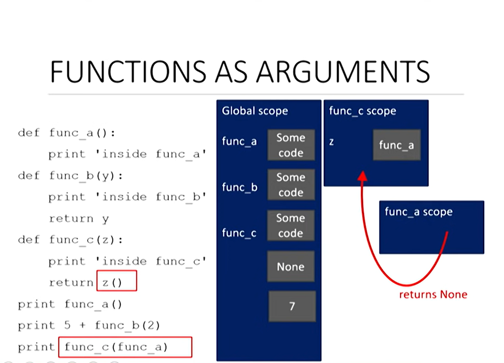
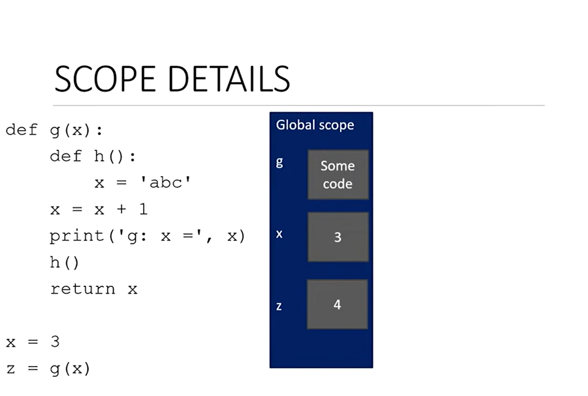

= Module 04 분해, 추상화, 함수

좋습니다. 모두 시작하겠습니다. 좋습니다, 비가 내리고 비가 내리는 슬픈 오후 좋은 오후입니다. 그래서-- 그래도 안에 있어서 다행이군요-- 좋습니다. 600에서 6.0001의 강의 4입니다. 지난 시간에 우리가 한 일을 빠르고 빠르게 요약합니다. 지난번에 우리는 문자열을 좀 더 조작한 다음 문자열에 대해 for 루프를 직접 사용하는 방법을 살펴보았습니다. 따라서 범위(예: 0, 1, 2, 3, 4 등)를 반복하는 for 루프 대신 문자열 개체를 직접 반복하는 for 루프를 사용하는 것이 더 강력하다는 것을 알게 되었습니다.

이것이 강의 전반부였습니다. 후반부에는 동일한 문제에 대해 다양한 구현을 구현할 수 있는 다양한 방법을 살펴보기 시작했습니다. 그래서 우리는 큐브 루트를 찾는 문제와 몇 가지 구현을 보았습니다. 추측 및 확인 방법과 근사 방법을 살펴보았습니다.

그리고 제가 생각하기에 가장 강력한 방법인 이분법을 살펴보았습니다. 기억나시나요? 저는 청중 중 누군가와 게임을 했는데 0에서 100 사이의 숫자를 추측했습니다. 그리고 우리는 이분법을 사용하여 그 숫자를 정말, 정말 빠르게 추측할 수 있다는 것을 알았습니다. 그리고 이것이 바로 문제 세트에서 구현하려는 방법입니다. 현재 구현하고 있는 방법입니다.

== 어떻게 코드를 짜야하는가?

* 지금까지...
** 해당 언어의 메커니즘
** 각 계산에 대해 서로 다른 파일을 작성하는 방법을 알고 있음
** 각 파일은 코드의 일부
** 각 코드는 일련의 명령어
* 이 접근 방식의 문제점
** 작은 문제에 적합함
** 큰 문제를 위해서는... 지저분함
** 세부정보를 추적하기 어려움
** 코드에서, 코드의 각각의 부분에 바른 정보가 제공되는지 어떻게 알 수 있는지?

좋아요, 오늘은 -- 이것으로 파이썬의 좀 더 기본적인 메커니즘에 대한 소개를 마칩니다. 그리고 오늘 우리는 코드의 세부 사항 중 일부를 숨김으로써 멋지고 일관성 있는 코드, 즉 재사용 가능한 코드를 작성할 수 있도록 프로그램을 구성하는 방법에 대해 이야기하겠습니다. 그러기 위해 우리는 함수라고 불리는 것들을 살펴보겠습니다.

좋습니다. 이제 한 걸음 물러서서 지금까지 코드를 작성하는 방법에 대해 대략적으로 살펴보겠습니다. 지금까지 프로그램용 코드를 작성하는 방법은 파일을 열고 특정 문제를 해결하기 위해 코드를 입력하는 것이었습니다. 문제 세트와 같이 각 파일에는 코드 조각이 포함되어 있으며 일련의 코드가 있습니다. 할당, 루프, 조건 등을 포함하는 명령어입니다. 그러나 실제로는 각 코드를 포함하는 하나의 파일이 있고 해당 특정 파일에 모든 것을 작성합니다.

그러나 지금까지 우리가 보아온 작은 문제에는 괜찮지만, 큰 코드 조각을 작성하기 시작하면 정말 빨리 지저분해질 것입니다. 따라서 코드의 한 부분에서 for 루프를 사용하고 코드의 다른 부분에서 동일한 for 루프를 사용하는 것이 유용하다는 것을 생각해 보십시오.

나중에 코드를 디버깅할 때 원래 for 루프를 변경하고 싶을 수도 있습니다. 예를 들어 해당 유형의 for 루프를 사용한 다른 모든 위치를 파악해야 합니다. 따라서 코드를 확장하면 이러한 세부 정보를 추적하기가 더 어려워집니다. 이것이 바로 오늘 강의에서 기능이 작동하게 될 부분입니다. 여러분에게 도움이 될 것입니다. 따라서 좋은 프로그래머로 여겨지고 싶다면, 좋은 프로그래밍 스타일은 반드시 많은 코드 줄을 추가하는 것이 아니라 실제로는 프로그램에 더 많은 기능을 추가하는 것입니다. 따라서 코드가 얼마나 길 수 있는지보다는 프로그램이 얼마나 많은 다른 기능을 수행할 수 있는지에 대한 것입니다. 나중에 수업에 필요한 경우 코드를 살펴보는 데 도움이 될 것입니다.

== Good Programming

* 많은 코드가 반드시 좋은 것은 아니다.
* 좋은 프로그래머는 기능적인 것의 양으로 측정됨
* 기능 소개
* decomposition(분해)와 abstraction(추상화)를 달성하는 메커니즘

그래서 오늘 우리는 함수에 대한 아이디어를 소개하려고 합니다. 그리고 함수는 분해와 추상화를 달성하는 메커니즘입니다. 이것이 바로 오늘 강의와 앞으로의 강의에서 등장하게 될 두 가지 핵심 단어입니다. 따라서 함수의 맥락에서 분해와 추상화를 소개하기 전에 먼저 일종의 실제 예를 살펴보겠습니다. 그럼 프로젝터를 가져가자. 나는 지금 하나를 사용하고 있습니다. 손을 빠르게 보여줍니다. 저항기, 팬, 전구, 렌즈, 케이스 등 프로젝터의 일부인 모든 전자 부품을 제공한다면, 그 안에 있는 모든 부품을 살펴보겠습니다. 여기 누가 프로젝터를 만들 수 있을까요? 손이 보이나요? 아니요? 오오오오 그래 좋아! 거짓말을 할 수도 있습니다. 차이점을 모르겠습니다. 하지만 그렇게 할 수 있다면 정말 감동받을 것 같아요.

== 예 - 프로젝터

* 프로젝터는 블랙박스이다
* 어떻게 동작하는지 알 필요는 없음
* 인터페이스만 알면 됨: 입력/출력
* 해당 입력과 통신할 수 있는 전자장치를 연결
* 블랙박스는 어떻게든 입력 소스의 이미지를 변환하여 확대하고 벽에 분사
* **Abstraction idea**: 프로젝터를 사용하기 위해 프로젝터가 어떻게 동작하는지를 알 필요는 없음

알겠습니다. 그러면 실제로 프로젝터를 구성할 수는 없겠죠? 또 다른 손을 보여주세요. 예를 들어, 제가 여러분에게 완전히 조립된 프로젝터와 컴퓨터를 준다면, 누가 그것들을 함께 작동하게 만드는 방법을 한 시간 안에 알아낼 수 있겠습니까? 좋아요, 꽤 괜찮은 수업이군요. 저건 완벽 해. 이것이 바로 제가 여기서 얻으려고 했던 답변입니다. 따라서 우리 중 누구도 프로젝터의 작동 방식, 즉 내부 구조를 실제로 알지 못하지만, 우리 중 훨씬 더 많은 사람들이 프로젝터 작동 방법을 알고 있습니다. 단지 일련의 기본 지침을 제공받거나 직관적으로 말하면 됩니다. 그래서 여러분은 프로젝터를 일종의 블랙박스로 봅니다. 그것을 사용하기 위해 그것이 어떻게 작동하는지 알 필요는 없습니다.

여러분은 어떤 입력이 필요할지, 높은 수준에서 무엇을 해야 하는지 알고 있을 것입니다. 내 화면에 있는 것을 가져다가 큰 화면에 올려놓고 확대해 보세요. 하지만 여러분은 그것이 어떻게 작동하는지, 즉 구성요소들이 어떻게 함께 작동하는지 모릅니다. 이것이 바로 추상화의 개념입니다. 프로젝터를 사용하기 위해 프로젝터의 작동 방식을 알 필요는 없습니다.

OK. 추상화입니다. 나머지 절반은 분해였습니다. 이제 프로젝터가 주어졌을 때 아주 큰 무대에 매우 큰 이미지를 투사하고 싶다고 가정해 보겠습니다. 예를 들어, 이것은 올림픽 중 하나에서 나온 것입니다. 축구장 10개 정도의 무대인가요? 엄청난 것. 매우 큰 이미지를 투사할 수 있는 프로젝터 하나를 만들 수 있지만 비용이 많이 들고 이번 한 번만 사용할 프로젝터를 만들어야 합니다.

따라서 대신에 할 수 있는 일은 여러 개의 작은 프로젝터를 사용하여 각 프로젝터에 서로 다른 입력을 제공하는 것입니다. 그리고 서로 다른 입력을 공급하면 각 입력은 서로 다른 출력을 표시하게 됩니다. 그러면 여러분은 이 정말 멋진 이미지를 매우 큰 무대에 투영하는 더 큰 문제를 해결하기 위해 다양한 프로젝터를 모두 함께 사용할 수 있게 될 것입니다.

이것이 바로 분해의 개념입니다. 동일한 프로젝터를 사용하여 서로 다른 입력을 공급하면 뒤에서는 정확히 동일한 작업을 수행하지만 이러한 서로 다른 입력 각각에 대해 서로 다른 출력을 생성합니다. 따라서 이러한 서로 다른 장치는 동일한 공통 목표를 달성하기 위해 함께 작동할 것입니다. 이것이 바로 분해의 개념입니다.

== 예 - 프로젝터

* 올림픽을 위한 대형 이미지를 별도의 프로젝터에 대한 작업으로 분해하여 투사
* 각 프로젝터는 입력을 받아 별도의 출력을 생성
* 모든 프로젝터가 함께 작동하여 더 큰 이미지를 생성
* **Decomposition idea**: 다양한 장치가 함께 작동하여 최종 목표를 달성

그래서 이것이 제가 큰 이미지를 투사하는 문제나 일반적인 프로젝터에 적용하는 곳이지만 프로그래밍에도 똑같은 개념을 적용할 수 있습니다. 따라서 분해는 실제로 코드에서 구조를 만드는 문제일 뿐입니다. 프로젝터 예에서는 함께 작동하는 별도의 장치가 있습니다. 프로그래밍에서는 분해를 달성하기 위해 코드를 더 작은 모듈로 나눕니다.

== Decomposition(분해)를 사용하여 구조 만들기

* 프로젝트 예제는, 장치를 분할하는 것
* 프로그래밍에서는, 코드를 **module(모듈)**로 분해
** **자립적(self-contained)**
** 코드를 **break up(분리)**하는데 사용
** 코드를 **organized(체계적)**으로 유지
** 코드의 **coherent(일관성)**을 유지
* 이 강의에서는 함수로 분해를 달성
* 후에 클래스로 분해를 달성

이것들은 독립적일 것이며 일종의 작은 미니 프로그램이라고 생각할 수 있습니다. 당신은 그들에게 어떤 입력을 주고, 그들은 작은 작업을 수행하고, 그런 다음 당신에게 무언가를 돌려줍니다. 그들은 나가서 자신의 일을 한 다음 결과를 돌려줍니다.

이러한 모듈은 코드를 분할하는 데 사용될 수 있으며 중요한 것은 재사용이 가능하다는 것입니다. 따라서 모듈을 한 번 작성하면, 즉 한 번 어떤 작업을 수행하는 작은 코드 조각을 한 번 디버깅한 다음 다른 입력을 사용하여 코드에서 여러 번 재사용할 수 있습니다. 이것의 이점은 코드를 체계적으로 유지하고 코드의 일관성을 유지한다는 것입니다.

따라서 함수는 분해를 달성하고 코드에서 구조를 생성하는 데 사용될 것입니다. 우리는 오늘 이 강의에서 함수를 볼 것이고, 몇 주 후에는 객체지향 프로그래밍에 관해 이야기할 때 클래스를 통해 어떻게 분해를 달성할 수 있는지 실제로 보게 될 것입니다. 그리고 클래스를 사용하면 부동 소수점을 추가하는 등 자신만의 개체 유형을 만들 수 있습니다. 원하는 대로 자신만의 개체 유형을 만들 수 있지만 그건 나중에 하는 일입니다. OK. 분해는 코드에 구조를 생성하는 것입니다. 그리고 추상화는 세부 사항을 억제하는 아이디어입니다. 따라서 프로젝터 예에서 추상화는 프로젝터를 사용하기 위해 프로젝터가 어떻게 작동하는지 정확히 알 필요가 없다는 점을 기억하십시오. 프로그래밍에서도 같은 생각이 될 것입니다.

== Abstration(추상화)로 세부사항을 숨김

* 프로젝터 예에서는 사용 방법에 대한 지침만 있으면 충분, 프로젝터의 제작 방법을 알 필요는 없음
* 프로그래밍에서는 코드 조각을 **블랙박스**로 생각
** 세부 정보를 볼 수 없음
** 세부 정보를 볼 필요가 없음
** 세부 정보를 보고싶지 않음
** 지겨운 코드 세부사항을 숨김
* **Function dpecification(함수 명세)**나 **docstring**으로 추상화를 달성

따라서 작은 작업을 수행하는 코드 조각을 작성하면 해당 코드 조각을 여러 번 다시 작성할 필요가 없습니다. 당신은 그것을 한 번 작성했고, 그것에 대한 함수 명세, 즉 독스트링(docstring)이라고 불리는 것을 작성했습니다. 그리고 이것은 미래에 이 기능을 사용하고 싶어하는 다른 사람, 즉 다른 사람, 아마도 당신 자신에게 이 기능을 사용하는 방법을 알려주는 텍스트입니다. 어떤 입력이 필요합니까? 입력 유형은 무엇입니까? 어떤 기능을 수행해야 하나요? 그리고 당신이 그로부터 얻게 될 결과는 무엇입니까? 따라서 그들은 함수를 어떻게 구현했는지 정확히 알 필요가 없습니다. 입력이 무엇인지, 무엇을 하는지, 출력이 무엇인지 알아야 합니다. 그 세 가지.

== 함수

* 재사용 가능한 코드의 조각/덩어리로, function(함수)라고 부름
* 함수는 **직접 호출(call)** 또는 **간접 호출(invoke)**되기 전까지는 프로그램에서 실행되지 않음
* 함수의 특징:
** 이름이 있음
** parameter를 가짐(없거나, 또는 여러개)
** **docstring**을 가짐(옵션이지만 권장됨)
** body를 가짐
** 무엇인가를 **return**

좋아요, 그러면 이 함수들은 재사용 가능한 코드 덩어리입니다. 그리고 오늘 강의에서 몇 가지 예를 통해 어떻게 작성하고 함수를 호출하는지 살펴보겠습니다. 그리고 오늘의 코드를 살펴보면서 두 가지 서로 다른 기능을 사용하는 함수에 대해 생각해 보셨으면 합니다. 첫 번째 모자는 함수를 작성하는 사람이 쓴 모자입니다. 따라서 프로젝터의 예에서는 누군가가 첫 번째 프로젝터를 만들어야 했습니다. 누군가는 이 모든 구성 요소를 하나로 묶는 방법을 알아야 했습니다. 따라서 함수를 작성하는 것이므로 해당 함수를 작동시키는 방법을 알아야 합니다. 그리고 또 다른 모자는 바로 그 기능을 사용하는 누군가, 즉 프로그래머로서 당신입니다. 당신은 그것이 이미 올바르게 구현되었다고 가정하고 있으며 이제는 그것을 사용하여 무언가를 하고 있습니다.

이는 기능 특성 중 일부이며 다음 슬라이드에서 예를 살펴보겠습니다. 따라서 함수에는 이름이 있게 됩니다. 뭔가 불러야 합니다. 몇 가지 매개변수가 있을 것입니다. 이는 함수에 대한 입력입니다. 입력은 0개 또는 원하는 만큼 가질 수 있습니다.

함수에는 독스트링이 있어야 합니다. 이것이 추상화를 달성하는 방법입니다. 따라서 선택 사항이지만 적극 권장되며, 이것이 다른 사람들에게 기능 사용 방법을 알려주는 방법입니다. 함수에는 함수의 고기이자 감자인 몸체가 있습니다. 그리고 함수는 무언가를 반환할 것입니다. 그것은 그것을 계산한 다음 다시 제공합니다. 어떤 대답을 다시 뱉어냅니다.

== 함수를 작성하고 Call/Invoke 하는 방법

[source, python]
----
def is_even(i):
    """
    input: i, a positive int
    Returns True if i is even, otherwise False
    """
    print("inside is_even")
    return i % 2 == 0

is_even(0)
----

좋아요, 여기 함수 정의와 함수 호출의 예가 있습니다. 함수 정의는 여기에 있습니다. 그냥 여기에 그려보겠습니다. 이것이 함수 정의입니다. 그리고 이것이 바로 여기 아래에 있는 함수 호출입니다.

따라서 누군가는 처음부터 무언가를 수행하는 함수를 작성해야 한다는 점을 기억하십시오. 그래서 함수를 작성하는 방법은 다음과 같습니다. 첫 번째는 앗-- 첫 번째는 def 키워드가 될 것입니다. 그리고 def는 -- 이것은 Python에게 내가 함수를 정의할 것임을 알려줍니다. 다음은 함수의 이름입니다. 이 경우 is_even 함수를 호출합니다. 그리고 함수 이름은 실제로 설명적인 것이어야 합니다.

반면에 이 기능을 사용하거나 보는 사람은 더 이상 설명하지 않고도 이 기능이 무엇을 해야 하는지 거의 알 수 있습니다. 그들은 단지 이름만 보고 있을 뿐입니다. 그런 다음 괄호 안에 인수라고도 하는 매개변수를 지정합니다. 그리고 이 매개변수는 함수에 대한 입력입니다. 그런 다음 콜론을 수행합니다.

좋습니다. 이것이 함수 정의의 첫 번째 줄입니다. 그 후에는 함수의 일부가 될 모든 항목이 들여쓰기됩니다. 다음 부분은 dockstring 또는 specification이 될 것이며 이것이 함수를 사용하여 추상화를 달성하는 방법입니다.

specification이 또는 dockstring은 삼중 따옴표로 시작하고 삼중 따옴표로 끝나며, 이것을 여러 줄 주석으로 생각할 수 있습니다. 함수를 사용하는 사람이라면 누구나 볼 수 있는 텍스트일 뿐이며 다음 사항을 알려주어야 합니다. 함수에 대한 입력은 무엇입니까? 일반적으로 어떤 기능을 수행해야 합니까? 그리고 이 함수는 호출한 사람에게 무엇을 돌려줄까요?

다음 부분은 함수의 본문이 될 것입니다. 다음 슬라이드에서는 그 내용에 대해 이야기하겠습니다. 그리고 그게 다야. 이것이 함수 정의의 전부입니다. def 어쩌고 저쩌고, 어쩌고 저쩌고, 들여쓰기, 함수 내부의 모든 것. 이것이 바로 함수 정의를 작성하는 것입니다.

함수 정의가 작성되면 함수를 호출할 수 있습니다. 그리고 그것이 바로 이 부분입니다. 여기서는 함수를 호출할 때 이름을 말한 다음 parameter를 지정합니다. 그리고 함수가 기대하는 만큼 많은 parameter를 제공합니다. 이 경우에는 parameter가 하나만 제공됩니다. 그렇다면 함수 본문 내부에는 무엇이 있습니까? 함수 본문 안에는 무엇이든 넣을 수 있습니다. 함수를 일종의 작은 프로시저나 작업을 수행하는 작은 미니 프로그램으로 생각하세요. 따라서 일반 프로그램에서 수행할 수 있는 모든 작업을 함수 내부에서 수행할 수 있습니다. 인쇄, 수학 연산 수행 등이 가능합니다.

== 함수 body

[source, python]
----
def is_even(i):
    """
    input: i, a positive int
    Returns True if i is even, otherwise False
    """
    print("inside is_even")
    return i % 2 == 0
----

하지만 마지막 줄은 함수에서 가장 중요한 부분입니다. 그리고 이것이 바로 이 return 문입니다. 그것이 바로 우리가 부르는 것입니다. 따라서 키워드인 return으로 시작하는 코드 줄입니다. 그러면 그것은 어느 정도 가치가 될 것입니다. 여기에는 표현식이 있습니다. i % 2 == 0은 어떤 값으로 평가될 표현식입니다. 그리고 이 부분이 어떤 가치를 평가하는 부분이라면 무엇이든 원하는 것이 될 수 있습니다.

그리고 여기 반환되는 이 줄은 Python에게 함수 내부의 모든 실행을 마친 후에 어떤 값을 반환해야 하는지 알려줍니다. 그리고 함수를 호출한 사람은 누구든 그 값을 돌려받게 되며 함수 호출 자체는 해당 값으로 대체됩니다. 좋습니다. 그럼 예를 살펴보겠습니다. 이제 범위 개념을 소개하겠습니다. 범위는 환경을 뜻하는 또 다른 단어입니다. 따라서 함수를 작은 미니 프로그램으로 생각할 수 있다고 말하면 함수의 범위는 기본 프로그램의 환경과 완전히 별개의 환경이 될 것입니다.

== 변수 범위

* formal parameter(형식 파라미터)는 함수가 호출될 때 actual parameter(실제 파라미터) 값에 바인딩 됨
* 함수로 진입할 때 생성되는 새로운 scope/frame/environment(범위/프레임/환경)
* 범위는 이름을 객체에 매핑하는 것

[source, python]
----
def f(x):
    x = x + 1
    print('in f(x): x=', x)
    return x
----

따라서 함수를 호출하자마자 Python이 말하는 이면에서는 다음과 같습니다. OK 메인 프로그램에 있지만 함수 호출이 보입니다. 저는 이 메인 프로그램에서 나가겠습니다. 나는 이 새로운 환경으로 떠날 것이다. 나는 이 환경 내에 존재하는 완전히 새로운 변수 세트를 만들 것입니다. 계산을 좀 해볼께요. 반환값을 볼 때 이 반환값을 가져오겠습니다. 해당 환경을 종료한 다음 기본 프로그램으로 돌아갑니다.

따라서 한 범위에서 다른 범위로 들어갈 때 이러한 값을 앞뒤로 전달하는 것과 같습니다. 따라서 범위를 입력하면 변수가 함수에 다시 전달됩니다. 그리고 함수가 끝나면 이를 호출한 사람에게 값을 다시 전달하게 됩니다.

다시 한 번, 이 상단 부분은 함수 정의입니다. 그리고 함수 정의에 대한 모든 인수를 형식 매개변수라고 합니다. 그리고 그것들은 아직 실제로 값을 갖고 있지 않기 때문에 형식 매개변수라고 불립니다. 함수 정의에서는 이 경우 x가 어떤 값을 가질 것이라고 가정하여 함수를 작성하는 것과 같습니다. 그러나 당신은 그것이 무엇인지 아직 모릅니다. 여기에서 함수를 호출할 때만 x가 어떤 값을 취하는지 알 수 있습니다.

이것이 함수 정의이고 나중에 메인 프로그램에서 x가 3인 변수를 정의할 수 있습니다. 그런 다음 함수를 호출합니다. f of x 여기에 함수 호출이 있습니다. x는 값 3을 취하기 때문에 값 3으로 f를 호출하겠습니다. 그런 다음 3을 함수에 매핑할 것입니다. 함수 호출에 전달되는 값은 실제로 값을 갖기 때문에 실제 매개변수라고 합니다.

그럼 이 프로그램, 즉 이 작은 프로그램을 단계별로 살펴보고 스코프의 뒤에서 정확히 무슨 일이 일어나는지 살펴보겠습니다. 그리고 방금 프로그래밍을 시작했다면 이러한 연습을 하면서 종이 한 장에 제가 여기서 다룰 내용과 유사한 내용을 적는 것이 매우 가치 있을 것이라고 생각합니다. 많은 도움이 될 것이라고 생각하며, 어떤 변수가 어떤 값을 취하고 어떤 범위에 속하는지 정확하게 단계별로 확인할 수 있을 것입니다. 프로그램이 처음 시작되면 이 전역 범위를 생성합니다. 주요 프로그램 범위입니다. 주 프로그램 범위에서 Python이 가장 먼저 보게 될 것은 여기 이 부분입니다. def f of x와 그 안에 있는 내용입니다. 이는 Python에 x라는 함수가 있음을 알려주지만 아직 코드 내부에 무엇이 있는지는 신경 쓰지 않습니다.

따라서 Python에서는 전역 범위에 있는 일부 코드일 뿐입니다. 따라서 def를 볼 때마다 거기에 코드를 추가하면 됩니다. 그런 다음 다음 줄로 이동합니다. x는 3과 같습니다. 따라서 전역 범위에서 이제 변수 x는 3이 됩니다. 그리고 다음 줄은 — z는 f와 같습니다. x는 함수 호출입니다. 함수 호출을 누르자마자 새 범위, 즉 새 환경을 만듭니다.

그래서 우리는 일시적으로 전역 범위와 일종의 포털을 새로운 범위로 떠나서 이 함수가 무엇을 할 것인지, 무엇을 반환할 것인지 알아내려고 노력할 것입니다. 따라서 가장 먼저 해야 할 일은 매개변수를 매핑하는 것입니다. x는 여기서 3으로 x의 f를 호출합니다. 그래서 가장 먼저 하는 일은 정의에 있는 모든 매개변수를 해당 값에 매핑하는 것입니다. 그래서 제가 가장 먼저 하는 일은 x가 값 3을 얻는 것입니다.

image::./images/image01.png[]

다음 줄은 x가 x + 1과 같다는 것입니다. 따라서 우리는 여전히 함수 호출 f 안에 있으므로 x는 값 4를 얻습니다. 우리는 이것을 인쇄하고 x를 반환합니다. 따라서 f의 범위에서 x는 4와 같으므로 이를 호출한 사람에게 해당 값을 다시 반환합니다. 이는 전역 범위 내에서 이 함수 호출이었습니다. 그래서 바로 여기 이 부분(함수 호출인 x의 f)은 4로 대체됩니다. 따라서 메인 프로그램 내에서 z는 4와 같습니다.

이것이 바로 우리가 매개변수를 함수에 전달하고 함수에서 매개변수를 다시 받는 방법입니다. 함수가 무언가를 반환하자마자 함수에 대한 범위가 지워집니다. 거기에 생성된 모든 변수를 잊어버리고 해당 범위를 삭제하면 호출을 시작한 위치로 돌아갑니다.

하지만 한 가지 경고. 그렇다면 return 문이 없으면 어떻게 될까요? 나는 모든 함수가 무언가를 반환해야 한다고 말했습니다. return 문을 명시적으로 넣지 않으면 Python이 대신 하나를 추가합니다. 이렇게 할 필요는 없습니다. 그리고 실제로는 None-- No-ne을 반환하게 됩니다. None은 특수 유형입니다. None은 NoneType이라는 특수 유형의 값이며 값이 없음을 나타냅니다. 그게 뭐야?

문자열이 아닙니다.

아니--

없음은 문자열이 아닙니다.

None은 정확히 문자열이 아닙니다. 특별한 유형입니다.

[source, python]
----
def is_even_with_return(i):
    """
    InputL i, a positive int
    Returns True if i is even, otherwise False
    """
    print('with return')
    reminder = i % 2
    return reminder == 0
----

자, 계속하기 전에 None과 인쇄 및 반환의 차이점을 보여주기 위해 Spyder에서 작은 연습을 해 보고 싶었습니다. 여기에 제가 작성한 두 가지 함수가 있습니다. 하나는 is_even_with_return입니다. 이름이 너무 설명적이네요. 이는 슬라이드에서 본 코드와 거의 동일합니다. 그것은 단지 여분의 작은 인쇄물을 가지고 있습니다. i를 2로 나눈 나머지를 얻습니다. 그리고 나머지가 0인지 여부를 반환합니다. 따라서 참 또는 거짓(boolean)을 반환합니다.

좋습니다. 제 함수 호출은 다음과 같습니다. is_even_with_return 값이 3이라고 말하고 있습니다. 이 함수 호출을 하면 이 3이 여기에 매핑됩니다. 이 변수는 여기에 있습니다. 따라서 나는 3과 같습니다. return으로 인쇄하고 나머지는 3% 2와 같다고 말하고 나머지는 1이므로 값은 1이 됩니다. 그리고 1이 0과 같은지 반환할 것인데 이는 거짓입니다. .

여기 이 줄은 false를 반환합니다. 그런데 제가 false로 어떤 작업을 하고 있나요? 설마. 그것은 단지 여기 코드에 앉아 있는 것과 같습니다. 그래서 이것은 false로 평가됩니다. 나는 그것을 인쇄하지 않습니다. 나는 그것으로 어떤 작업도 수행하지 않습니다. 그냥 거기 앉아 있어요. 그래서 아무데도 나타나지 않습니다. 결과를 어딘가에 표시하려면 인쇄해야 합니다. 이것이 바로 다음 줄이 하는 일입니다. 그래서 그것은 간단해야합니다.

[source, python]
----
def is_even_without_return(i):
    """
    Input i, a positive int
    Returns True if i is even, otherwise False
    """
    print('without return')
    reminder = i % 2
----

is_even_without_return은 조금 더 까다롭지만 그렇게 나쁘지는 않습니다. 여기에 print,without_return이 있고 나머지는 i% 2와 같습니다. 그래서 암묵적으로 Python은 저를 위해 None 반환을 추가할 것입니다. 추가할 필요는 없습니다.

따라서 여기서 함수를 호출하면 이 경우 반환이 부울이 아니라는 점을 제외하고는 동일한 작업을 수행하게 됩니다. 이렇게 특별할 거야 없음. 따라서 이것은 None으로 평가될 것입니다.

이번에도 인쇄하지 않습니다. 그냥 거기 앉아 있어요. 그 결과를 인쇄한다면 None 값이 인쇄될 것입니다. 이를 실행하면 여기에 바로 인쇄되는 것을 볼 수 있습니다. 따라서 다음 p 세트를 수행할 때 기능에 관한 것이며 일부 위치에서 이러한 없음이 나타나는 것을 볼 수 있습니다. 여기서 했던 것처럼 함수 내부에 무언가를 인쇄한 것이 아니라 실제로 무언가를 반환했는지 확인하세요. 좋아요, 그게 차이점이에요. 그리고 이 is_even 함수에 대해 마지막으로 언급하고 싶은 것은 이 함수가 얼마나 유용할 수 있는지입니다. 이는 슬라이드에 나온 함수입니다. 함수를 한 번 작성하면 코드에서 여러 번 사용할 수 있습니다. 여기서는 is_even 함수를 사용하여 0에서 19 사이의 숫자를 인쇄합니다.

여기 이 코드 조각을 주목하세요. 제가 이 함수 is_even을 작성하고 나면 정말 정말 멋져보이죠? 이 범위의 모든 숫자에 대해 i가 짝수이면 모든 숫자 0, 1, 2, 3, 4에 대해 true 또는 false를 반환합니다. 이것이 true이면 인쇄하겠습니다. 짝수로 출력하고, 그렇지 않으면 홀수로 출력하겠습니다.

그래서 이것을 실행하면 이렇게 됩니다. 짝수 0개, 홀수 1개, 짝수 2개 등입니다. 함수를 사용하면 내 코드가 정말 멋지게 보입니다. 함수를 사용하지 않았다면 이 두 줄을 여기 어딘가에 넣어야 했을 것이고 조금 더 지저분해 보일 것입니다.

그래서 저는 이전에 한두 번 이런 말을 한 적이 있습니다. Python에서는 모든 것이 객체입니다. 그 당시에는 아무 의미도 없었을지 모르지만 이 특별한 예를 사용하면 내가 의미하는 바가 무엇인지 알게 될 것입니다. 따라서 Python에서는 모든 것이 객체입니다. 정수도 객체이고, 부동 소수점도 객체이고, 심지어 함수도 객체입니다. 따라서 객체를 함수 매개변수로 앞뒤로 매개변수로 전달할 수 있듯이 다른 함수도 매개변수로 전달할 수 있습니다.

[source, python]
----
def func_a():
    print('inside func_a')

def func_b(y):
    print('inside func_b')
    return y

def func_c(z):
    print('inside func_c')
    return z()

print(func_a())
print(5 + func_b(2))
print(func_c(func_a))
----

이것이 무엇을 의미하는지 봅시다. 따라서 여기에 func_a, func_b 및 func_c의 세 가지 함수 정의가 있습니다. 그리고 내 메인 프로그램에는 세 줄의 코드가 있습니다. 그래서 func_a라는 하나, func_b라는 하나, func_c에 대한 호출 하나가 있습니다. 이전 예제와 마찬가지로 추적하여 정확히 무슨 일이 일어나는지 살펴보겠습니다.

내가 만드는 첫 번째 일은 전역 범위입니다. 그리고 세 가지 함수 정의가 있습니다. 다시 말하지만 아직 함수를 호출하지 않았기 때문에 코드에 무엇이 있는지는 신경 쓰지 않습니다. Python은 일부 코드를 포함하는 이러한 이름을 가진 함수가 있다는 것을 알고 있습니다.

image::./images/image02.png[]

이러한 정의를 마치고 나면 여기 이 줄이 나옵니다. func_a를 print 합니다. 함수를 호출하자마자 새로운 범위를 생성하고 그곳으로 뛰어들 것입니다. func_a 내부로 가서 func_a가 무엇을 하는지 살펴보겠습니다. 매개변수를 사용하지 않고 여기에 이 ​​메시지를 인쇄합니다. 그리고는 떠난다. 끝났다. 반환이 없으므로 None을 반환합니다. 그래서 func_a는 그것을 호출한 사람에게 None을 반환합니다. 거기 있는 줄은 None이 될 것입니다.

image::./images/image03.png[]

다음 줄. 이것은 바로 여기에 있습니다. 5를 인쇄하고 함수 호출을 더해 보세요. 다시 func_b의 범위로 이동하여 거기서 무엇을 해야 하는지 살펴보겠습니다. 먼저 매개변수를 매핑하겠습니다. 그래서 2-- 이런-- 2는 y에 매핑됩니다. 따라서 func_b의 범위 내에서 y는 값 2를 얻게 됩니다. 이것이 제가 하는 첫 번째 작업입니다. 모든 매개변수를 매핑하는 것입니다. 그런 다음 여기에 이것을 인쇄하고 y를 반환할 것입니다. 따라서 func_b 내에서 y의 값은 2이고, 나를 호출한 사람에게 2를 다시 반환합니다. 이것이 값 2이고 5 더하기 2, 즉 7을 인쇄합니다.

마지막 것. 이것이 가장 까다롭습니다. 아, 그게 나타났어요. 당신이 그것을 가지고 있다고 생각한다면, 그 연습을 시도해보십시오. 그러나 그렇지 않으면 따라 가십시오. func_c func_a를 인쇄하세요. 그래서 func_c의 범위에 들어가려고 한다는 것을 알 수 있습니다. 그래서 func_c가 무엇을 하는지 살펴보겠습니다.

가장 먼저 할 일은 모든 매개변수를 매핑하는 것입니다. 이것이 지금 당장 기능이라는 사실에 대해 걱정하지 마십시오. 그냥 x인 척 하세요. 따라서 func_a가 func_c 내부의 변수 z에 매핑될 것이라고 말합니다. 따라서 z는 func_c입니다. 실제 매개변수를 형식 매개변수로 매핑하면 됩니다. 그렇다면 func_c 안에서는 무엇을 해야 할까요? func_c 내부에서 인쇄한 다음 z를 반환합니다. 이것이 멋진 부분입니다. func_c 내부에서 z는 func_a입니다. 따라서 z를 func_a로 바꾸면 여기서는 return func_a 열기 닫기 괄호가 됩니다. 낯익어 보이나요? 우리는 바로 그 함수 호출을 했지요? 이것은 또 다른 함수 호출일 뿐입니다.

따라서 또 다른 함수 호출이 있으면 또 다른 범위를 생성하고 그 범위로 들어가게 됩니다. 그래서 우리는 하나, 둘, 두 개의 범위가 깊은 것 같고 우리가 어디로 가는지 알아내려고 노력하고 있습니다. 그래서 func_a의 범위는 여기가 될 것입니다.

그럼 func_a는 무엇을 할까요? 단지 이것을 인쇄하고 None을 반환합니다. 그래서 우리는 우리에게 전화한 사람에게 None을 반환할 것입니다. 그것은 func_c입니다. 따라서 여기 이 줄은 return None이 됩니다. 그래서 여기 이 줄은 그것을 호출한 사람에게 None을 반환할 것입니다. 이것이 바로 여기 아래 줄이었습니다. 아, 그 말을 지울 생각은 아니었어요. 그래서 여기 있는 줄은 None을 인쇄할 것입니다.

따라서 단계별로 진행한다면 변수 이름과 형식 매개변수 및 실제 매개변수로 어떤 일이 발생하는지 매핑해 보는 것도 나쁘지 않을 것입니다. 그래서 저는 종이와 펜을 적극 추천합니다.

[source, python]
----
def f(y):
    x = 1
    x += 1
    print(x)

x = 5
f(x)
print(x)
----

다른 예를 설명하기 전에 범위에 대해 마지막으로 언급하고 싶은 사항이 있습니다. 따라서 여러분이 처할 수 있는 상황에는 세 가지 종류가 있습니다. 첫 번째 상황은 아마도 가장 일반적인 상황일 것입니다. 이는 함수를 정의할 때입니다. 그리고 이 경우 함수 외부에서도 정의된 x라는 변수를 사용하고 있습니다. 그리고 그것은 범위라는 개념 때문에 중요하지 않습니다. 따라서 전역 범위 내에서 변수 x를 가질 수 있습니다. 다른 범위 안에 있으면 원하는 변수 이름을 무엇이든 가질 수 있습니다. 그리고 여러분이 해당 범위 안에 있을 때 Python은 해당 변수 이름을 사용하므로 서로 전혀 간섭하지 않습니다. 따라서 이 예에서는 변수 x가 1과 같다고 정의한 다음 증가시켰습니다. 이는 외부에 변수 x가 있다는 사실을 방해하지 않습니다.

[source, python]
----
def g(y):
    print(x)
    print(x + 1)

x = 5
g(x)
print(x)
----

이것은 조금 더 까다롭습니다. 나는 이 함수 g를 정의하고, g가 하는 일은 변수 x에 접근하는 것뿐입니다. 하지만 g 내부에서는 실제로 변수 x를 선언하거나 초기화한 적이 없습니다. 이 f에서 나는 x가 1과 같다고 말했습니다. 그러나 여기서는 x를 사용하는 것뿐입니다. 따라서 오류가 발생하지 않습니다. 사실 Python에서 이 작업을 수행하는 것은 괜찮습니다.

Python은 다음과 같이 말합니다. 좋습니다. 저는 이 범위에 있지만 x라는 변수가 없으므로 나를 호출한 사람의 범위로 들어갑니다. 그럼 일시적으로 범위 밖으로 나가서 내 외부에 변수 x가 있는지 살펴보겠습니다. 그리고 여기에서 이 변수 ​​x를 찾고 그 값을 출력할 것입니다. 그러니 괜찮습니다.

[source, python]
----
def h(y):
    x += 1

x = 5
h(x)
print(x)
----

여기 있는 마지막 예는 실제로 Python에서 허용되지 않습니다. 이 예와 유사합니다. 단, x 값을 증가시키려고 하지만 동시에 동일한 x 값에 다시 할당하려고 한다는 점만 다릅니다. 문제는 실제로 h 내부에서 x를 초기화하지 않았다는 것입니다. 그래서 제가 만약 h 내부에서 x가 1이라고 말하고 x 더하기 = 1이라고 했다면, 여기의 예는 f of y가 될 것입니다. 하지만 나는 그렇게 하지 않았습니다. 방금 x에 액세스하려고 시도한 다음 증가한 다음 다시 할당하려고 시도했습니다. 그리고 그것은 실제로 Python에서는 허용되지 않습니다.

전역 변수를 사용하는 방법이 있습니다. 하지만 실제로는 전역 변수를 사용하는 것이 눈살을 찌푸리게 합니다. 비록 전역 변수는 이 강의에서 읽을 내용의 일부이지만 말입니다. 전역 변수를 사용하는 것이 좋은 생각이 아닌 이유는 전역 변수가 범위에 대한 허점을 제공하여 매우 지저분해질 수 있는 코드를 작성할 수 있기 때문입니다.

따라서 전역 변수를 사용하면 함수 내부에 있는 다음 함수 외부에 정의된 변수를 수정할 수 있습니다. 그리고 그런 종류의 기능은 기능의 목적을 무너뜨리고 분리된 일관된 모듈을 작성하는 데 사용합니다. 그렇긴 하지만, 지금부터 몇 번의 강의에서 보게 되겠지만, 전역 변수를 사용하는 것이 때로는 유용할 수도 있습니다.

== 보다 어려운 범위 예제

** 중요하고 까다로움!

Python Tutor는 이 문제를 해결하는데 도움을 주는 가장 좋은 친구!

https://www.pythontutor.com

그래 좋아. 그럼 마지막 범위 예제로 넘어가겠습니다. 좋습니다. 이 슬라이드는 여기에 있습니다. Python Tutor가 매우 유용하다고 생각하므로 Python Tutor를 굵게 표시하고 밑줄을 긋고 이탤릭체로 표시했습니다. 따라서 Python Tutor는 제가 과제 중 하나에서 언급한 것처럼 실제로 여기 대학원생이 개발했거나 여기에서는 대학원생 슬래시 박사후 과정 학생이 개발한 것입니다.

그리고 Python을 통해 코드를 붙여넣고 단계별로 진행할 수 있습니다. 각 반복과 마찬가지로 각 변수의 값, 현재 범위, 범위 생성 시기, 범위 소멸 시기, 각 범위 내의 변수를 정확하게 보여줍니다. 따라서 기능을 이해하는 데 필요한 거의 모든 세부 사항이 있습니다.

우리가 시작하면서-- 보시다시피 몇 가지 질문이 있었는데 이것들은 훌륭한 질문이었습니다. 따라서 여전히 무슨 일이 일어나고 있는지 이해하려고 노력 중이라면 코드 조각을 가져와서 Python Tutor에서 실행해 보세요. 그러면 제가 설명한 것과 비슷한 방식으로 정확히 무슨 일이 일어나는지 볼 수 있을 것입니다. 내 다이어그램을 그렸습니다.

이 특정 강의의 모든 코드에는 각 연습에 대한 Python Tutor 링크를 넣었습니다. 따라서 복사하여 붙여넣기만 하면 특정 예제가 자동으로 채워지므로 클릭하고, 단계하고, 단계하고, 단계하기만 하면 됩니다. 좋습니다. Python Tutor용 플러그를 만들었으니 계속 진행하겠습니다.

[source, python]
----
def g(x):
    def h():
        x = 'abc'
    x += 1
    print('g: x = ', x)
    h()
    return x

x = 3
z = g(x)
----

좋습니다. 여기에 예가 있습니다. 몇 가지를 보여줄 것입니다. 하나는 print 대 return이며, 함수를 중첩할 수 있다는 아이디어도 있습니다. 따라서 중첩된 루프, 중첩된 조건문을 가질 수 있는 것처럼 함수 내에 함수를 중첩할 수도 있습니다. 그럼 이전의 스코프와 마찬가지로 몇 가지 다이어그램을 그려보겠습니다.

우리가 할 첫 번째 일은 프로그램이 있을 때 전역 범위를 만들고 우리가 가지고 있는 모든 변수를 추가하는 것입니다. 그런 다음 함수 호출에 도달하면 이에 대해 뭔가를 할 것입니다. 따라서 전역 범위에서 가장 먼저 해야 할 일은 이 함수 정의입니다. 내 전역 범위에서는 아직 호출하지 않았기 때문에 g를 일부 코드로 사용합니다. 저는 함수를 호출할 때만 함수 안으로 들어갑니다.

따라서 g에는 일부 코드가 포함되어 있습니다. 이제 코드의 75%가 완성되었습니다. 다음 줄은 x가 3과 같다는 것입니다. 그래서 저는 x를 전역 범위 내에서 값이 3인 변수로 만들겠습니다. 그리고 이 z는 x의 g와 같습니다. 이것은 함수 호출입니다. 함수 호출이 보이면 새 범위를 생성하겠습니다. 여기 g의 범위가 있습니다.

g의 범위를 사용하여 변수를 실제 매개변수와 형식 매개변수로 매핑합니다. 그래서 제가 하는 첫 번째 일은 g 내부에서 실제 매개변수 x의 값이 무엇인지 말하는 것입니다. 그리고 x는 값 3이 될 것입니다. 왜냐하면 x가 3인 g(x)를 호출했기 때문입니다.

다음으로, 이 함수 내부에서 본 것은 -- 이것이 함수의 내부입니다 -- 여기 이 부분이 있습니다. 또 다른 함수 정의입니다. 다시 말하지만, 함수를 정의하는 중이고 호출하는 것이 아니기 때문에 Python이 보는 것은 h가 일부 코드라는 것뿐입니다. 나는 아직 함수 h를 호출하지 않았습니다. 왜냐하면 여기서는 def로 함수를 정의하고 있기 때문입니다. 그럼 이번 편은 여기서 마치겠습니다.

다음 줄은 x = x 더하기 1입니다. 따라서 g 범위 내에서 x를 4로 증가시킵니다. 그런 다음 이 줄을 인쇄합니다. 그리고 여기까지 왔습니다-- h. 이것은 실제로 함수 호출이고 저는 h를 호출하고 있습니다. 함수를 호출하자마자 또 다른 범위를 생성합니다. 그래서 일시적으로 g의 범위를 벗어나서 h의 범위로 들어가게 됩니다.

따라서 Python은 h에 일부 코드가 포함되어 있다는 것을 알고 있으므로 이제 h 내부로 들어가서 필요한 모든 작업을 수행할 수 있습니다. 첫 번째는 h에는 매개변수가 없으므로 거기에 그런 것을 채울 필요가 없다는 것입니다. h는 abc인 x라는 변수를 정의합니다. 그것은 문자열입니다. 그리고 그것이 H가 하는 전부입니다. 무엇을 반환합니까? None 입니다.

image::./images/image05.png[]

중얼거리는 소리가 들렸는데 None 인것 같아요. 따라서 return 문이 없으므로 h는 None을 반환합니다. 따라서 h는 None을 반환합니다. 전화한 사람이 누구인지로 돌아가서, g 안에 있는 코드는 다음과 같습니다. 그래서 그것은 None으로 대체됩니다. 제가 가지고 있는 것은 여기 빨간색 원으로 표시된 h입니다. h가 반환되자마자 해당 범위, 즉 그 안에 생성된 모든 변수를 제거하고 h를 완료합니다.

이제 우리는 g로 돌아왔습니다. 방금 실행을 마쳤고 None으로 대체되었습니다. 우리는 그것을 인쇄하지 않으므로 어디에도 표시되지 않습니다. 그냥 거기 있어요. 그래서 우리는 그 라인을 마쳤습니다.

그리고 다음 줄은 return x입니다. 따라서 g 내부의 x는 4이므로 4는 이를 호출한 사람에게 다시 반환됩니다. 이는 여기 전역 범위에 있었습니다. 따라서 이것은 4로 대체됩니다. 따라서 x를 반환하면 g의 범위에서 완전히 빠져나와 우리를 호출한 사람에게 다시 돌아옵니다. 이는 전역 범위였으며 z는 동일합니다. x의 g로 완전히 바뀌었고 반환된 값인 4로 대체되었습니다.

이는 일종의 중첩된 함수를 보여주는 것입니다. 좋습니다. 추상화 분해로 다시 돌아갑니다. 마지막 슬라이드입니다. 오늘 강의와 관련된 코드를 보면 함수를 사용하는 것이 얼마나 강력한지 알 수 있는 다른 예제도 있습니다. 그리고 자신만의 함수를 정의하고 나중에 사용하면 정말 깨끗하고 간단한 코드를 작성할 수 있습니다.

그리고 나중에 여러 번 사용할 수 있는 자신만의 함수를 정의하는 것의 장점은 함수를 한 번만 디버그하면 된다는 것입니다. 그렇죠? 디버깅이 여러분이 좋아하는 것이 아니라는 것은 알지만, 이 한 가지만 디버깅하면 그것이 옳고 잘 작동한다는 것을 알 수 있으며 여러 번 사용할 수 있습니다. 그렇군요 모두 감사합니다.