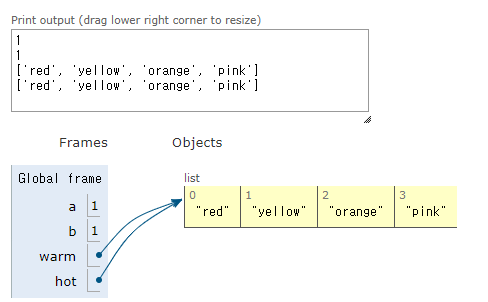
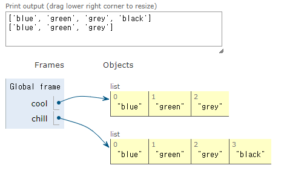
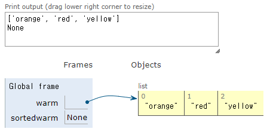
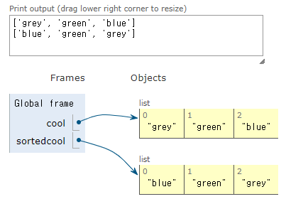
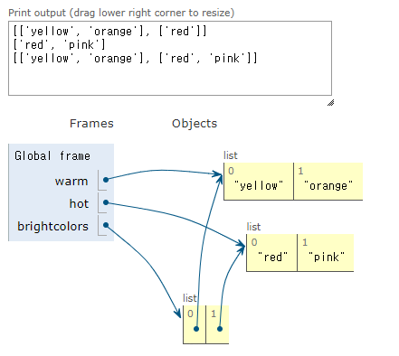

= Module 05: Tuple, List, Aliasing, Mutability, Cloning

== 지난 시간
* 함수
* decomposition(분해) - 구조 생성
* abstraction(추상화) - 상세를 숨김
* 앞으로는 함수를 많이 사용합니다

== 오늘
* 변수 타입: `int, float, bool, string`
* **compound data type(복합 데이터 타입)** 소개
** tuples
** lists
* aliasing 개념
* mutabliltiy 개념
* cloning 개념

== tuples

* 순서가 지정된 요소들의 순서로, 여러 타입의 요소가 있을 수 있음
* 요소 값을 변경할 수 없음. **immutable**
* 괄호로 표현

[source, python]
----
te = ()     # empty tuple
t = (2, "mit", 3)
t[0]                    -> 2
(2, "mit", 3) + (5, 6)  -> (2, "mit", 3, 5, 6)
t[1:2]
t[1:3]
len(t)
t[1] = 4
----

== tuples

* 변수 값을 `swap(교환)` 하는데 편리하게 사용

[source, python]
----
x = y
y = x

temp = x
x = y
y = temp

(x, y) = (y, x)
----

* 함수에서 `하나 이상의 값을 return` 하는데 사용

[source, python]
----
def quotient_and_reminder(x, y):
    q = x // y  # integer division
    r = x % y
    return (q, r)
(quot, rem) = quotient_and_reminder(4, 5)
----

== tuple 채우기

* tuple을 **iterate(반복)** 할 수 있음

[source, python]
----
def get_data(aTuple):
    nums = ()   # empty tuple
    words = ()
    for t in aTuple:
        nums = nums + (t[0], )  # singleton tuple
        if t[1] not in words:
            words = words + (t[1],)
    min_n = min(nums)
    max_n = max(nums)
    unique_words = len(words)
    return (min_n, max_n, unique_words)
----

== list

* index를 통해 접근 가능한 **순서화된 일련의** 정보
* list는 **square brakets(대괄호)**로 표시됨
* list에는 **element(요소)**가 포함됨
** 일반적으로 같은 유형의 요소
** 여러 타입의 요소를 추가할 수 있음(일반적이지 않음)
* list의 요소가 변경될 수 있으므로 list는 **변경가능(mutable)**

== indices and ordering

[source, python]
----
a_list = [] # empty list
L = [2, 'a', 4, [1,2]]
len(L)  # 4
L[0]    # 2
L[2] + 1    # 5
L[3]    # [1, 2], 다른 리스트
L[4]    # error

i = 2
L[i - 1]    # 'a'
----

== 요소 변경

* list는 mutable(가변)
* 인덱스로 list의 각 요소에 값을 할당

[source, python]
----
L = [2,1,3]
L[1] = 5
----

* L은 같은 객체 L에 대해 [2,5,3]의 요소를 가짐

== Iterating over a list

* list의 요소 값의 합을 계산
* 일반적인 패턴, list 요소를 순회

[source, python]
----
total = 0
for i in range(len(L)):
    total += L[i]
print(total)
----

[source, python]
----
total = 0
for i in L:
    total += i
print(total)
----

* 경고
** list 요소들은 0에서 len(L) - 1 까지로 인덱싱 됨
** `range(n)` 은 0에서 n - 1까지; 반복함

== list의 동작 - add

* **add** L.append(element)로 리스트에 요소를 더함
* list가 **바뀜**

[source, python]
----
L = [2,1,3]
L.append(5) -> L is now [2,1,3,5]
----

* What is dot?
** list는 Python 객체이고, Python의 모든 항목은 객체
** 객체에는 데이터가 존재함
** 객체에는 메소드와 함수가 존재함
** object_name.do_something()을 통해 이 정보에 액세스
** 이에 대해서는 나중에 자세히

== list의 동작 - add

* **concatenation(접합)**을 사용하여 리스트를 결합할 수 있음 + 연산자는 새 리스트를 만들어 전달
* L.extend(some_list)를 사용하여 리스트를 **변경**

[source, python]
----
L1 = [2,1,3]
L2 = [4,5,6]
L3 = L1 + L2        -> L3는 [2,1,3,4,5,6]. L1과 L2는 그대로
L1.extend([0,6])    -> L1은 [2,1,3,0,6]
----

== list의 동작 - remove

* `del(L[index])` 를 사용하여 **지정된 인덱스**의 요소를 삭제
* `L.pop()` 를 사용해 list의 가장 **마지막 요소**를 삭제, 삭제되는 요소를 반환
* `L.remove(element)` 를 사용해 **지정된 요소**를 삭제
** 요소를 찾아 제거
** 같은 요소가 여러 개일 경우 첫 번째 발견되는 요소를 제거
** 요소가 목록에 없으면 오류 발생

[source, python]
----
L = [2,1,3,6,3,7,0] # do below in order
L.remove(2)     # L이 변경됨 L = [1,3,6,3,7,0]
L.remove(3)     # L이 변경됨 L = [1,6,3,7,0]
del(L[1])       # L이 변경됨 L = [1,3,7,0]
L.pop()         # 0을 반환하고 L이 변경됨 L = [1,3,7]
----

== list를 string으로 변환, string을 list로 변환

* `list(s)` 를 사용하여 **string을 list로 변환**, string s 모든 문자열이 L의 요소가 된 list를 반환
* `s.split()` 을 사용하여 **character parameter 따라 문자열을 분할** 할 수 있음, parameter가 없으면 space(공백)으로 분할됨
* `.join(L)` 을 사용하여 **character 목록을 list로 변환**, 모든 요소 사이에 문자를 추가하기 위해 " " 로 묶인 문자를 제공할 수 있음

[source, python]
----
s = "I<3 cs"    # s는 string
list(s)         # ['I', '<', '3', ' ', 'c', 's'] 를 반환
s.split('<')    # ['I', '3 cs'] 반환
L = ['a', 'b', 'c']
''.join(L)      # 'abc' 반환
"_".join(L)     # 'a_b_c' 반환
----

== 다른 list 동작

* sort() 와 sorted()
* reverse()
* more
https://docs.python.org/3/tutorial/datastructures.html

[source, python]
----
L = [9,6,0,3]
sorted(L)       # 정렬된 새 list를 반환, L은 변동 없음
L.sort()        # L이 변경됨 L = [9,6,3,0]
L.reverse()     # L이 변경됨 L = [0,3,6,9]
----

== Mutation, Aliasing, Cloning

* Important and Tricky!

Again, Python Tutor is your best friend to hep sort this out!

http://www.pythontutor.com

== list in memory

* list는 **mutable**
* 메모리에 있는 객체
* 변수 이름은 객체를 가리킴
* 해당 객체를 가리키는 모든 변수가 영향을 받음
* list 작업시 **side effects**부작용에 주의해야 함

== 비유

* 한 사람의 attributes(속성)
** singer, rich
* justin bieber는 많은 이름을 가지고 있음
* 모든 nickname의 핵심은 **같은 사람** 이라는 것
** 하나의 nickname에 새로운 속성을 추가
** 모든 nickname은 이전 속성과 모든 새로운 속성을 참조

== aliases

* `hot` 은 `warm` 의 **alias** - 하나를 변경하면 다른 것이 변경됨!
* `append()` 는 부작용을 낳음

[source, python]
----
a = 1
b = a
print(a)
print(b)
warm = ['red', 'yellow', 'orange']
hot = warm
hot.append('pink')
print(hot)
print(warm)
----

== list 복제

* `chill = cool[:]` 을 사용하여 새 list를 만들고 모든 요소를 복사

[source, python]
----
cool = ['blue','green','grey']
chill = cool[:]
chill.append('black')
print(chill)
print(cool)
----

== list 정렬

* `sort()` 는 list를 **변경**하고, 아무것도 반환하지 않음
* `sorted()` 는 list를 **변경하지 않고**, 결과를 변수에 반드시 할당해야 함

[source, python]
----
warm = ['red', 'yellow', 'orange']
sortedwarm = warm.sort()
print(warm)
print(sortedwarm)
----

[source, python]
----
cool = ['grey','green','blue']
sortedcool = sorted(cool)
print(cool)
print(sortedcool)
----

== list의 list의 list의 list...

* **nested(포함된)** 리스트를 가질 수 있음
* 변환 후 여전히 부작용이 있을 수 있음

[source, python]
----
warm = ['yellow', 'orange']
hot = ['red']
brightcolors = [warm]
brightcolors.append(hot)
print(brightcolors)
hot.append('pink')
print(hot)
print(brightcolors)
----

== 변경과 반복
**Python tutor에서 수행할 것**

* list를 반복하면서 list를 변경하지 할 것

[source, python]
----
def remove_dups(L1, L2):
    for e in L1:
        if e in L2:
            L1.remove(e)

L1 = [1,2,3,4]
L2 = [1,2,5,6]

remove_dups(L1, L2)
----

[source, python]
----
def remove_dups(L1, L2):
    L1_copy = L1[:]
    for e in L1_copy:
        if e in L2:
            L1.remove(e)

L1 = [1,2,3,4]
L2 = [1,2,5,6]

remove_dups(L1, L2)
----

L1은 [3,4]가 아닌 [2,3,4]. 왜?
• Python은 내부 카운터를 사용하여 루프에 있는 인덱스를 추적함
• 변형하면 list 길이가 변경되지만 Python은 카운터를 업데이트하지 않음
• 루프는 요소 2를 볼 수 없음