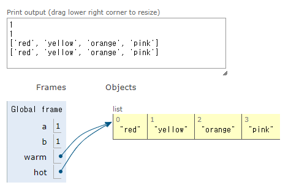
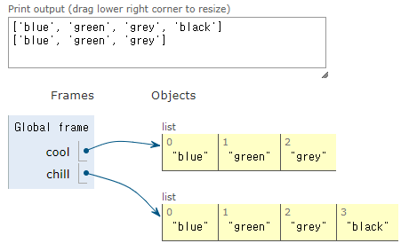
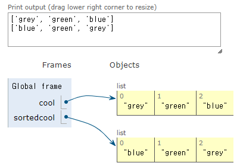

지난번에 수행한 작업을 빠르고 빠르게 요약합니다. 지난번에 우리는 분해와 추상화에 대한 아이디어를 소개했습니다. 그리고 우리는 그것을 프로그램에 넣기 시작했습니다. 이것은 일종의 높은 수준의 개념이었고 우리는 프로그램에서 함수라고 불리는 구체적인 것들을 사용하여 이를 달성했습니다. 그리고 함수를 사용하면 일관되고 구조가 있으며 재사용 가능한 코드를 만들 수 있었습니다. 좋아요.

그리고 앞으로는 문제집이나 강의에서 함수를 많이 활용하겠습니다. 따라서 작동 방식과 모든 세부 사항을 이해했는지 확인하십시오. 그래서 오늘은 두 가지 새로운 데이터 유형을 소개하겠습니다. 그리고 실제로는 다른 데이터 유형, 특히 int, float, Boolean 및 string으로 구성된 데이터 유형이기 때문에 복합 데이터 유형이라고 합니다. 실제로 이것들뿐만 아니라 다른 데이터 유형도 마찬가지입니다. 이것이 바로 복합 데이터 유형이라고 불리는 이유입니다.

그래서 우리는 튜플이라는 새로운 데이터 유형과 리스트라는 새로운 데이터 유형을 살펴보겠습니다. 그런 다음 우리는 구체적으로 list와 관련된 아이디어에 대해 이야기할 것입니다. 괜찮은. 그럼 바로 튜플로 들어가 보겠습니다. 따라서 문자열을 떠올려 보면 문자열은 문자의 시퀀스였습니다. 튜플은 단순히 문자의 시퀀스가 ​​아니라 무엇이든 시퀀스가 ​​될 수 있다는 점을 제외하면 무언가의 시퀀스가 ​​된다는 점에서 문자열과 유사합니다. 이는 모든 유형의 데이터가 포함될 수 있는 데이터 모음입니다.

따라서 튜플에는 정수, 부동 소수점, 문자열 등의 요소가 포함될 수 있습니다. 튜플은 변경할 수 없습니다. 그리고 기억하시면, 우리는 문자열에 대해 이야기할 때 이 단어에 대해서도 조금 이야기했습니다. 즉, 튜플 개체를 만든 후에는 수정할 수 없습니다. 따라서 문자열 개체를 만들 때 이를 수정할 수 없습니다.

== tuples
* 순서가 지정된 요소들의 순서로, 여러 타입의 요소가 있을 수 있음
* 요소 값을 변경할 수 없음. immutable
* 괄호로 표현

[source, python]
----
te = ()
t = (2, "mit", 3)
t[0]                    -> 2
(2, "mit", 3) + (5, 6)  -> (2, "mit", 3, 5, 6)
t[1:2]
t[1:3]
len(t)
t[1] = 4
----

따라서 우리가 튜플을 만드는 방법은 이러한 여는 괄호와 닫는 괄호를 사용하는 것입니다. 이것을 함수와 혼동해서는 안 됩니다. 왜냐하면 아무것도 없기 때문입니다. 이것은 함수 호출이 아닙니다. 그것은 튜플을 표현하는 방법입니다. 함수 호출의 경우 괄호 바로 앞에 뭔가가 있을 것입니다. 이것이 바로 우리가 튜플을 표현하기로 선택한 방법입니다. 그리고 그냥 열고 닫는 괄호는 빈 튜플을 나타냅니다. 따라서 길이는 0입니다. 그 안에는 아무것도 없습니다.

각 요소를 쉼표로 구분하여 일부 요소를 포함하는 튜플을 만들 수 있습니다. 따라서 이 경우에는 세 개의 요소를 포함하는 변수 t로 액세스할 수 있는 튜플입니다. 첫 번째는 정수, 두 번째는 문자열, 세 번째는 또 다른 정수입니다. 문자열과 마찬가지로 튜플을 색인화하여 특정 색인의 값을 찾을 수 있습니다. 따라서 이것을 위치 0의 t로 읽습니다. 따라서 위치 0의 변수 t로 표현된 튜플은 2로 평가됩니다. 왜냐하면 컴퓨터 과학에서는 다시 0부터 세기 시작하기 때문입니다. 그래서 그것은 우리에게 첫 번째 요소를 제공합니다.

문자열과 마찬가지로 튜플도 서로 연결할 수 있습니다. 그것은 단지 그것들을 함께 추가한다는 것을 의미합니다. 따라서 이 두 개의 튜플을 함께 추가하면 그 두 개만 있는 하나의 더 큰 튜플을 얻게 됩니다. 즉, 해당 튜플의 요소는 하나의 더 큰 튜플에 함께 모이게 됩니다. 다시 말하지만, 문자열과 마찬가지로 튜플로 나눌 수 있습니다. 따라서 인덱스 1에서 인덱스 2까지 t를 슬라이싱합니다. 기억하세요. 이 정지 지점에서 1을 뺀 지점까지 이동합니다. 따라서 이는 튜플 내부에 하나의 요소만 제공합니다.

[source, python]
----
t[1:2]
----

----
("mit", )
----

그리고 이것은 실수가 아닙니다. 여기에 있는 이 추가 쉼표는 실제로 튜플 개체를 나타냅니다. 여기에 이 ​​쉼표가 없다면 이것은 단지 문자열일 뿐입니다. 괄호는 단지-- 실제로 어떤 차이도 만들지 않을 것입니다. 그러나 여기의 쉼표는 이것이 요소가 하나만 있는 튜플이라는 것을 Python에게 분명히 보여줍니다.

우리는 두 개의 요소를 가진 튜플을 얻기 위해 더 멀리 분할할 수 있습니다. 그리고 우리는 튜플의 길이를 구하는 것과 같은 일반적인 작업을 수행할 수 있습니다. 즉, 내 튜플에 몇 개의 요소가 있습니까? 그리고 이 t의 len은 3으로 평가됩니다. 왜냐하면 튜플 내부에 세 개의 요소가 있기 때문입니다. 각 요소는 다시 쉼표로 구분됩니다.

그리고 문자열과 마찬가지로 튜플 내부의 값을 변경하려고 하면 -- 이 경우에는 두 번째 요소의 값을 4로 변경하려고 했습니다. -- 튜플은 변경할 수 없기 때문에 Python에서는 이를 허용하지 않습니다.

[source, python]
----
x = y
y = x

temp = x
x = y
y = temp

(x, y) = (y, x)
----

그렇다면 왜 튜플을 사용하고 싶을까요? 튜플은 실제로 몇 가지 다른 시나리오에서 유용합니다. 몇 년 전, 우리는 변수 x와 y의 값을 바꾸려고 시도한 이 코드를 살펴보았습니다. 그리고 이 첫 번째 코드는 x 값을 덮어쓰기 때문에 실제로 작동하지 않았습니다. 그래서 대신에 우리가 한 일은 x 값을 저장하는 임시 변수를 만들고 이를 덮어쓴 다음 임시 변수를 사용하는 것이었습니다. 글쎄요, 바로 여기 있는 이 세 개의 라이너 코드는 실제로 튜플을 사용하여 한 줄로 작성할 수 있다는 것이 밝혀졌습니다. 그래서 당신은 x 쉼표 y가 y 쉼표 x와 같다고 말합니다. 그리고 Python이 들어가서 말합니다. y의 값은 무엇입니까? 그리고 그것을 x에 할당합니다. 그러면 x의 값은 무엇입니까? 그리고 그것을 y에 할당합니다.

이를 확장하면 실제로 튜플을 사용하여 함수에서 둘 이상의 값을 반환할 수 있습니다. 따라서 함수에서는 하나의 객체만 반환할 수 있습니다. 따라서 둘 이상의 객체를 반환하는 것은 허용되지 않습니다. 그러나 튜플 객체를 사용하고 그것이 우리가 반환하는 것이라면 실제로 튜플 객체 내부에 원하는 만큼 많은 값을 넣어 이러한 종류의 규칙을 피할 수 있습니다. 그런 다음 원하는 만큼 많은 값을 반환할 수 있습니다.

따라서 이 특정 예에서는 x를 y로 나눌 때 몫과 나머지를 계산하려고 합니다. 이것이 함수 정의입니다. 그리고 여기 아래에서는 4와 5를 사용하여 함수를 호출합니다. 따라서 함수 호출을 하면 4는 x에 할당되고 5는 y에 할당됩니다. 그러면 q는 x를 y로 나눌 때 정수 나누기가 될 것입니다. 그리고 이 이중 슬래시는 단지 결과를 정수로 캐스팅하는 것과 같습니다. 나누어서 정수 부분만 유지하고 소수점 이하 나머지는 모두 삭제하라는 내용입니다.

[source, python]
----
def quotient_and_reminder(x, y):
    q = x // y
    r = x % y
    return (q, r)
(quot, rem) = quotient_and_reminder(4, 5)
----

그래서 4를 5로 나누면 이 q는 실제로 0이 될 것입니다. 왜냐하면 그것은 0점이기 때문이고 저는 점에 대해 신경쓰지 않습니다. 나머지는 백분율 연산자를 사용하는 것입니다. 그래서 4를 5로 나누면 나머지는 4가 됩니다. 그리고 제가 함수 내에서 계산한 두 값인 q와 r을 반환한다는 점에 주목하세요. 그리고 나는 이 튜플의 맥락에서 그것들을 반환할 것입니다. 그래서 저는 튜플인 하나의 객체만 반환합니다. 우연히 그 객체를 몇 가지 다른 값으로 채우게 되었습니다.

따라서 함수가 여기에서 반환되면 0 쉼표 4가 됩니다. 이것이 반환할 튜플입니다. Q는 0이 될 것이고 r은 4가 될 것입니다. 그러면 여기 있는 이 줄은 -- quot, rem은 0, 4와 같습니다 -- 기본적으로 이것은 우리가 여기서 한 것과 비슷합니다. 그래서 quot를 4에 할당합니다. 죄송합니다. Quot는 0이고 rem은 4입니다. 따라서 튜플을 사용할 수 있습니다. 이것은 매우 유용합니다. 함수에서 둘 이상의 값을 반환하는 데 이를 사용할 수 있습니다.

그래서 튜플은 훌륭합니다. 처음에는 약간 혼란스러워 보일 수도 있지만 데이터 컬렉션을 보관하기 때문에 실제로는 꽤 유용합니다. 그래서 여기서는 모든 데이터 세트에 적용할 수 있는 함수를 작성했습니다. 그리고 이 함수가 무엇을 하는지 설명하고 이를 일부 데이터에 적용할 수 있습니다. 그리고 우연히 수집한 데이터 세트에서 매우 기본적인 정보를 추출할 수 있다는 것을 알 수 있습니다.

== tuple 채우기

* tuple을 **iterate(반복)** 할 수 있음

[source, python]
----
# aTuple: ((ints, strings), (ints, strings), (ints, string))
def get_data(aTuple):
    nums = ()
    words = ()
    for t in aTuple:
        nums = nums + (t[0], )
        if t[1] not in words:
            words = words + (t[1],)
    min_n = min(nums)
    max_n = max(nums)
    unique_words = len(words)
    return (min_n, max_n, unique_words)
----

여기에 get_data라는 함수가 있습니다. 이 함수는 여기서 모든 작업을 수행합니다. 그리고 강의와 관련된 실제 코드에서 실제로 튜플의 조건이 무엇인지 말씀드렸습니다. 그래서 그것은 특정한 것의 튜플이어야 합니다. 그것은 특정한 방식으로 보입니다. 그리고 이것이 바로 보여야 하는 방식입니다.

그래서 그것은 하나의 튜플입니다. 여기 바깥쪽 괄호는 그것이 튜플이라는 사실을 나타냅니다. 그리고 이 튜플의 요소는 실제로 다른 튜플입니다. 따라서 첫 번째 요소는 튜플 개체이고, 두 번째 요소는 튜플 개체이고, 세 번째 요소는 튜플 개체입니다. 그리고 이러한 내부 튜플 개체 각각은 실제로 두 개의 요소를 포함하게 됩니다. 첫 번째 요소는 정수이고 두 번째 요소는 문자열입니다.

이것이 바로 이 함수가 실제로 작동하기 전에 튜플에 대해 가정하는 일종의 전제 조건입니다. 괜찮은. 그러면 이와 같은 튜플이 주어지면 함수는 무엇을 하게 될까요? 먼저 두 개의 빈 튜플을 생성합니다. 하나는 숫자(nums)라고 하고 다른 하나는 단어(words)라고 합니다. 그리고 for 루프가 있습니다. 여기서 for 루프는 튜플 내부의 모든 요소를 ​​반복한다는 점에 주목하세요. 문자열에서 인덱스가 아닌 문자를 직접 반복하는 for 루프를 사용할 수 있었던 때를 기억하시나요? 음, 우리는 여기서도 같은 일을 하고 있습니다. 인덱스를 반복하는 대신 각 위치의 튜플 객체를 반복할 것입니다.

따라서 처음으로 루프를 통과하면 여기에 첫 번째 튜플이 있게 됩니다. 루프를 두 번째로 통과하면 t는 이 튜플이 됩니다. 그리고 세 번째로, 그것은 바로 이 튜플 객체가 될 것입니다. 그래서 루프를 통과할 때마다 제가 하는 일은 계속해서 추가할 숫자 튜플을 갖게 되는 것입니다. 그리고 매번 새로운 객체를 생성하고 이를 이 변수 ​​nums에 다시 할당할 것입니다. 그리고 루프를 돌 때마다 이전 nums 값이 무엇인지 살펴봅니다. 그렇다면 나의 이전 튜플은 무엇이었나요? 그리고 나는 그것을 이 싱글턴 튜플로 추가할 것입니다. 따라서 이는 하나의 문자 또는 하나의 요소로 구성된 튜플입니다. 이 요소는 위치 0에 t입니다.

따라서 이것이 어떻게 작동하는지에 대해 마음을 포장해야 합니다. 따라서 t가 바로 여기 있는 이 튜플 요소가 될 경우 위치 0의 t는 여기의 파란색 막대가 됩니다. 따라서 이는 튜플의 정수 부분을 나타냅니다.

[source, python]
----
nums = nums + (t[0],)
----

따라서 루프를 진행하면서 이 nums는 튜플 객체 내부의 모든 튜플에 있는 모든 정수로 채워지게 됩니다. 이것이 기본적으로 여기 이 줄이 하는 일입니다. 동시에 나는 이 단어 튜플도 채우고 있습니다. 그리고 튜플이라는 단어는 약간 다릅니다. 왜냐하면 저는 이러한 문자열 개체를 모두 추가하는 것이 아니기 때문입니다. 따라서 위치 1은 내부 튜플의 문자열 부분입니다.

[source, python]
----
if t[1] not in words:
    words = words + (t[1],)
----

실제로 내 단어 list에 아직 없는 경우에만 문자열 부분을 추가하고 있습니다. 따라서 여기서는 기본적으로 내 list에서 고유한 문자열을 모두 가져옵니다.

마지막 종류의 세 줄, 여기 세 줄, 네 줄은 약간의 산술을 수행하여 '좋아, 이제 여기에 모든 숫자가 있습니다. 이 중에서 최소값은 얼마이고, 최대값은 얼마입니까?'라고 말합니다. 이것들 중? 그리고 이 고유 단어 변수는 원래 튜플에 고유 단어가 몇 개 있는지 알려줍니다.

이것은 일종의 일반적인 느낌이 들므로 일부 데이터에 대해 실행해 보겠습니다. 그래서 여기에 있습니다. 일부 테스트 데이터에서 테스트했습니다. 그리고 실제 데이터를 얻었습니다. 그리고 제가 분석하고 싶었던 실제 데이터는 Taylor Swift 데이터였습니다. 그리고 연도를 나타내는 튜플의 정수 부분과 해당 연도에 대한 노래를 쓴 사람을 나타내는 튜플의 문자열 부분을 나타냅니다.

[source, python]
----
test = ((1, "a"), (2, "b"),
        (1, "a"), (7, "b"))
(a, b, c) = get_data(test)
print(a, b, c)
----

여기에서 우리가 작업하고 있는 실제 데이터가 있습니다. 우리가 이 정보를 아는 것이 매우 중요합니다. 좋아요. 따라서 이 데이터를 사용하여 실행할 수 있습니다. 여기에 작성한 이 함수에 연결할 수 있습니다. 그리고 실제로 이것을 주석으로 처리하여 내용이 복잡해지지 않도록 할 것입니다. 그리고 실행하면, 이것이 제가 함수를 호출하는 부분입니다.

[source, python]
----
tswift = ((2014, "Katy"),
          (2014, "Harry"),
          (2012, "Jake"),
          (2010, "Taylor"),
          (2008, "Joe"))
(min_year, max_year, num_people) = get_data(tswift)
print("From", min_year, "to", max_year, "Taylor Swift wrote songs about", num_people)
----

나는 여기서 이 데이터를 가지고 그것을 부르고 있습니다. tswift는 튜플의 튜플입니다. 그리고 제가 돌려받는 것은 -- 여기, 38번째 줄 -- 큰 튜플이 되는 함수로부터의 반환입니다. 그리고 그 큰 튜플을 내 프로그램의 내 튜플에 할당합니다. 그리고 나서 저는 그냥 글을 쓰고 있습니다. 여기에 진술문을 인쇄해 보겠습니다.

그래서 최소 연도, 최대 연도, 그리고 인원수를 구하게 됩니다. 따라서 이 이름 중 하나를 여기에 이미 있는 다른 이름으로 바꾸면 작동한다는 것을 보여 드릴 수 있습니다. 그래서 다섯 사람에 대한 노래를 쓰는 게 아니라 네 사람에 대한 노래를 썼을 거예요. 예, 효과가 있었습니다.

== list

* index를 통해 접근 가능한 순서화된 정보
* list는 square brakets(대괄호)로 표시됨
* list에는 element(요소)가 포함됨
** 일반적으로 같은 유형의 요소
** 여러 타입의 요소를 추가할 수 있음(일반적이지 않음)
* list의 요소가 변경될 수 있으므로 list는 변경가능

이것이 튜플입니다. 그리고 기억하거나 기억하세요. 튜플은 불변이라는 점을 명심하세요. 이제 우리는 list라고 불리는 튜플과 매우 유사한 데이터 구조를 살펴보겠습니다. 단, list이 immutable이 아니고, 변경 가능한 객체(mutable)가 된다는 점만 다릅니다. list과 마찬가지로 모든 유형의 요소나 모든 유형의 객체가 포함됩니다. 당신은 그것을 표시합니다. 괄호 대신 대괄호로 list을 표시합니다. 그리고 차이점은 불변 객체가 아니라 불변 객체가 될 것이라는 점입니다.

== indices and ordering

[source, python]
----
a_list = []
L = [2, 'a', 4, [1,2]]
len(L)
L[0]
L[2] + 1
L[3]
# L[4]
i = 2
L[i - 1]
----

따라서 빈 list을 만들려면 닫는 대괄호를 열기만 하면 됩니다. 다양한 유형의 요소 list, 심지어 list의 list도 가질 수 있습니다. 따라서 요소 중 하나는 list의입니다. 평소와 같이 list의에 길이를 적용하면 list의에 요소가 몇 개 있는지 알 수 있습니다. 이것은 list의에 몇 개의 요소가 있는지 알려줄 것입니다. 그래서 그 이상은 보지 않을 것입니다. 그래서 이것은 정수, 이것은 문자열, 이것은 정수, 이것은 list의라고 말할 것입니다. 이 list의에 몇 개의 요소가 있는지는 밝히지 않습니다. 그것은 단지 외부, 즉 요소들의 껍질을 살펴볼 것입니다.

인덱싱과 슬라이싱은 동일한 방식으로 작동합니다. 따라서 위치 0의 l은 값 2를 제공합니다. list에 색인을 추가한 다음 반환된 값으로 작업을 수행할 수 있습니다. 그래서 나는 위치 2에 이렇게 말합니다. 이것이 바로 이 값이고 거기에 1을 더하는 것입니다. 위치 3의 L이 여기에 있는 list의이 됩니다. 다른 list의으로 평가됩니다.

list의 길이를 벗어나는 색인을 생성할 수 없습니다. 그러면 요소가 4개뿐이므로 오류가 발생합니다. 또한 인덱스에 대한 표현식을 사용할 수도 있습니다. 그래서 이것은-- Python은 여기서 i를 2로 대체하고 말합니다. 위치 1에 있는 l은 무엇입니까? 그리고 거기에서 그걸 잡아요.

== 요소 변경

* list는 mutable(가변)
* 인덱스로 list의 각 요소에 값을 할당

[source, python]
----
L = [2,1,3]
L[1] = 5
----

* L은 같은 객체 L에 대해 [2,5,3]의 요소를 가짐

좋아요. 따라서 문자열과 튜플에서 본 작업 종류와 매우 유사합니다. 한 가지 차이점(이 수업의 나머지 부분에서 우리가 집중할 내용)은 list가 변경 가능한 개체라는 것입니다. 그렇다면 내부적으로는 무엇을 의미합니까? 내부적으로는 list의 l이 있고 이를 할당한다고 가정해 보겠습니다. 죄송합니다. 2, 1, 3이라는 세 가지 요소가 있는 list를 가리키는 변수 l이 있다고 가정해 보겠습니다.

좋아요. 그것들은 모두 - 각 요소는 정수입니다. 튜플이나 문자열을 다룰 때 재할당을 하면 -- 바로 여기서 이 줄을 수행하려고 하면 오류가 발생합니다. 그러나 이것은 실제로 list에서는 허용됩니다. 따라서 해당 줄을 실행하면 Python은 중간 요소를 살펴보고 해당 값을 1에서 5로 변경합니다. 이는 list의 가변성 특성 때문입니다.

따라서 이 list 변수, 원래 이 list을 가리키는 변수 l이 정확히 동일한 list을 가리킨다는 점에 유의하세요. 우리는 메모리에 새로운 객체를 생성하지 않았습니다. 우리는 단지 메모리에 있는 동일한 객체를 수정하고 있을 뿐입니다. 그리고 이것을 가지고 있을 때 발생할 수 있는 몇 가지 부작용을 살펴보면서 이것이 왜 중요한지 알게 될 것입니다.

그래서 저는 이것을 이전에 몇 번 말했지만, 요소를 직접 반복하는 것에 대해 생각하려고 하면 list를 반복하려고 할 때 생각해보면 여러분의 삶이 훨씬 더 쉬워질 것입니다. 훨씬 더 Pythonic합니다. 나는 이전에 그 단어를 사용한 적이 있습니다.

따라서 이것은 list 요소를 직접 반복하는 위치를 보게 될 일종의 일반적인 패턴입니다. 우리는 튜플을 통해 이를 수행했습니다. 우리는 문자열을 통해 이를 수행했습니다. 그래서 이것들은 동일한 코드입니다. 왼쪽에서 0, 1, 2, 3 등을 거쳐가는 것을 제외하면 그들은 똑같은 일을 합니다. 그런 다음 요소 값을 얻기 위해 이러한 숫자 각각에 대한 색인을 생성합니다. 반면 오른쪽에서는 이 루프 변수 i가 요소 값 자체를 갖게 됩니다. 그래서 오른쪽의 코드가 훨씬 깔끔해졌습니다.

== list의 동작 - add

* `add` L.append(element)로 리스트에 요소를 더함
* list가 바뀜

[source, python]
----
L = [2,1,3]
L.append(5) -> L is now [2,1,3,5]
----

좋아요. 이제 list에서 수행할 수 있는 몇 가지 작업을 살펴보겠습니다. 예를 들어 튜플이나 문자열에서 수행할 수 있는 것보다 가변성 측면으로 인해 list에서 수행할 수 있는 작업이 훨씬 더 많습니다. 여기에 그 중 몇 가지가 있습니다. 그리고 그들은 이 가변성 개념을 활용할 것입니다. 따라서 우리는 이 펑키한 표기법 L.append를 사용하여 list 끝에 직접 요소를 추가할 수 있습니다. 그리고 마지막에 추가하려는 요소입니다. 그리고 이 작업은 list를 변경합니다.

따라서 L이 2, 1, 3과 같고 요소 5를 끝에 추가하면 L-- 동일한 L은 동일한 객체를 가리킬 것입니다. 단, 끝에 추가 숫자가 있을 것입니다. 끝. 5. 그런데 이제 이 점은 무엇일까요? 우리는 전에 이것을 실제로 본 적이 없습니다. 그리고 지금부터 몇 번의 강의를 통해 그것이 무엇을 의미하는지 분명해질 것입니다. 하지만 지금은 이 점을 연산으로 생각할 수 있습니다. 적용하는 함수가 특정 유형의 개체에만 작동할 수 있다는 점을 제외하면 함수를 적용하는 것과 같습니다.

따라서 이 경우에는 예를 들어 추가가 우리가 적용하려는 함수입니다. 그리고 우리는 그것을 점 앞에 있는 것, 즉 객체에 적용하고 싶습니다. 예를 들어 추가는 list 개체와 함께 작동하도록 정의되었으므로 이 경우 점을 사용하는 것입니다. 예를 들어, 정수에 추가 기능을 사용할 수 없습니다. 왜냐하면 해당 종류의 함수가 정수에 정의되어 있지 않기 때문입니다.

따라서 지금은 점과 함께 작동하는 함수와 [? ln, ?] 점이 없습니다. 하지만 몇 번의 강의를 통해 그 내용이 훨씬 더 명확해질 것이라고 약속합니다. 따라서 지금은 점 앞에 있는 것은 함수를 적용할 객체이고, 점 뒤에 있는 것은 객체에 적용할 함수라고 생각하면 됩니다.

== list의 동작 - add

* `add` L.append(element)로 리스트에 요소를 더함
* list가 바뀜

[source, python]
----
L = [2,1,3]
L.append(5) -> L is now [2,1,3,5]
----

* What is dot?
** list는 Python 객체이고, Python의 모든 항목은 객체
** 객체에는 데이터가 존재함
** 객체에는 메소드와 함수가 존재함
** object_name.do_something()을 통해 이 정보에 액세스
** 이에 대해서는 나중에 자세히

== list의 동작 - add

* concatenation(접합)을 사용하여 리스트를 결합할 수 있음 + 연산자는 새 리스트를 만들어 전달
* L.extend(some_list)를 사용하여 리스트를 변경

[source, python]
----
L1 = [2,1,3]
L2 = [4,5,6]
L3 = L1 + L2        -> L3는 [2,1,3,4,5,6]. L1과 L2는 그대로
L1.extend([0,6])    -> L1은 [2,1,3,0,6]
----

따라서 list 끝에 항목을 추가할 수 있습니다. 더하기 연산자를 사용하여 list를 결합할 수도 있습니다. 더하기 연산자는 list를 변경하지 않습니다. 대신, 두 list을 합친 새로운 list를 제공합니다. 따라서 이 경우 L1이 2,1,3이고 L2가 4, 5, 6인 경우 두 list를 함께 추가하면 L1과 L2는 동일하게 유지되는 완전히 새로운 list가 제공됩니다. 이것이 바로 우리가 추가 결과를 새로운 list에 할당해야 하는 이유입니다. 그렇지 않으면 결과가 손실됩니다.

list를 직접 변경하고 다른 list 내의 요소에 따라 list를 더 길게 만들고 싶다면 이 확장 기능이나 범위 방법을 사용할 수 있습니다. 그리고 이것은 L1을 직접적으로 변형시킬 것입니다. 따라서 L1이 2,1,3인 경우 list 0,6으로 확장하면 0,6을 L1에 직접 추가하게 됩니다. 따라서 L1이 돌연변이되었음을 확인하세요.

== list의 동작 - remove

* `del(L[index])` 를 사용하여 지정된 인덱스의 요소를 삭제
* `L.pop()` 를 사용해 list의 가장 마지막 요소를 삭제, 삭제되는 요소를 반환
* `L.remove(element)` 를 사용해 지정된 요소를 삭제
** 요소를 찾아 제거
** 같은 요소가 여러 개일 경우 첫 번째 발견되는 요소를 제거
** 요소가 list에 없으면 오류 발생

[source, python]
----
L = [2,1,3,6,3,7,0] # do below in order
L.remove(2)     # L이 변경됨 L = [1,3,6,3,7,0]
L.remove(3)     # L이 변경됨 L = [1,6,3,7,0]
del(L[1])       # L이 변경됨 L = [1,3,7,0]
L.pop()         # 0을 반환하고 L이 변경됨 L = [1,3,7]
----

이것이 list에 항목을 추가하는 것입니다. list에서 항목을 삭제할 수도 있습니다. 우리는 단지 list에 계속 추가하고 싶지 않습니다. 그러면 그 list이 매우 커질 것이기 때문입니다. 이제 list에서 일부 항목을 삭제하는 방법을 살펴보겠습니다. 몇 가지 방법이 있습니다. 첫 번째는 이 del 기능을 사용할 수 있습니다. 그리고 이것은 이 인덱스에 있는 요소를 list L에서 삭제한다는 의미입니다. 따라서 인덱스 0, 1, 2 또는 원하는 대로 요소를 삭제하려는 인덱스를 지정합니다.

list의 가장 오른쪽에 있는 요소만 삭제하려면 L.pop을 사용하세요. 특정 요소를 제거하려는 경우(list 어딘가에 숫자 5가 있음을 알고 이를 list에서 삭제하려는 경우) L.remove라고 말하고 제거할 요소를 말합니다. 그리고 그것은 단지 그것의 첫 번째 발생을 제거합니다. 따라서 list에 5가 2개 있으면 첫 번째 5만 제거됩니다.

그럼 이런 종류의 명령 순서를 살펴보겠습니다. 그래서 우리는 먼저 L이 여기 있는 긴 list과 같습니다. 그리고 저는 이러한 모든 작업이 우리 list을 변경하게 될 것이라는 점을 언급하고 싶습니다. 이것이 제가 이 설명을 여기에 쓴 이유입니다. 이 설명은 여러분이 이 작업을 순서대로 수행하고 있다고 가정합니다. 따라서 이 작업을 순서대로 수행하면 list가 변경될 것입니다. 그리고 list을 변경하는 경우 이 새로운 변경된 list으로 작업하고 있다는 점을 기억해야 합니다.

따라서 우리가 가장 먼저 하는 일은 list에서 2개를 제거하는 것입니다. 따라서 2를 제거하면 값이 2인 요소를 찾아서 list에서 제거한다는 의미입니다. 이것이 바로 여기서 첫 번째입니다. 따라서 우리에게 남은 list은 그 이후의 모든 것입니다. 그런 다음 list에서 3개를 제거하고 그 중 2개가 있는지 확인하려고 합니다. 여기에 3개가 있고 여기에 3개가 있습니다. 그래서 우리는 첫 번째 것, 즉 여기 있는 것만 제거하겠습니다. 따라서 우리에게 남은 list은 1,6,3,7,0입니다. 그런 다음 list L에서 위치 1의 요소를 삭제하겠습니다. 따라서 0부터 세기 시작하면 위치 1의 요소가 여기 있습니다. 그래서 우리는 그것을 제거했고 1, 3, 7, 0만 남게 되었습니다. 그런 다음 L.pop을 수행하면 가장 오른쪽에 있는 요소가 삭제됩니다. 그래서 list의 마지막에는 그것은 0입니다. 그러면 1, 3, 7만 남습니다. 그리고 L.pop은 L.pop의 반환 값이 제거된 값이 될 것이라고 알려주기 때문에 종종 유용합니다. 따라서 이 경우에는 0을 반환하게 됩니다.

하지만 저는 이 함수들 중 일부가 list를 변경한다는 점을 언급하고 싶습니다. 반환 값에 주의해야 합니다. 따라서 이것이 전부입니다. 이 모든 것을 반환 값에 주의하는 함수로 생각할 수 있습니다. 이것이 전부입니다. 여러분은 이 모든 것을 list에서 작동하는 함수로 생각할 수 있습니다. 다만 이 함수들이 하는 일은 list을 가져와서 수정하는 것뿐입니다. 그러나 함수로서 그들은 분명히 그것을 호출한 사람에게 무언가를 반환합니다. 그리고 종종 none이라는 값을 반환하기도 합니다.

예를 들어, L.remove 2를 수행하고 이를 인쇄하면 아무 것도 인쇄되지 않을 수 있습니다. 따라서 이 값을 변수에 할당하고 그것이 변경된 list가 될 것이라고 기대할 수는 없습니다. list이 변경되었습니다. 변경된 list은 여기에 전달된 list입니다. 이를 보여주는 몇 개의 슬라이드에서 한 가지 예를 살펴보겠습니다.

== list를 string으로 변환, string을 list로 변환

* `list(s)` 를 사용하여 string을 list로 변환, string s 모든 문자열이 L의 요소가 된 list를 반환
* `s.split()` 을 사용하여 string parameter 따라 문자열을 분할 할 수 있음, parameter가 없으면 space(공백)으로 분할됨
* `.join(L)` 을 사용하여 문자 list을 list로 변환, 모든 요소 가이에 문자를 추가하기 위해 " " 로 묶인 문자를 제공할 수 있음

[source, python]
----
s = "I<3 cs"    # s는 string
list(s)         # ['I', '<', '3', ' ', 'c', 's'] 를 반환
s.split('<')    # ['I', '3 cs'] 반환
L = ['a', 'b', 'c']
''.join(L)      # 'abc' 반환
"_".join(L)     # 'a_b_c' 반환
----

좋아요. 우리가 할 수 있는 또 다른 일은 데이터 작업을 할 때 종종 유용한데, list를 문자열로 변환한 다음 문자열을 list로 변환하는 것입니다. 때로는 list가 아닌 문자열로 작업하는 것이 유용할 수도 있고 그 반대의 경우도 마찬가지입니다. 따라서 여기 첫 번째 줄인 list s는 문자열을 가져와서 list로 캐스팅합니다. 예를 들어 float를 정수로 캐스팅할 때와 비슷합니다. 여기서는 list에 문자열을 캐스팅하는 것뿐입니다. 그리고 이 줄까지 그렇게 하면-- 그래서 이것이 당신의 여기라면-- list s를 할 때, 이것은 당신에게 list를 줄 것입니다-- 이렇게 생겼습니다-- s의 모든 단일 문자가 있을 곳이 될 것입니다 자체 요소입니다. 즉, 모든 문자는 문자열이 되고 쉼표로 구분되므로 공백도 포함됩니다.

list의 각 문자가 자체 요소가 되는 것을 원하지 않는 경우도 있습니다. 예를 들어 문장이 주어졌을 때 공백 사이의 모든 것이 자체 요소가 되도록 하고 싶을 때가 있습니다. 예를 들어, 그러면 문장의 모든 단어가 제공됩니다. 이 경우 분할을 사용하게 됩니다. 이 경우에는 보다 작음 기호를 분할했습니다. 하지만 다시 말하지만, 문장 예제를 수행하는 경우 공간을 분할하고 싶을 수도 있습니다. 따라서 이것은 여러분이 관심 있는 기호(이 경우에는 미만 기호) 사이의 모든 항목을 가져오고 list에서 별도의 요소로 설정하게 됩니다. 이것이 문자열을 list로 변환하는 방법입니다.

때로는 list가 주어졌을 때 이를 문자열로 변환하고 싶을 수도 있습니다. 이것이 바로 이 조인 방법이나 기능이 유용한 곳입니다. 따라서 이것은 빈 문자열입니다. 그래서 바로 open close quote 입니다. 공간 없음. 따라서 이것은 list의 모든 요소를 ​​하나로 결합합니다. 따라서 문자열 abc를 반환합니다. 그런 다음 원하는 캐릭터에 참여할 수 있습니다. 따라서 이 경우 밑줄로 조인할 수 있습니다. 따라서 list의 모든 요소 사이에 여기에 있는 모든 문자를 넣을 것입니다. 정말 유용한 기능이네요.

== 다른 list 동작

* sort() 와 sorted()
* reverse()
* more
https://docs.python.org/3/tutorial/datastructures.html

[source, python]
----
L = [9,6,0,3]
sorted(L)
L.sort()
L.reverse()
----

좋아요. list에 대해 수행할 수 있는 몇 가지 다른 작업(이것 역시 꽤 유용합니다)은 list를 정렬하고 list를 뒤집는 작업이며 Python 문서에 있는 수많은 다른 작업입니다. 따라서 두 정렬 list를 모두 정렬하고 정렬했지만 그 중 하나는 list를 변경하고 다른 하나는 변경하지 않습니다. 때로는 하나를 사용하는 것이 유용하고 때로는 다른 것을 사용하는 것이 유용합니다.

그래서 제가 이 list를 가지고 있다면 L은 9,6,0,3과 같습니다. 정렬된 -- L의 정렬된 버전을 제공한다고 생각할 수 있습니다. -- L의 정렬된 버전을 돌려줍니다. 그래서 새로운 결과를 반환합니다. 입력 list의 정렬된 버전이고 L을 변경하지 않는 list입니다. 따라서 L을 똑같은 방식으로 유지합니다. 따라서 이것은 정렬된 버전의 list로 대체되며, 이를 변수에 할당한 다음 원하는 대로 수행할 수 있습니다. 예를 들어 L2는 정렬된 L과 같습니다. 그리고 L은 동일하게 유지됩니다.

반면에 L을 변경하고 싶고 정렬된 다른 복사본을 얻는 데 관심이 없다면 L.sort를 수행하면 됩니다. 그러면 L이 자동으로 정렬됩니다. 이제 L은 L의 정렬된 버전입니다. 마찬가지로 reverse는 L을 가져와서 모든 문자, 즉 그 안의 모든 요소를 ​​반대로 합니다. 따라서 마지막 항목이 첫 번째 항목이고, 마지막에서 두 번째 항목이 두 번째 항목이 되는 식입니다.

== list in memory

* list는 **mutable**
* 메모리에 있는 객체
* 변수 이름은 객체를 가리킴
* 해당 객체를 가리키는 모든 변수가 영향을 받음
* list 작업시 **side effects**부작용에 주의해야 함

따라서 list은 변경 가능합니다. 우리는 이번 강의에서 그런 말을 여러 번 했습니다. 그런데 그게 정확히 무슨 뜻인가요? 그것은 어떤 의미를 갖고 있나요? 다시 한 번 강의의 다음 부분인 Pythontutor 입니다. 모든 코드를 붙여넣고 단계별로 진행하여 정확히 무슨 일이 일어나고 있는지 확인하세요. 따라서 list는 변경 가능합니다. 변수 이름이 있으므로(예를 들어 L은 일부 list와 동일) L은 메모리의 list을 가리킬 것입니다. 그리고 이 list는 변경 가능한 객체이기 때문에 메모리에서 정확히 동일한 객체를 가리키는 변수를 두 개 이상 가질 수 있습니다. 그리고 메모리에 있는 동일한 객체를 가리키는 변수가 두 개 이상인 경우, 메모리에 있는 해당 객체가 변경되면 이러한 변수 중 하나를 통해 해당 객체에 액세스하면 모두 변경된 객체 값을 제공하게 됩니다.

따라서 list을 다룰 때 명심해야 할 핵심 문구는 어떤 부작용이 발생할 수 있는가입니다. list을 변경하거나 list에 대한 작업을 수행하는 경우 부작용은 무엇입니까? 이 변경으로 인해 영향을 받을 수 있는 변수는 무엇입니까? 잠시 지구로 내려오자. 이것은 많은 사람들을 깨울 것입니다.

그럼 사람들에게 비유를 해보자. 사람이 있다고 가정 해 봅시다. 사람, 이 사건은 저스틴 비버(Justin Bieber)가 대상이 될 것입니다. 나는 물건이다. 나는 숫자 3과 같다. 비버는 물건이에요. 그 사람은 5번 같은 사람이에요. 다른 개체. 둘 다 유형의 사람들이었습니다.

좋아요. 사람이 다른 속성을 가지고 있다고 가정 해 봅시다. 우리가 할 수 있다고 가정해 봅시다. 그가 처음부터 두 가지 속성을 가지고 있다고 가정해 봅시다. 그 사람은 가수이고 부자예요. 나는 이 사람 개체를 다양한 이름으로 지칭할 수 있습니다. 그의 이름, 예명, 모든 팬걸들이 그를 부르는 이름, 그를 싫어하는 사람들은 여기에 올리지 않은 다른 이름으로 그를 부릅니다. 하지만 그는 이렇게 다양한 이름으로 알려져 있습니다. 이는 모두 동일한 사람 개체를 가리키는 별칭 또는 별명입니다.

== 비유

* 한 사람의 attributes(속성)
** singer, rich
* justin bieber는 많은 이름을 가지고 있음
* 모든 nickname의 핵심은 **같은 사람** 이라는 것
** 하나의 nickname에 새로운 속성을 추가
** 모든 nickname은 이전 속성과 모든 새로운 속성을 참조

좋아요. 원래는 저스틴 비버가 가수이고 부자였다고 가정해 보겠습니다. 이것이 내가 원래 그에게 할당한 두 가지 특성입니다. 그런 다음 저스틴 비버에게 다른 속성을 부여하고 저스틴 비버가 가수이고 부자이며 말썽꾼이라고 가정해 보겠습니다. 나는 여기서 친절하다.

좋아요. 따라서 저스틴 비버가 이 세 가지 특성을 갖고 있다고 말하면, 즉 제가 언급하는 사람이 바로 그 사람입니다. 그러면 그의 모든 별명은 정확히 같은 사람을 지칭하게 될 것입니다. 따라서 그의 모든 별명이나 별칭은 이러한 변경된 속성을 가진 동일한 개인 개체를 참조하게 됩니다. 그게 말이 되나요? 좋아요.

[source, python]
----
a = 1
b = a
print(a)
print(b)
warm = ['red', 'yellow', 'orange']
hot = warm
hot.append('pink')
print(hot)
print(warm)
----

그래서 그런 종류의 아이디어가 list에서 떠오릅니다. 따라서 list는 예를 들어 속성이 변경될 수 있는 값을 갖는 개인 개체와 같습니다. 그리고 변경됨에 따라 이 개체에 대한 다른 모든 별칭은 이 변경된 개체를 가리킵니다.

그럼 몇 가지 예를 살펴보겠습니다. 조금 작다면 죄송합니다만, 이건 기본적으로 오늘 강의에서 나온 코드에서 따온 pythontutor의 코드를 그대로 복사해서 붙여넣은 것입니다. 여기에 이러한 코드 줄이 있습니다. 처음 두 줄은 실제로 변경 불가능한 개체를 처리할 때 어떤 일이 발생하는지 보여줍니다. 따라서 변경할 수 없는 객체의 경우 자체 값을 갖는 두 개의 개별 객체가 있습니다. 그게 전부입니다. 이야기의 끝.

그러나 list을 사용하면 다른 일이 발생합니다. 그래서 따뜻함은 변수입니다. 그리고 그것은 이 list과 같을 것입니다. So Warm은 여기 이 list을 가리킬 것입니다. 빨간색, 노란색, 주황색. 여기에는 세 가지 요소가 포함되어 있습니다.

뜨거운 것은 따뜻한 것과 같습니다. 이는 이 list에 대한 별칭을 생성한다는 의미입니다. 그리고 list은 이 변수와 함께 hot이 될 것입니다. 따라서 똑같은 물체에 따뜻한 점과 뜨거운 점을 주목하세요. 따라서 8행에서 이 분홍색 문자열을 내 개체에 추가하면 이 두 변수는 모두 정확히 동일한 개체를 가리키므로 두 변수 중 하나를 통해 이 개체에 액세스하려고 하면 둘 다 동일한 내용을 인쇄하게 됩니다. 물건. 그리고 그것이 부작용입니다. 이것이 list 변경 가능의 부작용입니다.

[source, python]
----
cool = ['blue','green','grey']
chill = cool[:]
chill.append('black')
print(chill)
print(cool)
----

list의 완전히 새로운 복사본을 생성하려는 경우 이를 복제할 수 있는데, 이는 정말 멋진 일입니다. 하지만 실제로는 list의 복사본을 만드는 것뿐입니다. 그리고 여기에 콜론이 있는 열린 닫는 대괄호인 이 작은 표기법을 사용하여 복제합니다. 그리고 우리는 여기서 이런 표기법을 보았습니다. 그리고 이것은 Python에게 이것이 0이라는 것을 알려줍니다. 죄송합니다. 이것은 0이고 길이입니다. 시원한.

그러나 기본적으로는 모든 요소를 ​​가져와서 정확히 동일한 요소로 새 list를 만들고 이를 변수 chill에 할당한다고 말합니다. 따라서 여기에서 원래 Cool이 blue, green, gray과 같다면 바로 여기 펑키 표기법을 사용하여 2행에 복제하면 새 복사본이 생성됩니다. 그리고 다음 줄에서 복사본에 다른 요소를 추가할 때 복사본을 변경한다는 점을 주목하세요. 복제했기 때문에 원본은 그대로 유지되었습니다. 따라서 부작용(부작용 문제)을 원하지 않으면 변수(list)를 복제해야 합니다.

== list 정렬

* `sort()` 는 list를 **변경**하고, 아무것도 반환하지 않음
* `sorted()` 는 list를 **변경하지 않고**, 결과를 변수에 반드시 할당해야 함

[source, python]
----
warm = ['red', 'yellow', 'orange']
sortedwarm = warm.sort()
print(warm)
print(sortedwarm)
----

image::./images/image03.png[]

따라서 이 가변성과 부작용 문제의 맥락에서 정렬과 정렬의 차이점을 확인하는 좀 더 복잡한 예를 살펴보겠습니다. 좋아요. 다시 한 번, 이 따뜻한 색이 red, yellow, orange와 동일하도록 만들어 보겠습니다. 이것이 바로 Warm이 지적할 list입니다. 그런 다음 따뜻한 정렬은 따뜻한 정렬과 같습니다. 따라서 .sort가 변경됩니다. 그래서 제가 그렇게 하자마자, 그 따뜻한 list는 이제 그것의 정렬된 버전이 됩니다. 그리고 이 반환값을 따뜻한 정렬로 할당했음을 확인하세요. 그리고 L.sort 또는 .sort가 list를 변경했기 때문에 반환은 없습니다. list의 정렬된 버전이 반환되지 않았습니다. list 자체가 변경되었습니다.

좋아요. 그래서 따뜻한 인쇄를 하고 따뜻한 인쇄를 분류하면 변형된 버전을 인쇄하고 여기에 이 ​​버전을 인쇄합니다. 반면에 Sorted는 반환됩니다. 그렇지 않습니다. sorted는 주어진 list를 정렬하지 않습니다. 대신에 list의 정렬된 버전을 반환합니다.

[source, python]
----
cool = ['grey','green','blue']
sortedcool = sorted(cool)
print(cool)
print(sortedcool)
----

따라서 이 경우, Cool이 회색, 녹색, 파란색의 세 가지 색상과 같을 경우, Cool을 정렬하면 해당 list의 정렬된 버전인 파란색, 녹색, 회색이 반환됩니다. 그리고 그것은 Cool로 정렬된 변수에 할당됩니다. 따라서 인쇄하면 두 개의 별도 list가 표시됩니다. 하나는 정렬되지 않은 원본이고 다른 하나는 정렬된 버전입니다.

마지막 것은 좀 더 복잡합니다. 하지만 중첩된 list가 있더라도 여전히 부작용에 대한 생각에서 벗어날 수 없다는 것을 보여줍니다. 먼저 노란색, 주황색이라는 두 가지 색상과 동일한 따뜻한 느낌을 만들어 보겠습니다. 이 두 컬러가 너무 따뜻한 포인트가 되더라구요. Hot은 이 list, 즉 요소가 하나인 list와 같습니다. 밝은 색상이 list가 될 것입니다. 그리고 list 내부의 요소는 list 자체입니다.

따라서 이것이 list이기 때문에 이것은 여러분의 list이고 여기 내부의 요소인 list 자체는 실제로 따뜻한 것이 무엇이든 가리킵니다. 그 물건. 그런 다음 나는 밝은 색상에 뜨거운 느낌을 더합니다. 따라서 여기의 다음 요소는 또 다른 list가 될 것입니다. 즉, 여기 있는 다른 list를 가리키는 것뿐입니다. 복사본을 만드는 것이 아닙니다.

따라서 여기 있는 각 요소는 실제로 여기 있는 두 list를 가리키고 있습니다. 따라서 이 중 하나를 수정하면 밝은 색상도 수정됩니다. 그럼 제가 여기 핫리스트에 핑크색을 추가한다고 가정해 보겠습니다. 빨간색과 분홍색이 있습니다. 그러면 밝은 색상이 나타납니다. 첫 번째 요소는 이 list를 가리키고 두 번째 요소는 방금 수정한 이 list를 가리킵니다.

== list의 list의 list의 list...

* **nested(포함된)** 리스트를 가질 수 있음
* 변환 후 여전히 부작용이 있을 수 있음

[source, python]
----
warm = ['yellow', 'orange']
hot = ['red']
brightcolors = [warm]
brightcolors.append(hot)
print(brightcolors)
hot.append('pink')
print(hot)
print(brightcolors)
----

image::./images/image05.png[]

마지막으로, Python Tutor에서 연습으로 시도해 보도록 하겠습니다. 하지만 여기서는 list 내부에서 수정하는 list를 반복하는 for 루프를 작성할 때 주의해야 합니다. . 이 경우에는 L1 list를 살펴보려고 합니다. 그리고 L1과 L2에 있는 항목을 찾으면 L1에서 삭제하고 싶습니다.

== 변경과 반복
**Python tutor에서 수행할 것**

* list를 반복하면서 list를 변경하지 할 것

[source, python]
----
def remove_dups(L1, L2):
    for e in L1:
        if e in L2:
            L1.remove(e)

L1 = [1,2,3,4]
L2 = [1,2,5,6]

remove_dups(L1, L2)
----

[source, python]
----
def remove_dups(L1, L2):
    L1_copy = L1[:]
    for e in L1_copy:
        if e in L2:
            L1.remove(e)

L1 = [1,2,3,4]
L2 = [1,2,5,6]

remove_dups(L1, L2)
----

* L1은 [3,4]가 아닌 [2,3,4]. 왜?
** Python은 내부 카운터를 사용하여 루프에 있는 인덱스를 추적함
** 변형하면 list 길이가 변경되지만 Python은 카운터를 업데이트하지 않음
** 루프는 요소 2를 볼 수 없음

따라서 1과 2도 L2에 있습니다. 그래서 L1에서 삭제하고 3, 4만 남기고 싶습니다. 하지만 여기 왼쪽의 코드는 실제로 제가 생각하는 대로 작동하지 않습니다. 여기서는 반복하면서 list를 수정하고 있기 때문입니다. . 그리고 뒤에서 Python은 이것을 유지합니다. 인덱스를 추적하고 list를 변경할 때 인덱스를 업데이트하지 않습니다. 그래서 처음부터 list의 길이와 얼마나 많은 인덱스를 가지고 있는지 파악합니다. list에서 항목을 제거해도 업데이트되지 않습니다.

따라서 이에 대한 해결책은 먼저 list의 복사본을 만들고 복사본을 반복하여 그대로 유지한 다음 루프 내에서 수정하려는 list를 수정하는 것입니다. 따라서 Python Tutor에서 이 두 가지를 모두 실행하면 결과가 왼쪽에 표시되고 한 요소를 건너뛰게 됩니다. 그러면 귀하의 코드는 -- 그러면 그것은 잘못된 코드가 될 것입니다.