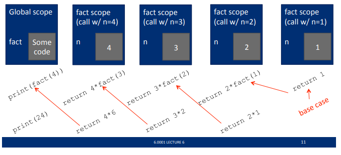
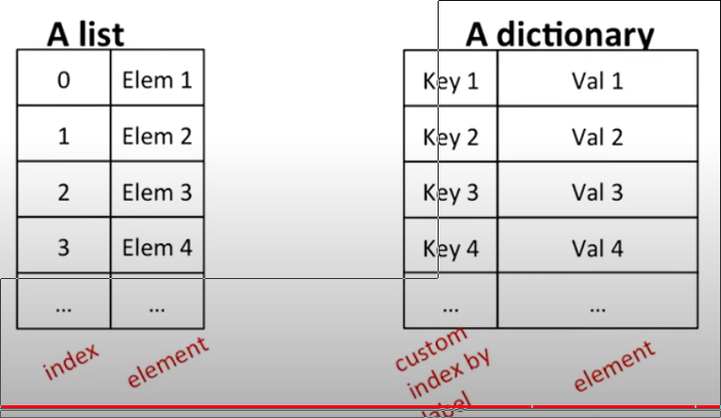
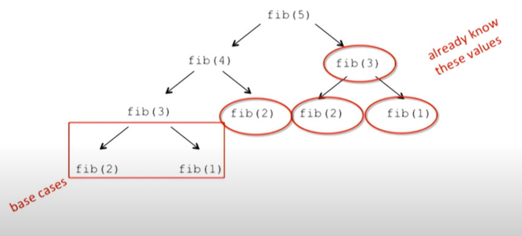

= Module 06: Recursion과 Dictionary

== 지난 시간

* tuples - immutable
* lists - mutable
* aliasing, cloning
* mutability side effects

== 오늘

* recursion - divide/decrease and conquer
* dictionaries - 또 다른 mutable 객체 타입

== Recursion

* 재귀는 항목을 자기 유사한 방식으로 반복하는 프로세스

== Recursion 이란?

* 알고리즘적으로: **분할 정복** 또는 **감소 정복**을 통해 문제에 대한 해결책을 설계하는 방법
** 문제를 동일한 문제의 더 간단한 버전으로 축소
* 의미상: **함수가 자신을 호출**하는 프로그래밍 기술
** 프로그래밍에서 목표는 무한 재귀를 갖지 않는 것
*** 해결하기 쉬운 **기본 사례가 하나 이상 필요**
*** 더 큰 문제 입력을 단순화하려는 목표를 가지고 **다른 입력**에 대한 동일한 문제를 해결

== 지금까지의 반복 알고리즘

* 반복 구조(while 및 for 루프)는 **반복** 알고리즘으로 이어짐
* 루프를 통해 각 반복마다 업데이트되는 **상태 변수** 집합에서 계산을 캡처

== 곱셈 - iterative solution

* a와 b를 곱하는 것은 "a를 b번 더하는 것과 같음"
* **상테**를 캡처
** **iteration** number(i)는 b에서 시작, i <- i - 1 후 0이 되면 정지
** 현재 **값을 계산**(result), result <- result + a

[source, python]
----
def mult_iter(a, b):
    result = 0          
    while b > 0:        # iteration
        result += a     # computation의 현재 값, 덧셈이 진행
        b -= 1          # Iteration 변수의 현재 값
    return result
----

== 곱셈 - recursive soluition

* **recursive step**
** 문제를 동일한 문제의 더 **간단하고 작은** 버전으로 줄이는 방법을 생각
* **base case**
** **직접적으로 해결**할 수 있는 간단한 사례에 도달할 때까지 문제를 계속 줄임
** when b = 1, a * b = a

----
a * b = a + a + a + a + a + a + a + ... + a
        -----------------------------------
                                        b times
      =  a + a + a + a + a + a + a + ... + a
            -------------------------------
                                        b - 1 times
      =  a + a * (b - 1) recursive reduction
----

[source, python]
----
def mult(a, b):
    if b == 1:      # base case
        return a
    else:
        return a + mult(a, b - 1)   # recursive step
----

== Factorial

----
n! = n * (n - 1) * (n - 2) * (n - 3) * ... * 1
----

* n의 factorial을 알고 있나요?
----
n = 1

if n == 1:
    return 1    # base case
----
* 문제를 어떻게 줄이는가? 기본 사례에 도달하기 위해 더 간단한 관점에서 다시 작성

----
n * (n - 1)!

else:
    return n * factorial(n - 1) # recursive step
----

== Recursion Function Scope Example

[source, python]
----
def fact(n):
    if n == 1:
        return 1
    else:
        return n * fact(n - 1)

print(fact(4))
----

== Some Observation

* 각 recursive는 **자신만의 scope/environment**를 가지는 함수를 호출
* 범위 내의 **변수 바인딩**은 recursive 호출로 변경되지 않음
* 함수 호출이 값을 전ekf하면 제어 흐름이 **이전 범위**로 다시 전달됨

== Iteration vs. Recursive

[source, python]
----
def factorial_iter(n):
    prod = 1
    for i in range(1, n + 1):
        prod *= i
    return prod
----

[source, python]
----
def factorial(n):
    if n == 1:
        return 1
    else:
        return n * factorial(n - 1)
----

* recursion은 보다 단순하며, 보다 직관적
* recursion은 프로그래머의 관점에서 보다 효율적
* recursion은 컴퓨터 관점에서 비효율적

== 귀납적 추론(Inductive Reasoning)

* recursive code가 어떻게 동작하는지 얼마나 알고 있습니까?
* `mult_iter` 는 b가 초기에 양수이기 때문에 종료되고 루프를 돌 때마다 1씩 감소함. 따라서 결국에는 1보다 작아야 합니다.
* b = 1로 `mult` 를 호출하면 recursive 호출을 하지 않고 종료
* b > 1로 `mult` 를 호출하면 보다 작은 b로 recursive 호출을 수행; 아는 반드시 b = 1으로 호출 됨

[source, pyton]
----
def mult_iter(a, b):
    result = 0
    while b > 0:
        result += a
        b -= 1
    return result
----

[source, python]
----
def mult(a, b):
    if b == 1:
        return a
    else:
        return a + mult(a, b - 1)
----

== 수학적 귀납법(Mathmathical Induction)

* 정수로 색인된 명제가 모든 값 n에 대해 참임을 증명하려면:
** n이 가장 작은 값일 때 true임을 증명(예: n = 0 또는 n = 1)
** 그런 다음 그것이 임의의 n 값에 대해 true라면 n + 1에 대해서도 true이어야 함을 보여줄 수 있음을 증명

== 귀납 예

* 0 + 1 + 2 + 3 + ... + n = (n(n + 1)) / 2
* 증명:
** n = 0 이면 왼쪽 값은 0이고, 오른쪽 값은 0 * 1 / 2 = 0, 그러므로 True\
** 어떤 k에 대해, 참이라고 가정마현, 다음과 같이 됨
*** `0 + 1 + 2 + ... + k + (k + 1) = \((k + 1)(k + 2)) / 2`
*** 왼쪽 값은 `k(k + 1) / 2 + (k + 1)`` 크기 k의 문제에 대해 속성이 유지된다는 가정에 의함
*** 이는 대수식에 의해 `\((k + 1)(k + 2)) / 2` 가 됨
** 따라서 expression은 모든 `n >= 0` 에 대해 유지됨

== 코드와의 관련성

* 같은 로직을 적용

[source, python]
----
def mult(a, b):
    if b == 1:
        return a
    else:
        return a + mult(a, b - 1)
----

* 기본적으로, `mult` 는 반드시 옳은 값을 return 한다는 것을 볼 수 있음
* 재귀적인 경우, mult는 b보다 작은 크기의 문제에 대한 답을 정확하게 반환하고, 덧셈 단계에서는 크기 b의 문제에 대한 정답도 반환해야 한다고 가정할 수 있음
* 따라서 유도를 통해 코드는 답변을 올바르게 return

== Hanoi Tower

* 이야기:
** 3개의 막대가 있음
** 첫 번째 막대에 64개의 다른 크기의 원반이 쌓여있음. 각 원반의 크기는 모두 다르고, 아래애서 위로 갈수록 점점 작아짐
** 첫 번째 막대에 있는 원반들을 그 순서를 지키면서 다른 막대로 옮겨야 함(다 옮기면 우주가 멸망)
** 한 번에 움직일 수 있는 원반은 제일 위의 원반 하나
** 어떤 원반위에 그보다 더 큰 원반을 쌓을 수 없음

== Haoni Tower

* 다양한 크기의 스택 예제로, 올바른 동작 묶음(set of moves)를 인쇄하는 프로그램을 어떻게 작성해야 할 까?
* **재귀적으로 생각하자**
** 작은 문제를 해결한다
** 기본 문제를 해결한다
** 작은 문제를 해결한다

[source, python]
----
def printMove(fr, to):
    print('move from' + str(fr) + ' to ' + str(to))

def Towers(n, fr, to, spare):
    if n == 1:
        printMove(fr, to)
    else:
        Towers(n - 1, fr, spare, to)
        Towers(1, fr, to, spare)
        Towers(n - 1, spare, to, fr)
----

== Hanoi Tower

[source, python]
----
def towers(n, fr, to, spare):
    if n == 1:
        printMove(fr, to)
    else:
        towers(n - 1, fr, spare, to)
        towers(1, fr, to, spare)
        towers(n - 1, spare, to, fr)
----

== 여러 base case에서의 recursion

* 피보나치 수열
** 레오나르도 피사(피보나치)가 아래의 모델을 제시
*** 새로 태어난 한 쌍의 토끼(수컷, 암컷)이 울타리에 넣어짐
*** 한 달에 한번 짝짓기를 함
*** 토끼의 임신 기간은 한 달
*** 토끼는 죽지 않음, 암컷은 한 달에 한번 암, 수 한쌍을 낳으며, 성숙하는데 한 달이 걸림
*** 1년 후 몇 마리의 암컷이 있을 것인가?

== Fibonacci

* 한 달후 (0으로 호칭) - 1 암컷
* 두 달째 - 여전히 암컷 한마리 (임신)
* 세 달째 - 암컷 두 마리, 한마리는 임신
* 일반적으로, females(n) = femails(n - 1) + femals (n - 2)
** 모든 암컷은 n 개월에서 생후 n - 2이 되면 한 마리의 암컷을 낳음
** 이는 전체 개월 수에서 n - 1마다 한 마리의 암컷이 추가됨

== Fibonacci

* Base cases:
** Females(0) = 1
** Females(1) = 1
* Recursive case
* Femails(n) = Females(n - 1) + Females(n - 2)

== Fibonacci

[source, python]
----
def fib(x):
    """ assimes x at int >= 0
        returns Fibinacci of x """
    if x == 0 or x == 1:
        return 1
    else:
        return fib(x - 1) + fib(x - 2)
----

== recursion on non-numeric

* string의 문자열이 palindrome인지 판별. 예) 바로 읽으나 거꾸로 읽으나 같은 문자열
** "Able was I, ere I saw Elba" - 나폴레옹을 기념하며
** "Are we not drawn onward, we few, drawn onward to new era?" - 앤 마이클스를 기념하며

== Solving recursively?

* 첫 번째로, 문자열(string)을 구두점 제거를 이용해 단일 문자(character)로 변경하고, 대문자를 소문자로 변경
* 그리고
** 기본 케이스: 문자열의 길이가 1 또는 0이면 palindrome
** Recursive case:
*** 만약 첫 번째 문자가 마지막 문자와 같으면, 가운데가 palindrome이면 palindrome.

== Example

* 'Able was I, ere I saw Elba' -> 'ablewasieraisawelba'
* `isPalindrome('ablewasieraisawelba')` 은
** `a` == `a` 면서 isPalindrome('blewasieraisawelb')`

== Code

[source, python]
----
def isPalindrom(s):
    def toChars(s):
        s = lower()
        ans = ''
        for c in s:
            if c in 'abcdefghijklmnopqrstuvwxyz':
                ans = ans + c
        return ans

    def isPal(s):
        if len(s) <= 1:
            return True
        else:
            return s[0] == s[-1] and isPal(s[1:-1])

    return isPal(toChars(s))
----

== Divide and Conquer

* "divide and conquer" 알고리즘 예제
* 어려운 문제를 쉬운 작은 문자로 분해하여 해결
** 작은 문제는 원래 문제보다 해결하기 쉬움
** 작은 문제의 해결책들은 결합하여 큰 문제를 해결할 수 있음

== Dictionaries

== 학생 정보를 어떻게 저장할까?

* 모든 정보에 대해 별도의 목록을 사용하여 저장할 수 있음

----
names = ['Ana', 'John', 'Denise', 'Katy']
grade = ['B', 'A+', 'A', 'A']
course = [2.00, 6.0001, 20.002, 9.01]
----

* 각 아이템에 대한 **분리된 리스트**
* 각 리스트는 반드시 **같은 길이**여야 함
* 각 같은 인덱스에 정보가 저장되고, 다른 인덱스의 정보는 각기 다른 사람의 정보

== How to Update/Retrieve Student Info

[source, python]
----
def get_grade(student, name_list, grade_list, course_list):
    i = name_list.index(student)
    grade = grade_list[i]
    course = course_list[i]
    return (course, grade)
----

* 추적해야 할 사항이 많으면 **지저분해짐**
* **많은 list**를 관리해야 하고, argument로 처리해야 함
* **항상 index**를 정수형으로 사용해야 함
* 여러개의 list를 함께 변경해야 한다는 것을 기억해야 함

== 더 낫고 깔끔한 방법 - Dictionary

* **관심있는 항목을 인덱스로 직접적으로 사용**할 수 있음 (정수형이 아니어도 됨)
* **하나의 데이터 소스**, 분리된 리스트가 아님

== Python dictionary

* 데이터의 쌍을 저장
** key
** value

[cols=2]
|===
|'Ana'
|'B'

|'Denise'
|'A'

|'John'
|'A+'

|'Katy'
|'A'
|===

[source, python]
----
my_dict = {}
grades = {'Ana':'B', 'John':'A+', 'Denise':'A', 'Katy':'A'}
----

== Dictionaly lookup

* list를 indexing 하는 것과 유사
* Key를 사용하여 찾음
* key와 연관된 값을 검색
* key가 발견되지 않으면 오류

[cols=2]
|===
|'Ana'
|'B'

|'Denise'
|'A'

|'John'
|'A+'

|'Katy'
|'A'
|===

[source, python]
----
grades = {'Ana':'B', 'John':'A+', 'Denise':'A', 'Katy':'A'}
grades['John']
grades['Sylvan']
----

== Dictionary Operations

[cols=2]
|===
|'Ana'
|'B'

|'Denise'
|'A'

|'John'
|'A+'

|'Katy'
|'A'
|===

[source, python]
----
grades = {'Ana':'B', 'John':'A+', 'Denise':'A', 'Katy':'A'}
----

* 항목 **추가**

[source, python]
----
grades['Sylvan'] = 'A'
----

* key가 dictionary에 있는지 테스트

[source, python]
----
'John' in greades   # returns True
'Daniel' in grades  # returns False
----

* 엔트리 삭제

[source, python]
----
del(grades['Ana'])
----

== Dictionary Operations

[source, python]
----
grades = {'Ana':'B', 'John':'A+', 'Denise':'A', 'Katy':'A'}
----

* **모든 키의 tuple처럼 작동하는 반복 가능 항목**을 가져옴

[source, python]
----
grades.keys()   # returns ['Ana', 'John', 'Denise', 'Katy']
----

* **모든 값의 tuple처럼 작동하는 반복 가능 항목**을 가져옴

[source, python]
----
grades.values()     # returns ['B', 'A+', 'A', 'A']
----

== Dictionary Keys and Values

* Values
** 모든 타입(**immutable and mutable**)
** **중복**될 수 있음
** dictionary의 값은 리스트가 될 수 있으며, 다른 사전일 수도 있음
* Keys
** 반드시 **유일**해야 함
** **immutable** type( `int, float, string, tuple, bool`)
*** 실제로 **hashtable** 객체가 필요한데, 그러나 모든 immutable type은 해시 가능하므로 immutable이라고 생각하라.
** `float` 을 키로 쓸때는 주의하라
* key와 value는 **정렬되지 않는다**!

[source, python]
----
d = {4:{1:0}, (1,3):"twelve", 'const':[3.14,2.7,8.44]}
----

== `list` vs. `dict`

* list
** 정렬된 요소의 시퀀스
** 정수 인덱스로 요소를 찾음
** 인덱스에는 순서가 있음
** 인덱스는 정수형

* dict
** "keys" 와 "values" 쌍
** 하나 하나씩 값을 찾음
** 정렬되지 않음이 보장됨
** 키는 어떤 immutable type이 될 수 있음

== Example 3: 노래 가사 분석을 위한 함수

1. **frequency dictionary** `str:int` 매핑을 생성한다.
2. **가장 많이 나타나는 단어**와 횟수를 찾는다.
** 단어가 두 개 이상인 경우 list를 사용한다.
** (words_list, highest_freq)를 위한 tuple `(list, int)`를 return
3. X 번 이상 나타나는 단어를 찾는다.
** 사용자가 "최소 X회"를 선택하도록 하여 매개변수로 허용
** tuple 목록을 return 한다. 각 tuple은 빈도순으로 정렬된 단어 목록을 포함하는 (list, int)입니다.
** IDEA: 노래 사전에서 가장 자주 나오는 단어를 찾는다. 가장 일반적인 단어를 삭제한다. 이를 반복하다. 노래 사전을 변경하기 때문에 작동한다.

== Creating a Dictionary

[source, python]
----
def lyrics_to_frequencies(lyrics):
    myDict = {}
    for word in lyrics:
        if word in myDict:
            myDict[word] += 1
        else:
            myDict[word] = 1
    return myDict
----

== Using the dictionary

[source, python]
----
def most_comon_words(freqs):
    values = freqs.values()
    best = max(values)
    words = []
    for k in freqs:
        if freqs[k] == best:
            words.append(k)
    return (words, best)
----

== Leveraging dictionary properties

[source, python]
----
def words_often(freqs, minTimes):
    result = []
    done = False
    while not done:
        temp = most_common_words(freqs)
        if temp[i] >= minTimes:
            result.append(temp)
            for w in temp[0]:
                del(freqs[w])
        else:
            done = True
    return result

print(words_often(beatles, 5))
----

== fibonacci recursive code

[source, python]
----
def fib(n):
    if n == 1:
        return 1
    elif n == 2:
        return 2
    else:
        return fib(n - 1) + fib(n - 2)
----

* 두 base case
* 자신을 두 번 호출
* 이 코드는 비 효율적

== fibonacci 비효율성

----
fib(n) = fib(n-1) + fib(n-2)
----

* 같은 값을 여러번 **다시 계산**
* 이미 계산된 값을 저장할 필요 있음

== dictionary를 사용한 fibonacci

[source, python]
----
def fib_efficient(n, d):
    if n in d:
        return d[n]
    else:
        ans = fib_efficient(n-1, d) + fib_efficient(n-2, d)
        d[n] = ans
        return ans

d = {1:1, 2:2}
print(fib_efficient(30, d))
----

* 이미 계산된 값을 **먼저 찾음**
* 함수 호출을 통해 **dictionary를 수정**

== 효율성 향상

* fib(34) 결과는 11,405,772회의 recursive 호출
* fib_effcient(34) 결과는 65회의 recursive 호출
* dictionary를 사용하여 중간 결과를 캡처하는 것은 매우 효율적일 수 있음
* 그러나 이는 부작용이 없는 프로시저에서만 작동한다는 점에 유의(즉, 프로시저는 호출 사이의 다른 계산과 관계없이 특정 인수에 대해 항상 동일한 결과를 생성).