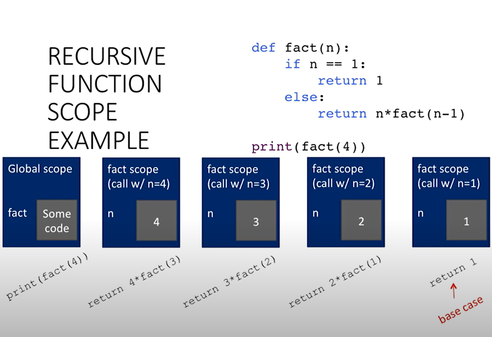

= Module 06: Recursion과 Dictionary

신사 숙녀 여러분, 이제 시작하고 싶습니다. 내 이름은 에릭 그림슨이에요. 저는 학문 발전을 위한 MIT 총장으로 봉사할 수 있는 특권을 가지고 있습니다. 그것이 무엇을 의미하는지 찾아보실 수 있습니다. John처럼 저도 전직 6과목 책임자였습니다. 이번 학기에는 Ana와 John과 함께 강의를 나누어서 최신 소식을 접할 예정입니다.

지난번에 Ana는 복합 데이터 유형, 튜플 및 목록 중 첫 번째를 소개했습니다. 그녀는 그것들을 조작하는 많은 방법과 그러한 구조를 조작하기 위해 내장된 많은 것들을 보여주었습니다. 그리고 둘 사이의 주요 차이점은 튜플이 변경 불가능하다는 것입니다. 즉, 변경할 수 없고 목록도 변경 가능하며 변경되거나 변경될 수 있다는 것입니다. 그리고 그것은 멋진 힘과 도전의 기회로 이어졌습니다. 그리고 특히 그녀는 동일한 목록 구조를 가리키는 두 개의 이름을 가질 수 있는 앨리어싱과 같은 것을 보여주었습니다. 그 때문에 하나의 내용을 변경할 수 있고 다른 하나의 내용의 모양도 변경됩니다. 그리고 그것은 몇 가지 좋은 도전으로 이어집니다. 따라서 가변성의 부작용은 우리가 과정을 진행하면서 플러스와 마이너스로 보게 될 것 중 하나입니다.

오늘은 잠시 다른 방향으로 돌아가서 재귀에 대해 이야기해보겠습니다. 이는 계산 문제를 해결하기 위한 강력하고 훌륭한 도구입니다. 그런 다음 또 다른 종류의 복합 데이터 구조인 사전(변경 가능)을 살펴보겠습니다. 그런 다음 우리는 두 부분을 함께 모아서 실제로 몇 가지 문제를 매우 효과적으로 해결하기 위해 실제로 어떻게 많은 힘을 제공하는지 보여줄 것입니다. 하지만 저는 재귀부터 시작하고 싶습니다. 적어도 프로그래머의 말에 따르면 컴퓨터 과학의 개념 중 가장 신비한 것 중 하나는 정말 나쁜 컴퓨터 과학 농담을 많이 낳는 개념일 것입니다. 사실 모든 컴퓨터 과학 농담은 나쁘지만 이것들은 특히 나쁩니다.

== Recursion

* 재귀는 항목을 자기 유사한 방식으로 반복하는 프로세스

그렇다면 재귀란 무엇인가라는 당연한 질문부터 시작해 보겠습니다. 지식의 궁극적인 원천인 위키피디아(Wikipedia)에 가면 본질적으로 재귀는 항목을 자기 유사 방식으로 반복하는 과정이라는 내용을 얻을 수 있습니다. 정말 도움이 되네요, 그렇죠? 그러나 우리가 그 아이디어를 보게 될 이유는 재귀는 문제를 취하여 동일한 문제의 더 작은 버전으로 축소하고 그 아이디어를 사용하여 실제로 문제를 해결하는 아이디어이기 때문입니다. 정말 흥미로운 문제들이 많아요. 하지만 재귀는 많은 곳에서 사용됩니다. 따라서 아이디어를 여러 번 사용하거나 반복하는 것이 아이디어입니다. 그렇다면 여러분의 3D 프린터가 3D 프린터를 인쇄한다면 얼마나 좋을까요? 그리고 계속해서 그렇게 할 수도 있습니다.

아니면 좀 더 흔한 것인데 실제로는 멋진 이름이 있는데 Mise en abyme(미장아빔)이라고 합니다. 예술에서는 때로 드로스테 효과라고도 합니다. 그림 안에는 그림 같은 그림이 있고 그 안에는 그림 같은 그림이 있습니다. 그림을 보면 아이디어를 얻을 수 있습니다. 물론 재귀에서 생각하고 싶은 것 중 하나는 재귀가 무한정 계속되도록 하는 것이 아닙니다. 그리고 재귀에 관한 전구 농담도 있습니다. 읽을 수 없다면 전구를 조이려면 얼마나 많은 비틀림이 필요합니까? 그리고 이미 나사로 조여져 있으면 대답은 0이라고 나와 있습니다. 그렇지 않으면 한 번 비틀고 다시 물어보고 내 대답에 1을 더하세요. 그리고 그것은 실제로 재귀에 대한 좋은 설명입니다.

== Recursion 이란?

* 알고리즘적으로: 분할 정복 또는 감소 정복을 통해 문제에 대한 해결책을 설계하는 방법
** 문제를 동일한 문제의 더 간단한 버전으로 축소
* 의미상: 함수가 자신을 호출하는 프로그래밍 기술
** 프로그래밍에서 목표는 무한 재귀를 갖지 않는 것
*** 해결하기 쉬운 기본 사례가 하나 이상 필요
*** 더 큰 문제 입력을 단순화하려는 목표를 가지고 다른 입력에 대한 동일한 문제를 해결

그럼 좀 더 진지하게 살펴보겠습니다. 재귀란 무엇입니까? 나는 그것을 추상적으로, 알고리즘적으로, 의미적으로, 또는 원하는 경우 프로그래밍 측면에서 설명하고 싶습니다. 추상적으로 이것은 종종 분할 정복, 때로는 감소 정복이라고 불리는 것의 훌륭한 예입니다. 재귀의 개념은 제가 해결하려는 문제를 어떻게 해야 동일한 문제의 더 간단한 버전과 제가 할 수 있는 몇 가지 작업으로 줄일 수 있는지 말하려는 것입니다. 그런 다음 그 간단한 버전을 다시 줄여서 직접 해결할 수 있는 간단한 사례에 도달할 때까지 계속 그렇게 할 것입니다. 이것이 바로 우리가 문제에 대한 해결책을 설계하는 것에 대해 생각하는 방법입니다.

의미상으로 이것은 일반적으로 함수의 정의인 프로그램이 본문에서 자신을 참조하는 경우로 이어집니다. 그것은 몸 안에서 자신을 부를 것입니다. 고등학교 기하학 선생님을 기억하신다면 아마도 여러분의 관절을 감싸주실 것입니다. 여러분에게는 허용되지 않는 일입니다. 왜냐하면 기하학과 같은 것에서는 그 자체로 무언가를 정의할 수 없기 때문입니다. 그렇죠? 그것은 허용되지 않습니다. 재귀에서는 괜찮습니다. 프로시저에 대한 우리의 정의는 내가 직접 해결할 수 있는 것에 도달했을 때 문제 풀기를 중지하는 방법인 기본 사례라고 부르는 것이 있는 한 그 자체를 자체적으로 호출할 수 있습니다. 따라서 우리가 할 일은 해결하기 쉬운 기본 사례가 하나 이상 있는지 확인하여 무한 재귀를 피하는 것입니다.

== 지금까지의 반복 알고리즘

* 반복 구조(while 및 for 루프)는 **반복** 알고리즘으로 이어짐
* 루프를 통해 각 반복마다 업데이트되는 **상태 변수** 집합에서 계산을 캡처

자, 예를 살펴보고 무대를 설정하기 위해 여러분이 해왔던 반복 알고리즘으로 돌아가겠습니다. For 루프, while 루프는 자연스럽게 반복 알고리즘이라고 부르는 것으로 이어지며 이러한 알고리즘은 상태 변수 세트로 캡처되는 것으로 설명할 수 있습니다. 즉, 계산 상태를 정확하게 알려주는 하나 이상의 변수를 의미합니다. 말이 너무 많네요. 예를 들어 보겠습니다. 사소한 일이라는 걸 알지만, 참아주세요.

== 곱셈 - iterative solution

* a와 b를 곱하는 것은 "a를 b번 더하는 것과 같음"
* **상테**를 캡처
** **iteration** number(i)는 b에서 시작, i <- i - 1 후 0이 되면 정지
** 현재 **값을 계산**(result), result <- result + a

정수 곱셈을 하고, 두 개의 정수를 함께 곱하고, 내가 사용할 수 있는 것은 덧셈뿐이라고 가정해 보겠습니다. 따라서 a 곱하기 b는 a를 자신에게 b번 더하는 것과 같습니다. 이에 대해 반복적으로 생각한다면 두 개의 상태 변수를 사용하여 이 계산을 캡처할 수 있습니다. 하나는 iteration number(반복 번호)라고 부르는데, 예를 들어 b에서 시작하고 루프를 통과할 때마다 1이 줄어듭니다. 그리고 제가 b번 카운트다운을 하고 0이 될 때까지 계속 그렇게 할 것입니다.

동시에 계산의 일부 값을 갖게 됩니다. 이를 결과라고 부를 수 있습니다. 0에서 시작하여 처음에는 a를 추가하고 다음에는 a를 추가하여 얼마나 많은 항목이 있는지 추적합니다. 끝날 때까지 합산했습니다. 그리고 예, 저는 여러분이 다중 작업을 수행할 수 있다는 것을 압니다. 그러나 이것은 이 아이디어를 얻으려고 노력하고 있습니다. 어떻게 반복적으로 수행할 것인가입니다. 따라서 나는 추가할 b 항목이 아직 남아 있다고 말하면서 i부터 시작할 수 있으며 결과는 1입니다. 루프를 처음 통과할 때 a를 추가하고 i를 1만큼 줄입니다. 다음번 루프를 통해 다른 것을 추가합니다. a, i를 1로 줄이면 아이디어를 얻을 수 있습니다. 나는 이 계산이 끝날 때까지 그냥 걸어 내려갑니다.

[source, python]
----
def mult_iter(a, b):
    result = 0
    while b > 0:
        result += a
        b -= 1
    return result
----

따라서 이를 위한 코드를 작성할 수 있으며 실제로는 매우 간단합니다. 거기는. 이를 mult_iter라고 부르겠습니다. 두 인수 a와 b를 사용하고 해당 프로세스를 정확하게 캡처하겠습니다. 그래서 제가 하는 일을 주목하세요. 결과를 축적하는 데 사용할 작은 변수로 내부적으로 설정했습니다. 그런 다음 반복이 있습니다. b가 0보다 큰 경우 어떻게 해야 합니까? 결과에 a를 추가하고, 저장하고, b를 1만큼 줄입니다. b가 0이 될 때까지 계속 이 작업을 수행합니다. 이 경우에는 결과를 반환합니다. 좋아요, 간단한 해결책입니다.

이제 이것을 다른 방식으로 생각해 봅시다. A 곱하기 b는 a 자신에게 b번을 더하는 것인데, 이는 더하기가 a 자신에게 b 빼기 1번을 더하는 것과 같습니다. 좋아요, 그건 제게는 여가 시간처럼 들리네요. 그냥 말장난처럼 들리네요. 하지만 정말 중요해요. 왜냐면 이게 뭐죠? 아, 그것은 꼭대기 점의 정의에 따르면 단지 a 곱하기 b 빼기 1이군요. 당신이 정말 감동받았을 거라는 건 알아요. 하지만 이건 사실 정말 멋진데요. 왜냐면 제가 무슨 짓을 한 걸까요? 나는 한 가지 문제를 택했습니다. 이 문제는 동일한 문제의 더 간단한 버전과 제가 알고 있는 몇 가지 작업으로 축소되었습니다. 그리고 이 문제를 어떻게 해결할까요? 같은 방법입니다. a 곱하기 a 곱하기 b 빼기 2입니다. 한 번 더 풀고 직접 해결할 수 있는 기본 사례에 도달할 때까지 계속 그렇게 합니다. 그리고 그것은 쉽습니다. b가 1이면 답은 a입니다. 아니면 b가 0일 때 답은 0이 될 수도 있습니다. 그리고 그것을 포착하는 코드가 있습니다.

[source, python]
----
def mult(a, b):
    if b == 1:
        return a
    else:
        return a + mult(a, b - 1)
----

다른 형태, 훌륭하고 간결한 설명, 무엇을 말합니까? 내가 기본 사례에 있다면 b가 1과 같다면 대답은 단지 a일 뿐입니다. 그렇지 않은 경우 더 작은 버전으로 동일한 문제를 해결하고 이를 a에 추가한 후 해당 결과를 반환하겠습니다. 그리고 그것은 문제의 훌륭하고 명확한 특성입니다. 문제를 동일한 문제의 더 간단한 버전으로 줄이는 재귀적 정의입니다. 좋습니다. 또 다른 예를 살펴보겠습니다. 재귀의 고전적인 문제는 계승을 계산하는 것입니다. 그렇죠? n 팩토리얼 또는 원하는 경우 n 뱅, n 느낌표는 n 곱하기 n 빼기 1, 1까지입니다. 따라서 n이 양의 정수라고 가정하면 1부터 n까지의 모든 정수의 곱입니다.

따라서 이 문제를 재귀적으로 해결하고 싶다면 동일한 질문을 할 수 있으며 기본 사례는 무엇입니까? 음, n이 1과 같을 때, 그것은 단지 1입니다. 재귀적인 경우, n 곱하기 n - 1이 1까지 내려갈 것입니다. 그것은 n 곱하기 n - 1 계승과 같습니다. 따라서 기본 사례를 쉽게 작성할 수 있으며 이 문제에 대한 멋진 재귀적 솔루션을 얻었습니다. 좋아, 만약 당신이 나와 같고 이번이 처음이라면, 내가 당신의 머리를 잡고 약 180도 비틀어 놓은 것 같은 느낌이 들 것이다. 저는 180도를 더 살펴보겠습니다. 왜냐하면 여러분은 "잠깐만요. 그것이 정말로 멈춘다는 것을 어떻게 알 수 있습니까?"라고 말할 수도 있기 때문입니다. 실제로 계산이 종료되는지 어떻게 알 수 있나요? 그럼 살펴보겠습니다.

[source, python]
----
def fact(n):
    if n == 1:
        return 1
    else:
        return n * fact(n - 1)

print(fact(4))
----

팩토리얼(factorial)의 줄임말인 사실에 대한 나의 정의가 있습니다. 사실 1은 n이 1과 같으면 1을 반환하고, 그렇지 않으면 n 곱하기 n - 1의 사실을 반환한다는 것입니다. 그리고 스코프의 환경 측면에서 Ana가 말한 도구를 사용하고 여기서 무슨 일이 일어나는지 생각해 봅시다. 그래서 제가 그것을 읽거나 Python에서 평가할 때, 이름 사실을 일부 코드에 바인딩하는 정의를 생성합니다. 여기에 있는 모든 항목과 형식 매개변수의 이름만 포함하면 아직 아무 작업도 수행되지 않았습니다.

그리고 나서 저는 fact(4)를 print하는 것을 평가할 것입니다. print에는 값이 필요하므로 fact(4)의 가치를 얻어야 하며 우리는 그것이 무엇을 하는지 압니다. 사실을 찾아보면 프로시저 정의가 있습니다. 따라서 새 프레임, 새 환경을 만들고 해당 프로시저를 호출하고 해당 프레임 내에서 사실에 대한 형식 매개변수가 전달된 값에 바인딩됩니다. 따라서 n은 4에 바인딩됩니다. 해당 프레임은 이 전역 프레임에 의해 범위가 지정됩니다. 글로벌 프레임의 것들을 상속받을 것입니다. 그리고 그것은 무엇을 합니까? 이 프레임 안에서 사실의 본체를 평가한다고 합니다. 좋아요, 그러면 n이 1과 같다는 건가요? 아니요, 아닙니다. 4입니다. 따라서 이 경우 else 문으로 가서 '아, n과 n의 n배 사실을 4로 반환하고, n 빼기 1의 사실은 3의 사실 4배를 반환해야 한다는 뜻입니다'라고 말합니다.

4는 쉽다 곱셈은 쉽다 3의 사실, 아, 사실을 찾아본다. 이제 나는 이 프레임 안에 있고, 거기서 사실을 볼 수는 없지만, 나는 그 프레임으로 올라갑니다. 사실에 대한 정의가 있고 나머지 부분은 좀 더 빠르게 처리하겠습니다. 그게 무슨 역할을 합니까? 사실이라는 새로운 프레임을 만듭니다. 그리고 n에 대해 전달된 인수는 n 빼기 1입니다. 바로 거기 있는 값은 3입니다. 따라서 3은 이제 n에 바인딩됩니다. 같은 게임에서 신체의 n이 1과 같다고 평가하나요? 아니요, 그렇다면 저는 return 문으로 갈 것입니다. return은 2의 사실을 3번 곱한 값이라고 나와 있습니다. 그리고 이 n 값만 보고 있다는 점에 주목하세요. 왜냐하면 그것이 제가 속해 있는 프레임이기 때문입니다. 절대 그렇지 않습니다. n의 값을 봅니다.

알았어, 내가 400의 사실을 하지 않은 게 기쁘지 않니? 이제 두 개만 더 남았지만 이해가 되실 겁니다. 마찬가지로, 2라는 사실을 얻어야 합니다. n이 2에 바인딩된 상태에서 사실을 다시 호출해야 합니다. 본문을 평가하지만 아직 1과 같지 않은 상대 항목입니다. 이는 else 절로 가서 사실을 2번 반환한다는 뜻입니다. 이제 n이 1로 묶인 상태에서 Fact를 다시 호출합니다. 다행히도 이제 해당 절은 true이고 return 1이라고 표시됩니다. 죄송합니다. 그렇게 하기 전에 기본 사례가 있습니다. 그리고 그것은 당신에게 명백해 보일 수도 있지만 이것은 중요합니다. 그렇죠? 계산을 멈출 수 있는 무언가에 도달할 때까지 이것을 풀고 있습니다. 이제 return 1이라고 적혀 있기 때문에 간단히 계산을 모아보겠습니다. 누가 요청했습니까? 음, 그 호출은 fact(1)입니다. 그러면 2 곱하기 1의 반환으로 줄어듭니다. 그리고 누가 그것을 요청했습니까? fact(2).

몇 가지 관찰을 통해 각 재귀 호출이 어떻게 자체 프레임을 생성하는지 확인하고 결과적으로 어떤 n 값을 사용하고 있는지 혼동이 없습니다. 또한 다른 프레임에서는 n이 변경되지 않았습니다. 우리는 그것을 변형하지 않았습니다. 따라서 우리는 문자 그대로 재귀 호출을 위한 로컬 범위를 생성하고 있는데, 이것이 바로 우리가 원하는 것입니다. 또한 어떤 것의 사실을 계산할 때 제어의 흐름이 어떻게 있었는지 주목하세요. 이는 n - 1의 사실을 n배로 반환하는 것으로 축소되어 새로운 범위를 생성합니다. 그리고 값을 반환할 수 있는 항목에 도달할 때까지 계속 풀린 다음 해당 프레임을 모두 다시 수집합니다. 따라서 여기에는 자연스러운 제어 흐름이 있습니다. 그러나 가장 중요한 것은 n 값을 찾을 때 어떤 변수를 사용하는지 혼동하지 않는다는 것입니다.

좋습니다. 상황이 다소 혼란스러워지는 경우가 많기 때문에 한 가지 예를 더 들어보겠습니다. 하지만 먼저 계승의 두 가지 다른 버전을 나란히 보여드리겠습니다. 사실, 나는 약간 거짓말을 했습니다. 우리는 이것을 더 일찍 보여주지 않았지만 반복적으로 하고 싶다면 계승이 있습니다. 일부 초기 변수를 1로 설정한 다음 루프를 실행했습니다. 예를 들어 1에서 n 빼기 1 바로 아래까지 또는 1에서 n까지 곱하여 다시 반품 제품에 넣습니다.

어느 쪽을 더 좋아하시나요? 둘 중 하나를 선택해야 한다고 말할 수도 없습니다. 손을 들어주세요. 이것을 좋아하시는 분은 몇 명이나 됩니까? 일부 주저하는 사람들, 얼마나 많은 사람들이 이것을 선호합니까? 네, 그게 제 생각이에요. 나는 편견이 있지만 재귀적인 것을 정말 좋아합니다. 보기에 더 선명하고, 무엇을 하고 있는지 알 수 있습니다. 이 문제를 해당 문제의 더 간단한 버전으로 축소하겠습니다. 자신만의 버전을 선택하세요. 하지만 재귀 버전이 이해하기 더 직관적이라고 생각합니다. 프로그래머의 관점에서는 내부 변수에 대해 생각할 필요가 없기 때문에 실제로 작성하는 것이 더 효율적인 경우가 많습니다. 기계에 따라 호출할 때 효율적이지 않을 수 있습니다. 왜냐하면 재귀 버전에서 해당 프레임 세트를 설정했기 때문입니다. 그리고 이러한 언어의 일부 버전은 실제로 매우 효율적입니다. 그들 중 일부는 조금 덜 그렇습니다. 그러나 오늘날 컴퓨터의 속도를 고려하면 실제로 계산만 수행하는 한 누가 신경쓰겠습니까?

예, 한 가지 더 예를 들어보겠습니다. 재귀 코드가 작동하는지 실제로 어떻게 알 수 있나요? 방금 시뮬레이션을 했지만 한 가지 방법을 더 살펴보겠습니다. 반복 버전에 대해 무엇을 말할 수 있습니까? 글쎄, 나는 b가 적절한 값을 주었다고 가정할 때 처음에 양수이기 때문에 그것이 종료될 것이라는 것을 알고 있습니다. 이 루프를 돌 때마다 1씩 감소합니다. 어느 시점에서는 1보다 작아야 하며 중지됩니다. 그래서 나는 그것이 항상 종료될 것이라고 결론을 내릴 수 있습니다. 재귀 버전은 어떻습니까? 글쎄, 내가 그것을 b와 1로 부르면 나는 끝난다. b를 1보다 큰 값으로 호출하면 재귀 호출에서 다시 1씩 줄어들 것입니다. 즉, 각 재귀 호출에서 b가 줄어들고 결국에는 양의 정수를 주었다고 가정할 때 한 자리까지 내려갑니다. 여기서 b는 1과 같습니다. 그러니까 그만할게,

방금 우리가 한 일은 MIT에서 두 번째로 좋은 학과인 수학의 훌륭한 도구를 사용한 것입니다. 와, 난 그 문제에 대해 어떤 쉿소리도 내지 않았어, 존, 알았어. 그리고 지금 수학부서장과 문제가 생겼어. 이제 여러분의 관심을 끌었으니, 그렇습니다. 모든 컴퓨터 과학 농담은 다 나쁘고 제 농담도 정말 형편없지만 저는 종신직을 맡았습니다. 당신은 그것에 대해 망할 일을 할 수 없습니다.

프로그램에 대해 정말 좋은 방식으로 생각하게 해주는 도구인 수학적 귀납법을 살펴보겠습니다. 여러분은 이것을 본 적이 없습니다. 여기에 수학적 귀납법의 아이디어가 있습니다. 명제를 증명하고 싶다면 그것을 정수에 대한 색인화라고 부릅니다. 즉, 정수에 대해 실행되는 수학적 설명입니다. 이 정수의 모든 값에 대해 이것이 참임을 증명하려면 수학적으로 n의 가장 작은 값이 일반적으로 n이 0 또는 1과 같다는 것을 증명함으로써 이를 수행한 다음 흥미로운 작업을 수행합니다. 나는 그것이 임의의 n 값에 대해 참이라는 것을 증명해야 한다고 말합니다. 나는 그것이 n 더하기 1에 대해서도 참이라는 것을 증명할 것입니다. 그리고 만약 내가 이 두 가지 일을 할 수 있다면 나는 무한한 숫자에 대해 결론을 내릴 수 있습니다. n 값의 경우 항상 참입니다.

그런 다음 잠시 후에 이를 프로그래밍과 다시 연결하겠습니다. 하지만 여러분이 본 적이 있는 간단한 예를 보여 드리겠습니다. 0부터 n까지의 정수, 또는 1부터 n까지의 정수가 있다면 그것은 n 곱하기 n 더하기 1 나누기 2와 같다고 주장합니다. 그러면 1, 2, 3은 6이 됩니다. 3 곱하기 4를 2로 나누면 6이 나옵니다. 이것을 어떻게 증명할 수 있을까요? 음, 인덕션으로요? n이 0이면 간단한 경우를 수행해야 합니다. 그러면 이 변은 0이 됩니다. 그리고 그것은 0 곱하기 1이고, 이는 0을 참으로 나눈 것입니다. 따라서 0은 0과 같습니다. 이는 사실입니다.

이제 귀납적 단계입니다. 나는 그것이 어떤 k에 대해 참이라고 가정할 것입니다. 나는 n을 선택했어야 했지만, 어떤 k에 대해서는 그것이 k 더하기 1에 대해 참이라는 것을 보여줘야 합니다. 음, 왼쪽 변이 있고, 저는 이것을 하고 싶습니다. 이것이 그것과 같다는 것을 보여라. 그리고 나는 정확히 이 재귀적인 아이디어를 사용하여 그것을 할 것입니다. 왜냐하면 내가 무엇을 알고 있는지, 나는 여기에서 내가 가정하고 있는 이 합계가 사실이라는 것을 알고 있기 때문입니다.

그리고 그것은 좌변, 즉 그것의 첫 번째 부분이 단지 k 곱하기 k 더하기 1/2라는 것을 말하는데, 이것이 제가 가정하고 있는 것의 정의입니다. 여기에 k 더하기 1을 더하겠습니다. 음, 대수학을 할 수 있죠, 그렇죠? 그것은 k 더하기 1이고 항상 k 나누기 2 더하기 1입니다. 이는 k 더하기 2 나누기 2입니다. 오 멋지네요, 바로 그거예요. 그렇게 하고 나면 이제 이것이 n의 모든 값에 대해 사실이라는 결론을 내릴 수 있습니다.

프로그래밍과 어떤 관련이 있나요? 이것이 바로 우리가 재귀 코드에 대해 생각할 때 하고 있는 일입니다. 그렇죠? 우리는 그것이 기본 사례에 대해 참이라는 것을 보여주고, 내가 본질적으로 가정하고 있는 것은 그것이 b보다 작은 값에 대해 작동한다면 코드가 b에 대한 정답을 반환한다는 것입니다. 대답은 '절대 그렇습니다'입니다. 저는 귀납법을 사용하여 실제로 제 코드가 올바른 일을 한다는 것을 추론하고 있습니다. 내가 왜 당신을 이렇게 괴롭히는 걸까요? 왜냐하면 이것이 제가 여러분이 재귀에 대해 생각하기를 바라는 방식이기 때문입니다. 문제를 동일한 문제의 더 작은 버전으로 나눌 때 더 작은 버전이 답을 제공한다고 가정할 수 있습니다. 내가 해야 할 일은 내가 결합한 것이 올바른 결과를 내는지 확인하는 것뿐입니다.

좋아요, 여러분은 제가 여기 아래에 있는 멋진 첨단 기술 장난감을 가지고 무엇을 하고 있는지 궁금하실 것입니다. 저는 재귀의 또 다른 예를 보여드리고 싶습니다. 지금까지 우리는 단지 하나의 기본 사례만 있는 단순한 것들을 보았습니다. 이것은 하노이의 탑이라는 신화적인 이야기입니다. 제가 듣기로 이 이야기는 하노이 어딘가에 세 개의 큰 가시와 64개의 보석이 박힌 일시적인 이야기가 있다는 것입니다. 크기가 모두 다른 황금 디스크. 그들은 모두 가장 작은 것부터 가장 큰 것까지 주문된 속성으로 하나의 스파이크에서 시작했습니다.

그리고 이 사원에는 디스크를 한 번에 하나씩, 초당 하나씩 옮기는 성직자들이 있는데, 그들의 목표는 전체 스택을 한 스파이크에서 다른 스파이크로 옮기는 것입니다. 그리고 그들이 그렇게 할 때 열반이 성취되고 우리 모두는 정말로 훌륭한 삶을 살게 됩니다. 한 가지 비결이 있기 때문에 시간이 얼마나 걸릴지는 별도로 이야기하겠습니다. 그들은 작업을 수행하는 동안 작은 디스크를 더 큰 디스크로 덮을 수 없으므로 임시로 세 번째 디스크를 갖게 됩니다. 그리고 저는 여러분에게 이 문제를 해결하는 방법을 보여주고 싶습니다. 여러분이 잠시 내 도움을 받아 코드를 작성하거나, 제가 여러분의 도움을 받아 이 문제를 해결하기 위해 잠시 후에 코드를 작성할 것이기 때문입니다.

그럼 한 번 볼까요? 주의 깊게 관찰해 보세요. 크기 1의 디스크를 옮기는 것은 꽤 쉽죠? 크기 2의 디스크를 옮기는 경우, 덮어 두지 않도록 옮기는 동안 이 디스크를 예비 디스크에 올려 놓기만 하면 됩니다. 그건 쉽습니다. 크기가 3인 디스크를 이동할 때는 좀 더 조심해야 합니다. 더 큰 디스크로 작은 디스크를 덮을 수 없으므로 디스크를 어디에 놓을지 잘 생각해야 합니다. 이런 일들을 저글링하지 않고 해결하는 데 도움이 될 것입니다. 알았어, 보고 있어? 4개를 해야 합니다. 4번을 다시 수행하려면 이 작업을 수행하면서 내용을 은폐하지 않도록 정말 조심해야 합니다. 결국에는 맨 아래 부분이 노출되게 하려고 하므로 저 부분을 끌어당길 것입니다. 패턴을 정말 잘만들면 제가 이 일을 하고 있는 동안 심각한 실수를 해도 여러분은 눈치 채지 못할 것입니다. 방금 한 일입니다. 하지만 저는 그것으로부터 회복해서 이런 식으로 이것을 여기 놓을 것이고, 저것은 저기로 갈 것입니다. 만약 제가 하버드 스퀘어에서 이 일을 한다면 돈을 벌 수 있을 것입니다. 그렇죠?

알겠습니다. 해결책을 찾았나요? 해결 방법을 알아볼까요? 이에 대한 코드를 작성해 주실 수 있나요? 어, 아닐 수도 있어요. 그건 퀴즈에 있는 거야, 고마워요, 존. 퀴즈에서 그런 말은 하지 마세요, 젠장. 좋아요, 사실 아름다운 재귀적 해결책이 있다고 주장하고 싶습니다. 그리고 여기에 재귀적으로 생각하는 방법이 있습니다. 나는 크기 n의 타워를 이동하고 싶습니다. 더 작은 타워를 이동할 수 있다고 가정하면 정말 쉽습니다. 어떻게 해야 할까요? n 마이너스 1 크기의 스택을 가져와서 여분의 스택으로 옮기고 아래쪽 스택을 위로 옮긴 다음 n 마이너스 1 크기의 스택을 거기로 옮깁니다. 아름답고 재귀적인 솔루션입니다. 그리고 더 작은 스택을 어떻게 이동합니까? 같은 방법으로 간단하게 풀기만 하면 됩니다. 실제로 코드는 정확히 그 내용을 따릅니다.

좋습니다. 여러분의 관심을 끌기 위해 여기에 작은 [들리지 않음] 도메인을 추가했습니다. 그런데 그렇게 함으로써 제가 무엇을 했는지 알 수 있을까요? 저는 여러분에게 재귀적으로 생각해 보라고 요청했는데, 재귀적 해결책을 보면 사실 매우 간단하고 코드도 있습니다. 아주 사소한 일, 글쎄요, 그 사소한 일이 불공평하지만 아주 간단합니다. 오른쪽? 저는 단순히 무언가를 작성하므로 설명하겠습니다. 이동하려는 타워의 크기를 말해야 하며 세 개의 스택에 시작, 끝, 예비 레이블을 지정하겠습니다. 움직임을 인쇄하는 간단한 절차가 있는데 해결책은 무엇입니까? 크기가 1인 스택인 경우 이동을 인쇄하고 from-- from to to로 가져가세요. 그렇지 않으면, n 마이너스 1 크기의 타워를 원래 지점에서 예비 지점으로 이동한 다음 타워 크기 1에서 2로 남은 타워를 이동합니다.

우리가 나눠드린 코드에서 이 코드를 볼 수 있고 실행할 수 있습니다. 나는 그것을 인쇄하지 않을 것입니다. 만약 내가 인쇄했다면 여러분은 단지 '좋아요, 그것은 올바른 일을 하는 것 같습니다'라고 말할 것이기 때문입니다. 멋지고 쉬운 코드를 보세요. 문제가 생겼을 때 그렇게 하시기를 바랍니다. 우리는 재귀적으로 생각해 보라고 요청했습니다. 동일한 문제의 더 작은 버전으로 이 문제를 어떻게 해결합니까? 그런 다음 이를 사용하여 더 큰 솔루션을 구축하려면 어떻게 해야 합니까? 이 경우는 조금 다릅니다. 여기서는 이것이 실제로 재귀 호출이 아니라 단지 아래쪽 호출을 이동하는 것이라고 주장할 수 있습니다. 직접 수행할 수도 있습니다. 하지만 여기 본문에는 두 개의 재귀 호출이 있습니다. 더 작은 스택을 두 번 이동해야 합니다. 이에 대해서는 잠시 후에 다시 다루겠습니다.

조금 다르게 실행되는 재귀의 또 다른 예를 보여드리겠습니다. 이 경우에는 여러 기본 사례가 있을 것이며 이것은 또 다른 매우 오래된 문제인 피보나치 수라고 합니다. 이는 피보나치라고도 알려진 피사의 레오나르도라는 신사가 몇 세기 전에 다음과 같은 질문을 했을 때의 내용을 기반으로 합니다. 그는 말했습니다. 갓 태어난 토끼 한 쌍, 수컷 한 마리와 암컷 한 마리를 일종의 팬 같은 울타리 안에 넣을 예정입니다. 그리고 토끼는 다음과 같은 특성을 가지고 있습니다. 한 달이 되면 짝짓기를 하므로 성숙하는데 한 달이 걸립니다. 한 달의 임신 기간이 지나면 그들은 또 다른 한 쌍의 수컷과 암컷 토끼를 낳습니다. 그리고 그는 토끼가 결코 죽지 않을 것이라고 가정할 것이라고 말했습니다. 그래서 매달 성숙한 암컷은 또 다른 쌍을 생산할 것입니다. 그리고 그의 질문은,

아이디어는 두 마리의 미성숙 토끼로 시작한다는 것입니다. 한 달이 지나면 그 토끼들이 성숙해지며, 이는 다음 달이 지나면 새로운 한 쌍의 토끼를 낳게 된다는 것입니다. 한 달이 지나면 그 성숙한 쌍은 또 다른 쌍을 낳고, 미성숙한 쌍은 성숙해집니다. 이는 다음 달이 지나면 성숙한 두 쌍이 자손을 낳을 것이고, 미성숙한 쌍은 성숙해졌음을 의미합니다. 그리고 아이디어를 얻었고 몇 달 후에 호주에 도착했습니다. 이것을 어떻게 계산하는지 생각해 보는 것도 흥미로울 것입니다. 그러나 제가 보고 싶은 것은 이에 대한 재귀적 해결책입니다. 그러면 이것을 어떻게 포착할 수 있을까요?

음, 그것에 대해 생각하는 또 다른 방법이 있습니다. 첫 달 이후에 우리가 이런 재미있는 일을 할 것이라는 것을 알고 있습니다. 우리는 그것을 0으로 색인화할 것이므로 그것을 0개월이라고 부릅니다. 미성숙한 암컷이 1마리 있습니다. 두 번째 달이 지나면 그 암컷은 성숙해 이제 임신을 합니다. 이는 세 번째 달이 지나면 새끼를 낳는다는 뜻입니다. 그리고 더 일반적으로, n번째 달에 처음 몇 가지 사례를 통과한 후에는 무엇을 얻게 됩니까? 두 달 전에 그곳에 있었던 암컷은 모두 새끼를 낳았습니다. 성숙하는 데 최소 한 달이 걸리기 때문에 아직 성숙하지 않은 경우 자손을 낳게 됩니다. 그리고 지난 달쯤에 있었던 암컷은 결코 죽지 않기 때문에 여전히 남아 있습니다.

그래서 이것은 조금 다릅니다. 이것은 이제 n월의 여성 수는 T월 n - 1의 여성 수에 여성 수와 n월 - 2를 더한 것입니다. 따라서 두 개의 재귀 호출이 있지만 인수는 다릅니다. 두 번의 재귀 호출이 있었던 하노이 타워와는 다르지만 동일한 크기의 문제가 있습니다. 이제 두 개의 기본 사례가 필요합니다. 하나는 n이 0일 때, 다른 하나는 n이 1일 때입니다. 그리고 재귀 사례가 있으므로 멋진 작은 코드 조각이 있습니다. 피보나치, 저는 x가 0보다 크거나 같은 정수라고 가정하겠습니다. 저는 x의 피보나치를 반환하겠습니다. 이제 보시다시피 x가 0이거나 x가 1이면 1을 반환하고, 그렇지 않으면 다른 인수를 사용하여 문제의 두 가지 더 간단한 버전으로 줄이고 더합니다. .

좋습니다. 이것을 살펴보고 코드를 찾을 수 있다면 실제로 실행할 수 있습니다. 바로 거기에 있습니다. 저는 그냥 하려고 합니다. 예를 들어 fib가 0이라고 말하여 확인할 수 있습니다. 방금 제가 보지 못하는 버그가 발생했습니다. 다시 시도해 보겠습니다. fib 0으로 한 번 더 시도해 보겠습니다. 젠장, 틀렸네요. 한번 시도해 보겠습니다. 여기에는 서로 다른 두 가지 버전의 fib가 있습니다. 그게 바로 제가 할 일입니다. 다시 한 번 해보죠. fib 1을 해보겠습니다. 자, fib 2는 2이고, fib 3은 3이고, fib 4는 이전 두 개를 더해서 5가 됩니다. 자, 갑니다. 죄송합니다. 내 파일에 두 가지 버전의 fib가 있어서 그것이 나에게 불평한 이유입니다. 이것이 바로 오류 지침을 항상 읽어야 하는 이유입니다. 오류 지침은 귀하가 무엇을 잘못했는지 알려주기 때문입니다. 계속해서 재귀를 수행하는 예를 하나 더 살펴보겠습니다.

지금까지 우리는 숫자적인 것에 대해 재귀를 수행해 왔지만, 숫자가 아닌 것에 대해서도 할 수 있습니다. 이에 대해 생각하는 좋은 방법은 문자열이 회문인지 어떻게 알 수 있을까요? 즉, 거꾸로 읽어도 앞으로 읽어도 똑같다는 뜻이다. 아마도 가장 유명한 회문은 나폴레옹의 "엘바를 보기 전에 나는 가능했다"일 것이다. 나폴레옹이 프랑스인이었다는 점을 고려하면 그가 "엘바를 보기 전에는 그럴 수 있었다"고 말한 것은 의심스럽습니다. 그러나 그것은 훌륭한 회문입니다. 또는 Anne Michaels의 또 다른 말은 "우리는 새로운 시대로 이끌리지 않습니까? "라고 같은 내용을 앞뒤로 읽습니다. 회문을 어떻게 만드는지 생각하는 것은 재미있습니다.

이 문제를 해결하기 위한 코드를 작성하고 싶습니다. 다시 한 번, 나는 그것에 대해 재귀적으로 생각하고 싶기 때문에 여기에 내가 할 일이 있습니다. 먼저 문자열을 가져와 모두 소문자로 줄이고 공백과 구두점을 제거하겠습니다. 나는 단지 캐릭터를 원할 뿐이다. 그리고 일단 그것을 얻으면, 그 문자열, 그 문자 목록, 또는 제가 말해야 할 그 문자 모음이 회문인가요? 그리고 나는 그것에 대해 재귀적으로 생각할 것입니다. 그것은 실제로 매우 쉽습니다. 길이가 0 또는 1이면 회문입니다. 그렇지 않으면 이 것의 각 끝에 인덱스를 두고 중간까지 계산하는 것에 대해 생각할 수 있지만 끝에 두 개를 가져와 동일하다면 무엇이 남아 있는지 확인하는 것이 훨씬 쉽습니다. 중간은 회문이고, 이 두 속성이 참이라면, 난 끝났어. 그리고 제가 방금 한 일을 주목하세요. 저는 더 큰 문제를 약간 더 작은 문제로 훌륭하게 줄였습니다. 그것이 바로 내가 하고 싶은 일이다.

좋아요? 따라서 확인하라는 내용은 다음과 같습니다. 문자열로 줄인 다음 두 개를 떼어내고 동일한지 확인하여 회문인지 확인합니다. 그런 다음 가운데 자체가 회문인지 확인합니다. 어떻게 쓸까요? 여기에 isPalindrome이라는 프로시저를 만들겠습니다. 나는 그 안에 나를 위해 작업을 수행하는 두 가지 내부 절차를 가질 것입니다. 첫 번째는 단순히 이것을 공백 없이 모두 소문자로 줄이는 것입니다. 그리고 s는 문자열이기 때문에 내가 무엇을 할 수 있는지 주목하세요. 내장된 문자열 메서드 lower를 사용할 수 있으므로 점 표기법인 s.lower가 있습니다. 그것은 말한다. 문자열에 lower 메서드를 적용합니다. 해당 프로시저를 실제로 호출하려면 끝마다 열기 및 닫기가 필요하며 이는 s를 모두 소문자로 변경합니다.

그런 다음 약간의 루프를 실행하고 답변 또는 답변을 빈 문자열로 설정한 다음 변경된 문자열 내부의 모든 항목에 대해 간단히 이렇게 말할 것입니다. 이 문자열 안에 있으면 편지를 답장에 추가하세요. 공백이나 쉼표 등이라면 무시하고, 완료되면 답을 반환하고 소문자로 제거합니다. 그런 다음 이를 isPal에 전달하면 간단히 말해서 이것이 0 또는 1 길이이면 회문이고 true를 반환한다고 말합니다. 그렇지 않은 경우 문자열의 첫 번째 요소와 마지막 요소가 동일한지 확인하고 마지막 요소로 들어가는 인덱싱을 확인하고 마찬가지로 첫 번째 요소와 마지막 요소를 무시하고 문자열을 분할한 다음 회문인지 물어보세요. 그런 다음 전화만 하면 됩니다.

내가 여기서 무엇을 하고 있는지 다시 한 번 주목해 보세요. 분할정복을 하고 있어요. 나는 그것을 동일한 문제의 더 간단한 버전으로 줄이는 문제를 겪고 있습니다. 내가 직접 해결할 수 있는 문제, 기본 사례에 도달할 때까지 계속 긴장을 풀어보세요. 그리고 그것은 문제에 대한 재귀적인 해결책에 대해 생각하는 것의 핵심입니다. 제가 여기서 정말 형편없는 말을 한 것 외에 제가 기억하는 것 중 하나가 하노이 타워라는 아이디어였으면 좋겠습니다. 왜냐하면 제게 있어서 그것은 반복적으로 해결하기 어려운 문제의 가장 좋은 예 중 하나이기 때문입니다. 재귀적 솔루션은 매우 간단합니다. 재귀를 수행하는 것에 대해 생각할 때 이 점을 명심하십시오.

자, 이제 이야기를 바꿔서 사전이라는 또 다른 종류의 데이터 유형에 대해 아주 간략하게 이야기해 보겠습니다. 그리고 간단한 예를 통해 사전에 대한 아이디어에 동기를 부여하겠습니다. 목요일에 퀴즈가 있어요. 당신이 그런 말을 듣고 싶어하지 않을 것이라는 건 알지만, 그런 말은 우리가 성적을 기록하게 된다는 뜻입니다. 그래서 제가 학생들의 성적을 추적하기 위해 작은 데이터베이스를 구축하고 싶다고 상상해 보세요. 그래서 제가 할 수 있는 방법 중 하나는 학생들의 이름이 포함된 목록을 만들고, 성적이 포함된 또 다른 목록을 만들고, 학생들이 좋은 결과를 얻은 실제 과목이나 과정이 포함된 세 번째 목록을 만들 수 있었습니다. 나는 그들 각각에 대해 별도의 목록을 유지하고 동일한 길이를 유지하며 본질적으로 여기서 내가 하는 일은 각 목록의 동일한 인덱스에 정보를 저장하는 것입니다. 그래서 아나,

좋아요, 나쁜 농담은 제쳐두고 제가 하고 있는 일은 단지 목록을 만드는 것뿐입니다. 목록의 목록을 만들 수도 있지만 간단한 방법은 기본적으로 각 색인에 관련 정보가 있는 목록을 만드는 것입니다. 처리하는 방법은 간단합니다. 성적을 받으려면 약간의 작업이 필요합니다. 특정 학생과 관련된 성적을 얻으려면 어떻게 해야 합니까? 이름 목록으로 가서 이전에 본 index 메서드를 사용합니다. 다시 점 표기법이 목록입니다. 인덱스 메서드를 사용하고, Student에 대해 호출하고, Student의 값이 무엇이든 상관없습니다. , 목록에서 해당 지점의 색인을 반환한 다음 이를 사용하여 해당 과정의 성적을 얻고 무언가를 반환할 수 있습니다.

간단한 방법이지만 약간 보기 흉합니다. 왜냐하면 무엇보다도 목록의 다른 위치에 항목이 저장되어 있기 때문입니다. 목록에 뭔가를 추가할지 생각해야 합니다. 목록의 같은 위치에 넣어야 합니다. 나는 항상 정수를 사용하여 색인을 생성하는 것을 기억해야 합니다. 이는 적어도 지금까지는 목록으로 수행하는 방법을 알고 있습니다. 나에게 더 나은 방법이 있다면 좋을 것입니다. 그리고 그것이 바로 사전이 나에게 제공할 것입니다. 따라서 정수에 대한 색인을 생성하는 대신 관심 있는 항목에 대해 직접 색인을 생성하고 싶습니다. Ana의 기록이 어디에 있는지 말하고 그것을 하나의 데이터 구조에서 찾고 싶습니다. 따라서 목록은 정수로 색인화되고 이와 관련된 요소가 있는 반면 사전은 키 또는 원하는 경우 일종의 이름을 실제 값과 결합합니다. 그리고 우리는 이름이나 라벨을 기준으로 색인을 생성할 것입니다. 그럼 몇 가지 예를 보여드리겠습니다.

우선, 사전을 생성하기 위해 중괄호를 사용하고 닫힌 중괄호를 엽니다. 따라서 빈 사전은 단순히 해당 호출이 됩니다. 실제 사전을 만들고 싶다면 사전에 내용을 삽입하기 전에 약간의 펑키한 표기법을 사용합니다. 키 또는 레이블, 콜론, 값입니다. 이 경우 문자열 Ana와 문자열 b, 그 뒤에 키와 레이블의 다음 쌍 또는 키와 a의 쌍과 구분하는 쉼표가 옵니다. 가치 등이 있습니다. 따라서 내가 이 작업을 수행하면 내 사전에서 해당 레이블과 내가 연관시킨 값의 쌍을 만드는 것입니다. 좋아요, 이것들은 매우 간단합니다. 하지만 실제로 우리가 할 수 있는 좋은 일이 많이 있습니다.

따라서 일단 인덱싱을 수행하면 이제 목록과 유사하지만 숫자로 수행되지 않고 값으로 수행됩니다. 그래서 그것이 내 열쇠라면, 나는 John의 성적이 무엇인지 말할 수 있습니다. 호출에 주목하세요. 그것은 내 사전에 있는 성적입니다. 닫는 대괄호를 열고 John이라는 라벨을 붙입니다. 그리고 그것이 하는 일은 사전에 들어가서 그와 관련된 값을 반환하는 것입니다. 사전에 없는 것을 요청하면 중요한 오류가 발생합니다. 사전을 사용하여 수행할 수 있는 다른 작업으로는 목록에서 수행하는 것과 마찬가지로 항목을 추가할 수 있습니다. 등급을 사전으로 여는 대괄호와 닫는 대괄호 안에 새 레이블과 값을 입력하면 해당 내용이 사전에 추가됩니다.

이 레이블이 등급에 있는지 간단히 말하여 사전에 항목이 있는지 테스트할 수 있으며, 사전의 모든 레이블이나 키를 확인하여 해당 항목이 있는지 확인하고 그렇지 않은 경우 false를 반환합니다. 이전에 본 적이 있는 매우 일반적인 항목인 del을 제거할 수 있습니다. 무언가를 삭제할 것이며, 이 경우에는 사전 등급에서 해당 키와 관련된 항목을 찾아 죄송합니다. Ana, 곧 플러시될 예정이므로 제거하라고 말합니다. 그녀는 수업 시간에 단지 AB를 취득하고 그것을 가르치고 있습니다. 우리는 이것에 대해 뭔가를 해야 합니다, 그렇죠? 따라서 항목을 추가할 수도 있고 삭제할 수도 있으며 항목이 있는지 테스트할 수도 있습니다.

사전에 관한 몇 가지 다른 내용을 보여 드리겠습니다. 나는 사전에 있는 모든 키를 요청할 수 있습니다. 형식에 주목하세요. 점 표기법이 있고 사전으로서의 등급이 있으며 이 데이터 구조 사전과 관련된 키 방법을 사용한다고 말합니다. Open close는 실제로 이를 호출하고 임의의 순서로 모든 키 모음을 돌려줍니다. 여기서는 지금까지 본 적이 없는 재미있는 용어를 사용하겠습니다. 그것은 우리가 iterable이라고 부르는 것을 반환합니다. 그것은 범위와 같습니다. 목록과 동등한 것을 돌려준다고 생각해보세요. 실제로 목록은 아니지만 우리가 살펴볼 수 있는 것입니다. 이것이 바로 내가 사전에 있는 것이라고 말할 수 있는 이유입니다. 사전에 있는 것이 이 키 세트를 반환하고 거기에 뭔가가 있는지 테스트할 수 있기 때문입니다.

사전에 관해 명심해야 할 주요 사항은 다음과 같습니다. 값은 모든 유형, 변경 가능, 불변일 수 있습니다. 중복될 수 있습니다. 그것은 실제로 의미가 있습니다. 예를 들어 동일한 등급이 다른 사람들과 연관되어 있을 수 있습니다. 그것은 완벽하게 괜찮습니다. 값은 목록일 수도 있고, 다른 데이터 구조일 수도 있고, 심지어 다른 사전일 수도 있습니다. 무엇이든 될 수 있습니다. 정말 좋습니다.

키의 첫 번째 부분은 좀 더 구조적입니다. 고유해야 합니다. 뭐, 말이 되네. 동일한 키가 사전의 두 곳에 있는 경우 이를 찾아볼 때 내가 원하는 것이 무엇인지 어떻게 알 수 있습니까? 따라서 고유해야 하고 불변이어야 합니다. 이는 또한 의미가 있습니다. 사전의 키에 무언가를 저장하고 키 값을 변경할 수 있다면 내가 찾고 있던 것을 어떻게 기억할 수 있을까요? 따라서 정수, 부동 소수점, 문자열, 튜플, 부울과 같은 것만 가능합니다. 나는 부동 소수점이 정확히 동일한지 확인해야 하고 때로는 약간 까다로울 수 있기 때문에 부동 소수점을 사용하는 것을 권장하지 않습니다. 그럼에도 불구하고 변경할 수 없는 유형을 키로 사용할 수 있습니다. 그리고 키나 값에는 순서가 없습니다.

따라서 이 두 가지 목록 또는 정수로 색인된 순서가 지정된 시퀀스를 비교하면 정수 색인으로 검색하며 결과적으로 색인은 순서를 가져야 합니다. 사전은 키를 값에 임의로 일치시키는 훌륭한 일반화입니다. 저는 해당 키 아래에 있는 항목을 검색하여 간단히 항목 하나를 찾습니다. 내가 요구하는 것은 키가 변경 불가능해야 한다는 것입니다.

좋아요, 마지막으로 두 가지 작업을 하고 싶습니다. 여기까지 7분 남았습니다. 저는 여러분에게 사전을 사용하는 예를 보여주고 싶습니다. 좀 더 흥미로운 예를 들어 설명하겠습니다. 노래 가사를 분석하고 싶습니다. 이제 보여드리겠습니다. 이미 내 나이와 아나 나이의 차이를 알 수 있습니다. 그녀는 Taylor Swift와 Justin Bieber를 사용했습니다. 저는 비틀즈를 이용하겠습니다. 그게 내 세대에 더 가깝다. 링고 스타(Ringo Starr)를 본 샤이닝 타임 스테이션(Shining Time Station)을 보지 않고서는 비틀즈에 대해 들어본 적이 없는 분들이 대부분이겠죠?

좋아요, 제가 하려는 것은 노래 가사에 있는 단어의 빈도를 기록하는 작은 절차 세트를 작성하는 것입니다. 그래서 문자열이나 단어를 정수와 일치시키겠습니다. 그 단어가 노래 가사에 몇 번이나 등장했나요? 그리고 어떤 단어가 가장 많이 나오는지, 몇 번 나오는지 쉽게 알 수 있는지 묻고 싶습니다. 그럼 여기서 가장 많이 쓰이는 단어가 무엇인지 모아보겠습니다. 그리고 저는 사용자에게 "나는 일정 횟수 이상 나타나는 모든 단어를 원합니다"라고 말할 수 있도록 할 것입니다. 이는 간단한 예이지만 사전의 변형이 어떻게 이 문제를 해결하기 위한 정말 강력한 도구를 제공하는지 확인하시기 바랍니다.

그럼 이를 위한 코드를 작성해 보겠습니다. 유인물에도 나와 있습니다. 주파수의 가사는 단지 단어, 문자열의 목록일 뿐입니다. 그래서 저는 빈 사전을 설정하려고 합니다. 거기에는 여는 중괄호가 있고, 여기에 제가 하고 싶은 일이 있습니다. 가사에 있는 모든 단어를 살펴보겠습니다. 이전에 본 적이 있을 것입니다. 이것은 가사의 모든 단어를 반복하는 것입니다. 아, 내가 뭘 할지 주목해봐. 간단하게 말하겠습니다. 첫 번째 부분은 목록을 쉽게 반복할 수 있다는 것입니다. 하지만 이제 단어가 사전에 있고 사전이 반복 가능하기 때문에 다음과 같이 말할 것입니다. 단순히 나에게 모든 키를 돌려주는 것입니다. 이 경우에는 사전에 있으면 이미 거기에 있습니다. 관련된 값이 있으니 그 값을 가져오라고 말합니다. 1을 더하고 다시 넣으세요. 사전에 아직 없는 경우 처음 본 것이므로 사전에 저장하세요. 그리고 작업이 끝나면 사전을 반환하세요. 좋아요?

그래서 제가 제 Python으로 이 작업을 제대로 수행할 수 있다면 이에 대한 예를 보여 드리겠습니다. 저는 훌륭한 클래식 비틀즈 노래 중 하나를 넣었습니다. 여러분도 바로 그 곡을 알아볼 수 있을 것입니다. 대부분 반복되는 내용이 많기 때문입니다. 그래서 그 사람은 당신을 사랑해요, 예, 예, 예. 미안해요. 사실 제가 방금 비꼬는 것보다 그 사람들이 노래를 더 잘 부르거든요. 미안하지만 거기에서 그녀가 당신을 사랑한다는 것을 알았습니다. 여기 제 코드가 있습니다. 주파수에 대한 가사입니다. 그럼 우리가 그것을 호출하면 어떤 일이 일어나는지 봅시다. 그리고 우리는 그녀가 당신을 사랑하는 주파수에 맞춰 가사를 말합니다. 그리고 내가 입력할 수 있으면 도움이 될 것입니다. 좋습니다. 한 번 더 시도해보겠습니다. 주파수의 가사는 그녀가 당신을 사랑합니다. 좋아요, 이게 나에게 사전을 돌려줬어요. 중괄호를 볼 수 있고 거기에 나타나는 모든 단어와 그것이 나타나는 횟수가 있습니다.

순서는 무엇입니까? 당신은 상관하지 않습니다. 당신은 모른다. 우리가 하고 싶은 것은 이것을 어떻게 분석할 수 있는지 생각하는 것입니다. 이제 돌아가서 이것의 마지막 부분을 살펴보겠습니다. 즉, 가사를 주파수로 변환할 수 있습니다. 그럼 다음으로 제가 하고 싶은 일은 가장 일반적인 단어를 어떻게 찾을 수 있을까요? 음, 여기에 제가 하려는 것이 있습니다. 주파수는 사전입니다. 제가 방금 꺼낸 것입니다. 따라서 이전에 말했듯이 반환하고 반복할 수 있는 값 메서드를 사용할 수 있습니다. 다시 호출해야 하기 때문에 열기 닫기를 확인할 수 있습니다.

그러면 내부에 모든 주파수가 포함된 반복 가능 항목이 반환됩니다. 반복 가능 항목이기 때문에 max를 사용할 수 있고 편집 가능 항목을 가져와서 가장 큰 값을 돌려줍니다. 최선을 다해 단어를 빈 목록으로 설정한 다음 사전에 있는 모든 항목을 살펴보고 해당 항목의 값이 같은지 확인하겠습니다. 해당 항목을 단어에 가장 잘 추가하려면 목록 끝에 추가하면 됩니다. 그리고 해당 루프를 모두 마치면 해당 기간의 단어 모음과 해당 단어가 얼마나 자주 등장했는지에 대한 튜플을 반환할 것입니다. 잠시 후에 예를 보여드리겠지만 저는 단순히 사전의 속성을 사용하고 있다는 점에 주목하세요.

마지막으로 하고 싶은 일은 단어가 얼마나 자주 나타나는지 보고 싶다는 것입니다. 그래서 나는 사전과 최소한의 횟수를 제공할 것입니다. 여기서는 결과를 빈 목록으로 설정하고 false라는 플래그를 생성하여 완료 시점을 추적합니다. 아직 끝나지 않았다면 가장 일반적인 단어와 그 단어가 얼마나 자주 등장했는지 알려주는 이전 절차를 호출하겠습니다. 나는 그것이 튜플이라는 것을 확인하고 기억합니다. 얼마나 자주 나타나는지, 그것이 내가 찾고 있는 것보다 크면 결과에 추가하겠습니다.

그리고 가장 좋은 점은 이제 여러 번 등장한 모든 단어를 살펴보고 사전에서 삭제한다는 것입니다. 사전을 변경할 수 있습니다. 그리고 그렇게 함으로써 다시 돌아가서 이것을 다시 할 수 있고, 이것이 몇 번이나 나타났는지 뽑아내고 계속할 것입니다. 끝까지 갈 수 있을 때 더 이상 찾을 수 없으면 플래그를 true로 설정합니다. 이는 여기에서 벗어나 결과를 반환한다는 의미입니다. 나는 당신이 이것을 직접 실행하게 할 것입니다. 그렇게 하면 놀랍지도 않게 '예'가 가장 흔한 것이고 그녀는 당신을 사랑하고 그 다음은 사랑 그리고 몇 가지 다른 사람들이 따른다는 것을 알게 될 것입니다. 여기서 여러분이 보고 싶은 것은 사전이 우리가 원하는 부분을 어떻게 포착했는지입니다.

마지막으로 우리가 이전에 불렀던 피보나치(Fibonacci)가 있습니다. 실제로 엄청나게 비효율적입니다. 왜냐하면 제가 호출하면 기본 사례에 도달할 때까지 모든 하위 호출을 수행해야 하기 때문입니다. 그래도 괜찮습니다. 하지만 여기서 제가 하는 다른 모든 작업은 실제로 해당 값을 계산한 것입니다. 나는 측정값을 낭비하고 있거나 시간을 낭비하고 있습니다. fib 5이면 그다지 나쁘지 않지만 이것이 20이라면 이 트리의 오른쪽에 있는 거의 모든 것이 이미 한 번 계산된 것입니다. 이는 섬유질이 매우 비효율적이라는 것을 의미합니다. 매우 편리한 도구인 사전을 사용하여 이를 개선할 수 있습니다. 나는 n 값뿐만 아니라 처음에 기본 사례로 초기화할 사전을 사용하여 fib를 호출할 것입니다. 그리고 제가 무엇을 하는지 주목하세요. 제가 이미 이것을 계산했다면, 사전에 값을 반환하면 됩니다. 내가하지 않았다면,

다르게 생각하면 이것이 정말 좋은 이유는 메모이제이션(memoization)이라는 방법입니다. 표준 방식으로 34의 fib를 호출하면 답을 얻기 위해 1,100만 번과 재귀 호출이 더 필요하기 때문입니다. 그건 시간이 오래 걸려요. 이에 대한 몇 가지 코드를 제공했습니다. 시도해 보고 시간이 얼마나 걸리는지 확인할 수 있습니다. 사전을 사용하여 중간 값을 추적하고 65번 호출합니다. 그리고 직접 사용해 보시면, 이것을 실행하면서 속도의 차이를 느끼실 수 있을 것입니다. 따라서 사전은 데이터를 저장하는 것뿐만 아니라 중간 값이 변경되지 않을 때 프로시저 호출에도 유용합니다. 우리가 진행하면서 보게 될 것은 정보를 포착하기 위해 사전을 사용하고 특히 재귀를 사용하여 더 큰 문제를 동일한 문제의 더 작은 버전으로 나누는 등 이러한 아이디어를 정확하게 사용할 것이라는 것입니다. 그것을 정말 복잡한 문제를 해결하기 위한 도구로 사용하는 것입니다. 그럼 그럼 다음에 또 만나요