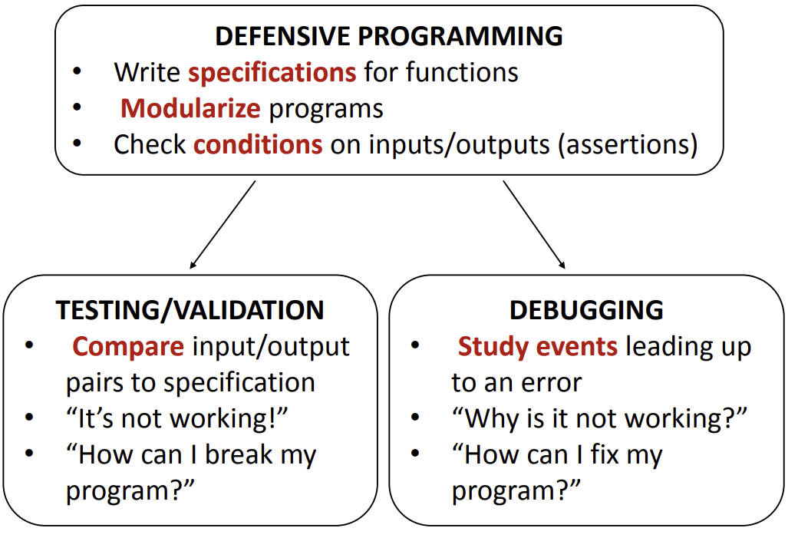

= Module 07: Testing, Debugging, Exceptions, Assertions

== 우리는 고품질을 목표로 합니다 – 수프와 유사합니다

수프를 만들고 있는데 천장에서 벌레가 계속 떨어지네요. 어떡할건가요?

* 수프에 벌레가 있는지 확인
** 테스트
* 뚜껑을 닫아둔다
** 방어적 프로그래밍
* 주방 청소
** 소스의 버그 제거

image:./images/image01.png[]

== 쉬운 테스트와 디버깅을 위한 설정

* **처음**부터 이 부분을 쉽게 할 수 있도록 코드를 디자인
* 프로그램을 개별적으로 테스트하고 디버깅할 수 있는 **모듈**로 나눔
* 모듈에 대한 **문서 제약**
** 입력이 어떻게 될 것으로 예상합니까?
** 결과가 어떻게 될 것으로 예상합니까?
* 코드 설계 뒤에 있는 **가정을 문서화**합니다.

== 언제 테스트할 준비가 되는가?

* **코드 실행**이 보장될 때
** Syntax error 제거
** Static symantic error를 제거합니다.
** Python 인터프리터는 일반적으로 이러한 항목을 찾아줄 수 있습니다.
* **예상되는 결과 세트**가 있음
** 입력 세트
** 각 입력에 대해 예상되는 출력

== 테스트 분류

* Unit testing
** 프로그램의 각 조각 금증
** 각 **함수를 분리하여 테스팅**
* Regression testing
** 버그를 발견하면 테스트를 추가
** 이전에 수정된 오류를 **다시 찾아냄**
* Integration testing
** **전반적인 프로그램**이 작동하는가?
** 이 일을 서두르는 경향이 있다

== 테스트 접근 방식

* 문제의 자연스러운 경계에 대한 직관적인 접근

[source, python]
----
def is_bigger(x, y):
    """ Assumes x and y are ints
    Returns True if y is less than x, else False """
----

** 자연스럽게 경계를 구분할 수 있는가?
* 자연스러운 파티션이 없으면 **랜덤 테스트(Random Test)**를 수행할 수 있음
** 코드가 올바를 확률은 테스트의 양과 비례함
** 아래는 더 나은 방법
* 블랙박스(Black Box) 테스트
** Specification을 통해 경로를 탐색
* 유리상자(Glass Box) 테스트
** 코드를 통해 경로를 탐색

== Black box Testing

[source, python]
----
def sqrt(x, eps):
    """ Assumes x, eps floats, x >= 0, eps > 0
    Returns res such that -x-eps <= res*res <= x+ eps """
----

* 코드를 **보지 않고** 디자인
* 코드를 구현한 사람의 **편견**을 피하기 위해 다른 사람이 수행할 수 있음
* 구현이 변경되면 테스트를 재사용할 수 있음
* Specification을 통해 경로를 탐색
** 다양한 파티션에 테스트 케이스를 구축
** 경계 조건(빈 목록, 싱글턴 목록, 큰수, 작은 수 등)을 고려

