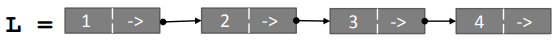
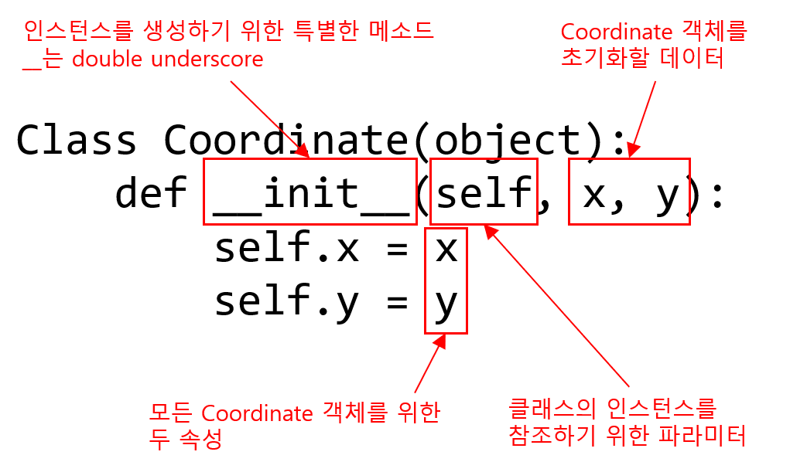
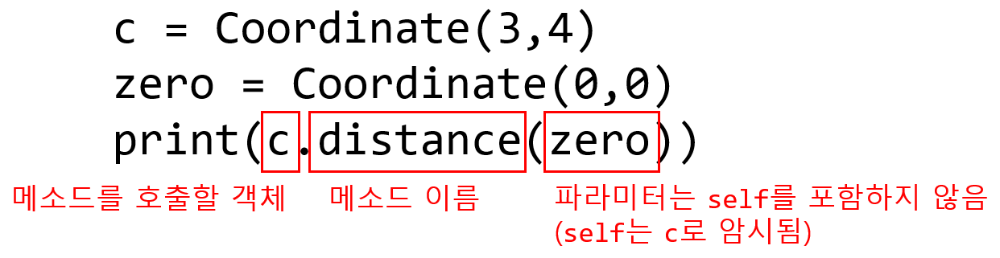
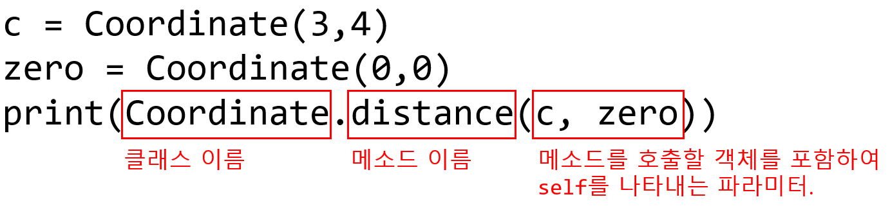

= Object Oriented Programming

== Objects

* Python은 많은 다른 종류의 데이터를 제공함

[source, python]
----
1234 3.14159 "Hello" [1, 5, 7, 11, 13]
{"CA": "California", "MA": "Massachusetts"}
----

* 각각의 데이터는 객체(object)이고, 모든 객체는 아래의 것들을 가짐:
** 타입
** 내부적 데이터 표현(primitive 또는 composite)
* 객체는 타입의 **인스턴스**
** `1 2 3 4` 는 `int` 의 인스턴스
** `"hello"` 는 string의 인스턴스

== Object Oriennted Programming (OOP)

* **Python에서 모든 것은 객체** (타입을 가짐)
* 어떤 타입의 **새 객체를 생성**할 수 있음
* **객체를 조작**할 수 있음
* **객체를 소멸**시킬 수 있음
** 명시적으로 객체를 `삭제(del)` 하거나 그냥 "잊어버릴" 수 있음
** Python 시스템은 소멸되었거나 액세스 할 수 없는 객체를 회수함 - 이를 "Gabage Collection"이라 부름

== 객체란 무엇인가?

* 객체는 다음을 통한 **데이터 추상화(Data Abstraction)**
1. **내부 표현** • 데이터 속성
2. 객체와 상호작용하기 위한 **인터페이스**
• 메소드(프로시저/함수라고도 함)
• 동작을 정의하지만 구현을 숨김

== 예: `[1,2,3,4]` 는 list 타입

* list가 내부적으로 어떻게 표현될까: 셀들의 연결된 리스트로 표현됨
+
 +
각 포인터는 다음 인덱스를 가리킴
+
* list 조작
** `L[i], L[i:j], +`
** `len(), min(), max(), del(L[i])``
** `L.append(),L.extend(),L.count(),L.index(), L.insert(),L.pop(),L.remove(),L.reverse(), L.sort()`
* 내부 표현은 비공개이어야 합니다.
* 내부 표현을 직접 조작하면 올바른 행동이 동작을 보장못함

== OOP의 장점

* 잘 정의된 인터페이스를 통해 데이터를 작업하는 절차와 함께 데이터를 패키지로 묶음
* `Divide and Conquer` 개발
** 각 클래스의 동작을 별도로 구현하고 테스트
** 향상된 모듈성(modularity)으로 복잡성 감소
* 클래스를 사용하면 코드를 쉽게 재사용할 수 있음
** 많은 python 모듈이 새 클래스를 정의
** 각 클래스에는 별도의 환경이 있음(함수 이름에 충돌 없음)
** Inhertance를 통해 subclass는 superclass의 선택된 부분을 재정의하거나 확장할 수 있음

== 클래스를 사용하여 타입 생성 및 사용

* 클래스 생성과 클래스 인스턴스 사용을 구분
* 클래스 생성
** 클래스 이름 정의
** 클래스 속성 정의
** 누군가 list 클래스를 구현하는 코드를 작성했다면
* 클래스 사용
** 객체의 새로운 인스턴스 생성
** 인스턴스에 대한 작업 수행
** _예)_ `L=[1,2]` _및_ `len(L)`

== 타입 정의

* `class` 키워즈를 사용하여 새 타입 정의

[source, python]
----
class Coordinate(object):
"""   ^ name/type  ^ class parent """
    # defile attribute here
----

* `def` 와 비슷하게, 들여쓰기 된 코드에 쓴 statement는 **클래스 정의**의 일부가 된다
* `object` 는 'Coordnate` 가 Python 객체이고 모든 속성을 **상속(Inherits)** 한다는 의미
** `Coordinate` 는 `object` 의 서브클래스
** `object` 는 `Coordinate` 의 수퍼클래스

== 속성(Attribute) 란?

* 클래스에 **"속하는"** 데이터 및 프로시저
* **데이터 속성**
** 클래스를 구성하는 객체로서의 데이터
** 예로, Coordinate는 두 개의 숫자로 구성됨
* **메소드(procedual attribute)** 
** 클래스에서만 동작하는 함수로 생각할 것
** 객체와 상호작용 하는 방법
** 예로, 두 Coordinate 객체 사이의 거리를 정의할 수는 있지만 두 list 개체 사이의 거리는 의미가 없음

== 클래스의 인스턴스를 생성하는 방법 정의

* 먼저 객체의 인스턴스를 생성하는 방법을 정의
* 일부 데이터 속성을 초기화하려면 `__init__` 라는 특수 메소드 사용

== 클래스 인스턴스의 실제 생성

[source, python]
----
c = Coordindate(3, 4)
origin = Coordinate(0, 0)
print(c.x)
print(origin.x)
----

* 인스턴스의 데이터 속성은 **인스턴스 변수(instance variable)** 이라고 부름
* `self` 를 위한 argument는 제공하지 않음, Python은 자동으로 이를 수행

== 메소드란?

* 절차적 속성(procedual attribute), **해당 클래스를 위해서만 동작하는 함수**
* Python은 항상 객체를 첫 번째 argument로 전달함
** 첫 번째 argument 이름으로 `self` 를 사용하는 것이 관례
* `"."` **연산자**는 모든 속성에 액세스하는데 사용
** 객체의 데이터 속성
** 객체의 메소드

== `Coordinate` 클래스를 위한 메소드 정의

[source, python]
----
class Coordinate(object):
    def __init__(self, x, y):
        self.x = x
        self.y = y
    def distance(self, other):
        x_diff_sq = (self.x-other.x)**2
        y_diff_sq = (self.y-other.y)**2
        return (x_diff_sq + y_diff_sq)**0.5
----

* `self` 및 `+.` 표기법을 제외하면 모든 메소드는 함수처럼 동작함(파라미터 사용, 동작 수행, return)

== 메소드 사용

[source, python]
----
def distance(self, other):
    # code here
----

클래스 사용:

* 기존 방식
+

+
* 같은 방법
+

+

== 객체의 표현 print

[source, python]
----
>>> c = Coordinate(3, 4)
>>> print(c)
<___main___c.Coordinate object at 0x7fa918510488>
----

* 기본적으로 객체 정보를 print하지 않음
* 클래스에 `\\__str__` 메소드 정의
* Python은 클래스 객체에서 `print` 와 함께 사용될 때 `\\__str__` 메소드를 호출함
* `Coordinate`` 객체를 print할 때 표시할 객체를 선택
** 반드시 string 반환

[source, python]
----
>>> print(c)
<3, 4>
----

=== print 메소드 정의

[source, python]
----
class Coordinate(object):
    def __init__(self, x, y):
        self.x = x
        self.y = y
        def distance(self, other):
        x_diff_sq = (self.x-other.x)**2
        y_diff_sq = (self.y-other.y)**2
        return (x_diff_sq + y_diff_sq)**0.5
    def __str__(self):
        return "<"+str(self.x)+","+str(self.y)+">"
----

== 타입과 클래스

* 객체 인스턴스의 타입을 알 수 있음

[source, python]
----
>>> c = Coordinate(3, 4)
>>> print(c)    #
<3, 4>
>>> print(type(c))
<class __main__.Coordinate>
----

* 그러면 아래가 말이 된다

[source, python]
----
>>> print(Coordinate)
<class __main__.Coordinate>
>>> print(type(Coordinate))
<type 'type'>
----

* `isinstance()` 를 사용하여 객체가 `Coordinate` 타입인지 체크

[source, python]
----
>>> print(isinstance(c, Coordinate))
True
----

== 특별한 연산자

* +. -. ==, <, >, len(), print, 그외 많은 연산자
+
https://docs.python.org/3/reference/datamodel.html#basic-customization
+
* `print` 처럼, 이 작업들은 클래스에서 오버라이드 할 수 있음
* 앞 뒤로 두 언더스코어(__)를 사용하여 정의

[source, python]
----
__add__(self, other) # self + other
__sub__(self, other) # self - other
__eq__(self, other) # self == other
__lt__(self, other) # self < other
__len__(self) # len(self)
__str__(self) # print self
----
.. 그외 기타..

== 예제: 분수(Fractions)

* 숫자를 분수로 표현하는 새로운 타입 생성
* 내부 표현은 두 개의 정수
** 분자(numerator)
** 분모(denumerator)
* Faction 객체 인터페이스(메소드, 상호 작용 방법)
** 더하기, 빼기
** print 표현, 부동 소수점 변환
** 분수 반전

== OOP의 힘

* 공유하는 객체를 함께 묶음
** 공통 속성, 및
** 해당 속성에 대해 작동하는 절차
* 객체를 구현하는 방법과 객체를 사용하는 방법을 구별하기 위해 추성화를 사용
* 다른 객체 클래스의 동작을 상속하는 객체 추상화 계층 구축
* Python의 기본 클래스 위에 자체적인 객체 클래스 생성
