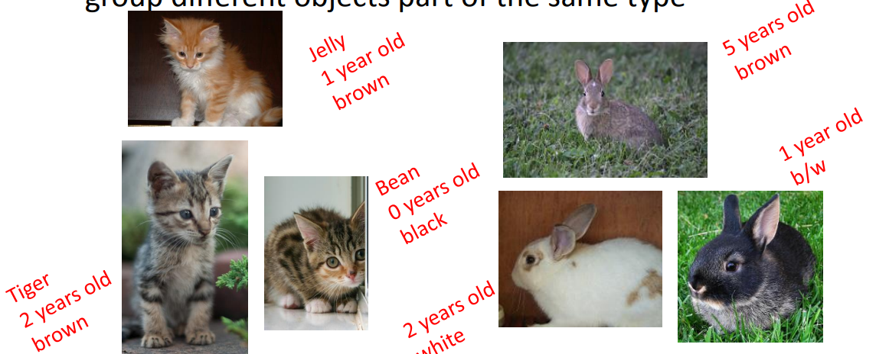
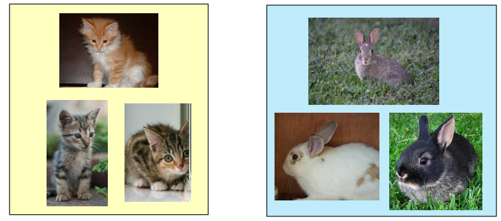
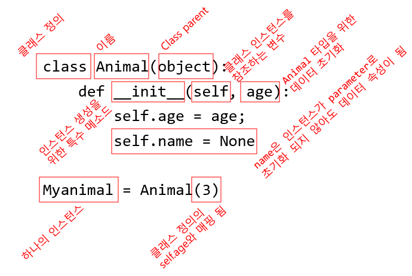
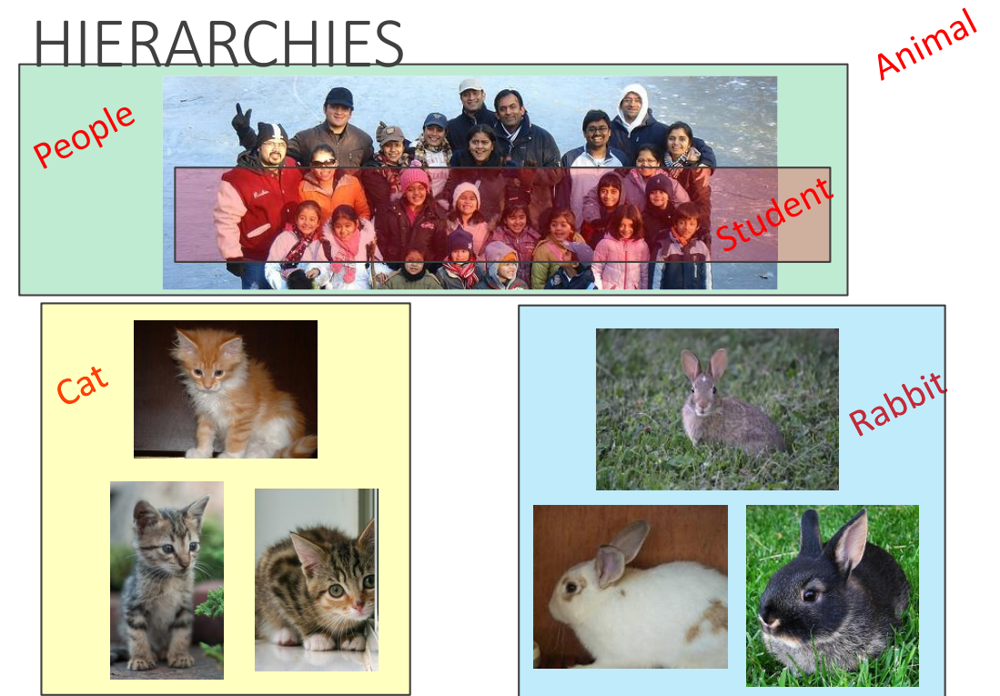
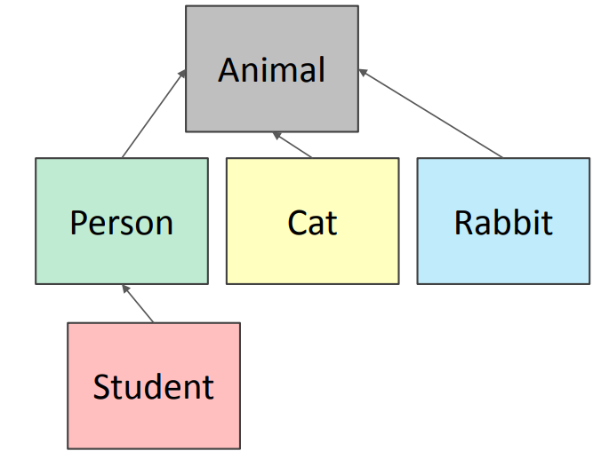
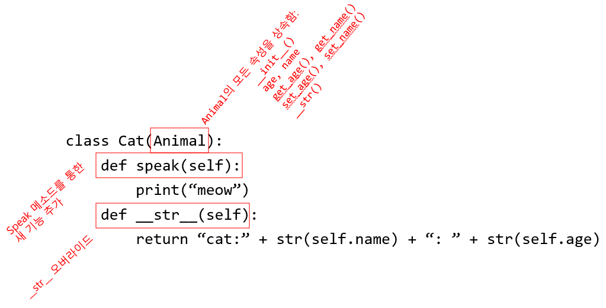
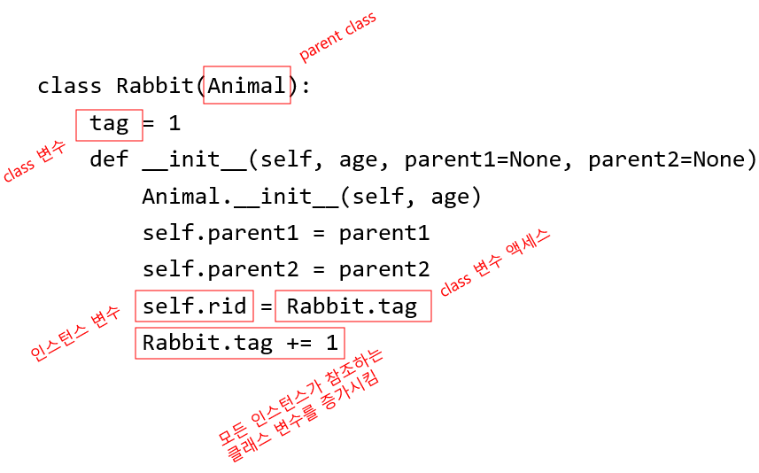
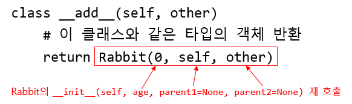

= Module 09: Python 클래스와 상속(Inheritance)

== 지난 시간

* 클래스를 통한 추상 데이터 타입(Abstract Data Type)
* `Coordinate` 예제
* `Fraction` 예제

== 오늘

* 클래스에 대해 더 알아봄
** getter와 setter
** 정보 은닉(information hiding)
* Inheritance(상속)

== 클래스 구현 vs. 클래스 사용

* 두 가지 다른 관점에서 코드 작성

* 클래스 구현 관점
** 클래스를 사용하여 새로운 객체 타입 **구현**
*** 클래스 **정의**
*** **데이터 속성** 정의 (그 객체는 무엇인가)
*** **메소드** 정의 (객체를 사용하는 방법)

* 클래스 사용 관점
** 코드에서 새 객체 타입 **사용**
*** 객체 타입의 인스턴스 생성
*** 생성한 인스턴스로 연산(operations) 수행

== 객체 유형의 클래스 정의 인스턴스 vs. 클래스의 인스턴스

* 객체 유형의 클래스 정의 인스턴스
** 클래스 이름은 **타입**
+
----
class Coordinate(object)
----
+
** 클래스는 일반적으로 정의됨
*** 클래스를 정의하는 동안 `self` 를 사용하여 일부 인스턴스를 참조
+
----
(self.x - self.y)**2
----
+
*** `self` 는 클래스 정의의 메소드에 대핸 파라미터
** 클래스는 **모든 인스턴스에 공통되는** 데이터와 메소드를 정의함

* 클래스의 인스턴스
** 인스턴스는 하나의 특정 객체
+
---- 
coord = Coordinate(1, 2)
----
+
** 데이터 속성 값은 인스턴스마다 다름
+
----
c1 = Coordinate(1, 2)
c2 = Coordinate(3, 4)
----
+
** `c1` 과 `c2` 는 서로 다른 객체이므로, 서로 다른 데이터 속성 값 `c1.x` 와 `c2.x` 를 가짐
** 인스턴스는 **클래스의 구조**를 가짐

== 왜 OOP, Class와 Object를 사용하는가?

* 실생활을 흉내 냄
* 동일한 타입의 서로 다른 객체 부분을 그룹화

== 겍체 그룹은 속성을 가짐

* **데이터 속성(Data attribute)**
** 객체의 데이터를 어떻게 표현할 것인가?
** **데이터 속성이란 무엇인가?**
** _좌표를 위해서: x와 y 값_
** _동물을 위해서: 나이, 이름_
* **절차적 속성(Procedual attribute)** (behavior/operations/**methods**/)
** 객체와 어떻게 상호작용 할 것인가?
** _좌표를 위해서: 두 좌표간의 거리 찾기_
** _동물을 위해서: 소리 만들기_

== 클래스 정의

== getter와 setter 메소드

[source, python]
----
class Animal(object):
    def __init__(self, age):
        self.age = age
        self.name = None
    
    def get_age(self):      # getter
        return self.age

    def get_name(self):     # getter
        return self.name
    
    def set_age(self, newage):      # setter
        self.age = newage
    
    def set_name(self, newname=""): # setter
        self.name = newname
    
    def __str__(self):
        return "animal: " + str(self.name) + ": " + str(self.age)
----

* **getter와 setter**는 클래스 외부에서 데이터 속성에 액세스 할 수 있어야 함

== 인스턴스와 dot notation

* 인스턴스화(instantiation)은 객체의 인스턴스를 생성함

[source, python]
----
a = Animal(3)
----

* **dot notation** 으로 데이터 속성에 액세스 할 수 있음 (getter와 setter를 사용하는 것이 바람직함)

[source, python]
----
a.age
a.get_age
----

== 정보 은닉(Information hiding)

* 작성자는 클래스 정의의 **데이터 속성 변수 이름을 변경**할 수 있음

[source, python]
----
class Animal(object):
    def __init__(self, age):
        self.years = age    # age 데이터 속성을 years로 변경
    
    def get_age(self):
        return self.years
----

* 클래스 외부에서 **데이터 속성에 접근**하려 하고, **정의가 변경**되었다면, 오류가 발생함
* 클래스 외부에서는 `a.age` 형태의 데이터 속성에 대한 직접 액세스 보다는 `a.get_age()` 형태의 getter와 setter를 사용
** 좋은 스타일
** 코드를 유지 관리하기 쉬움
** 버그 방지

== Python은 정보 은닉에 좋지 않음

* 클래스 외부에서 **데이터 액세스**를 허용함
+
[source, python]
----
print(a.age)
----
+
* 클래스 외부에서 **데이터에 쓰기**를 허용함
+
[source, python]
----
a.age = 'infinite'
----
+
* 클래스 외부에서 **데이터 속성의 생성**을 허용함
+
[source, python]
----
a.size = "tiny"
----

* 이는 좋은 스타일이 아님!

== Default argument

* formal parameter를 위한 **기본 인자(default argument)**는 actual parameter가 주어지지 않았을 때 사용됨
+
[source, python]
----
def set_name(self, newname=""):
    self.name = newname
----
+
* default argument 사용
+
[source, python]
----
a = Animal(3)
a.set_name()
print(a.get_name())     # "" 를 출력
----
+
* argument를 전달하며 메소드 호출
+
[source, python]
----
a = Animal(3)
a.set_name("fluffy")
print(a.get_name())
----

== 계층구조(Hierarhies)

* **parent class**(superclass)
* **child class**(subclass)
** parent class의 모든 데이터(data)와 행위(behavior)를 **상속(Inherits)**함
** **더 많은** 정보를 ***더함**
** **더 많은** 행위를 더함
** 행위를 **오버라이드(override)**

== Inheritance: Parent class

[source, python]
----
class Animal(object):
    def __init__(self, age):
        self.age = age
        self.name = None

    def get_age(self):
        return self.age

    def get_name(self):
        return self.name

    def set_age(self, newage):
        self.age = newage

    def set_name(self, newname=""):
        self.name = newname

    def __str__(self):
        return "animal:"+str(self.name)+":"+str(self.age)
----

* 클래스 선언 Animal의 object
** 모든 것은 객체
** class `object` 는 Python의 기본 동작(operation)들을 구현

== Inheritance: Subclass

* `speak()` 로 새 기능 추가
** 타입 `Cat` 의 새 인스턴스는 새 메소드를 호출할 수 있음
** `Animal` 타입 인스턴스에서 `Cat` 의 새 메소드를 호출하면 오류 발생
* `\\__init__` 은 유실된 것이 아니라, `Animal` 버전을 사용

== 어떤 메소드를 사용해야 하는가?

* subclass는 superclass와 **같은 이름을 가진 메소드**를 가질 수 있음
* 클래스 인스턴스의 경우 **현재 클래스 정의**에서 메소드 이름을 찾음
* 찾을 수 없는 경우 **위쪽 계층 구조**에서 메소드 이름을 찾음(부모, 조부모 등)
* 해당 메소드 이름으로 찾은 계층 구조의 첫 번째 메소드를 사용

[source, python]
----
class Person(Animal):   # parent class가 Animal
    def __init__(self, name, age):
        Animal.__init__(self, age)  # Animal 생성자 호출
        self.set_name(name)         # Animal의 메소드 호출
        self.friends = []           # 새 데이터 속성 추가
    
    def get_friends(self):          # 새 메소드
        return self.friends
    
    def add_friends(self, fname):   # 새 메소드
        if fname not in self.friends:
            self.friends.append(fname)
    
    def speak(self):                # 새 메소드
        print("hello")
    
    
    def age_diff(self, other):      # 새 메소드
        diff = self.age - other.age
        print(abs(diff), "year difference")
    
    def __str__(self):              # Animal의 __str__ 메소드 오버라이드
        return "person: " + str(self.name) + ": " + str(self.age)
----

[source, python]
----
import random   # random 클래스의 메소드를 가져옴

class Student(Person):  # Person과 Animal 클래스의 속성 상속
    def __init__(self, name, age, major=None):  
        Person.__init__(self, name, age)
        self.major = major      # 새 데이터 추가
    
    def change_major(self, major):
        self.major = major
    
    def speak(self):
        r = random.random()     # python 문서에서 random 클래스 사용법을 찾아볼 것, random() 메소드는 [0, 1] 사이의 float을 반환
        if r < 0.25:
            print("i have homework")
        elif 0.25 <= r < 0.5:
            print("i need sleep")
        elif 0.5 <= r < 0.75:
            print("i should eat")
        else:
            print("i am watching TV")
    
    def __str__(self):
        return "student: " + str(self.name) + ": " + str(self.age) + ": " + str(self.major)
----

== `Rabbit` 서브 클래스

* **클래스 변수**와 해당 값은 클래스의 모든 인스턴스 간에 공유됨

* `tag` 는 모든 Rabbit 인스턴사가 고유한 값을 가지도록 사용됨

== `Rabbit` getter 메소드

[source, python]
----
class Rabbit(Animal):
    tag = 1
    def __init__(self, age, parent1=None, parent2=None):
        Animal.__init__(self, age)
        self.parent1 = parent1
        self.parent2 = parent2
        self.rid = Rabbit.tag
        Rabbit.tag += 1
    
    # Rabbit 클래스의 getter 메소드
    # get_name과 get_age getter 메소드는 Animal 에서 상속됨
    def get_rid(self):  
        return str(self.rid).zfill(3)   # 문자의 시작 부분을 0으로 채움. 1이 아닌 000으로 표시
    
    def get_parent1(self):
        return self.parent1
    
    def get_parenrt2(self):
        return self.parent2
----

== 정의된 type에서 작업

* 두 `Rabbit` 인스턴스 간의 **+ 연산자** 정의
** `r4 = r1 + r2` 와 비슷한 형식의 동작 정의, r1과 r2는 `Rabbit` 인스턴스
** `r4` 는 age가 0인 새 `Rabbit` 인스턴스
** `r4` 는 `self` 를 parent로 가지고 `other` 를 다른 부모로 가짐
** `__init__` 에서, **parent1과 parent2는 Rabbit 타입**

== 두 `Rabbit` 의 비교를 위한 특별한 메소드

* 두 parents를 가지고 있을 때 두 토끼가 같은지 결정

[source, python]
----
def __eq__(self, other):
    parents_same =  self.parent1.rid == other.parent1.rid and self.parent2.rid == other.parent2.rid     # boolean
    parents_opposite = self.parent2.rid == other.parent1.rid and self.parent1.rod == other.parent2.rid   # boolean
    return parents_same or parents_opposite
----

* ID가 고유하므로 부모의 ID를 비교(클래스 var로 인해)
* 개체를 직접 비교할 수는 없음
** 예를 들어. self.parent1 == other.parent1 사용
** None에서 호출할 때까지 \\__eq__ 메서드를 계속해서 호출하고 parent1.None을 수행하려고 하면 AttributeError를 발생시킴

== Object Oriented Programming

** 새 **collections of data**를 생성
** 정보를 **조직(organzie)**
** 작업을 **구분(division)**
** **일관된** 방식으로 정보에 접근
** 복잡성 **계층** 추가
** 함수와 마찬가지로 클래스는 프로그래밍에서 **분해(decomposition)** 및 **추상화(abstraction)**를 위한 메커니즘