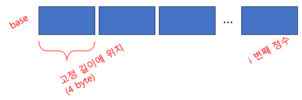

= Module 10: Understanding program efficiency part 1

== 오늘

* 알고리즘 성장 순서 측정
* Big "O" 표기법
* 클래스 복잡성

== 프로그램의 효율성을 이해

* 컴퓨터는 점점 더 빨리지므로, 프로그램의 효율의 중요성은 떨어지고 있을까?
** 그러나 데이터 세트는 매우 클 수 있다(예: 2014년 Google은 30,000,000,000,000페이지, 100,000,000GB에 해당. brute force 검색을 수행하는 데 얼마나 오랜 시간이 소요될까?)
** 따라서 단순한 솔루션은 수용 가능한 방식으로 크기가 확장되지 않을 수 있음
* 어떤 프로그램 옵션이 가장 효율적인지 어떻게 결정 할까?

* 프로그램의 **시간 및 공간 효율성**을 분리
* 시간 및 공간 효율성 사이의 절충안:
** 때로는 사전 계산 결과를 저장. 그런 다음 "조회"를 사용하여 검색(예: 피보나치 memoization)
** 여기에서는 시간 효율성에 중점을 둘 것

== 프로그램의 효율성을 이해

계산 문제에 대한 솔루션의 효율성을 이해하는 데 어려움이 있음

* 프로그램은 **다양한 방법으로 구현**될 수 있음
* 몇 가지 **알고리즘**만 사용하여 문제를 해결할 수 있음
* 구현 선택과 좀 더 추상적인 알고리즘 선택을 분리해야 함

== 프로그램 효율성 연산(evaluate)

* **timer**로 측정
* 작업(operation)의 **count**
* **성장 순서**에 대한 추상적 개념 +
이것이 문제 해결에 있어 알고리즘 선택의 영향에 접근하는 가장 적절한 방법이며. 그리고 문제 해결에 있어서 본질적인 어려움을 측정하는 것

== Timning a program

* time module 사용
* import는 해당 클래스를 코드 파일로 가져오는 것을 의미

[source, python]
----
import time

def c_to_f(c):
    return c * 9 / 5 + 32

t0 = time.perf_counter()        # start clock
c_to_f(100000)                  # 함수 호출
t1 = time.perf_counter() - t0   # stop clock

print("t = ", t0, ":", t1, "s, ")
----

== Timing 프로그램은 일관성이 없음

* 목표: 다양한 알고리즘의 평가
* 실행 시간은 **알고리즘마다 다름** (만족)
* 실행 시간은 **구현마다 다름**    (만족되지 않음)
* 실행 시간은 **컴퓨터마다 다름**   (만족되지 않음)
* 작은 입력으로 실행 시간을 **예측할 수 없음**  (만족되지 않음)

* 시간은 입력마다 다르디만 입력과 시간간의 관계를 실제로 표현할 수는 없음

== Counting 동작

* 이 단계에는 일정한 시간이 걸린다고 가정
** 수학 연산
** 비교
** 할당
** 메모리에 있는 객체에 접근
* 그 후 입력 크기의 함수로 실행된 작업 수 계산

[source, python]
----
def c_to_f(c):
    return c * 9 / 5 * 32   # 3 ops

def mysum(x):
    total = 0   # 1 op
    for i in range(x + 1):  # loop x times, (x + 1) 에서 1 op
        total += 1          # 1 op    
    return total
----

== Counting 동작이 더 낫지만...

* 목표: 다양한 알고리즘의 평가
* 실행 시간은 **알고리즘마다 다름** (만족)
* 실행 시간은 **구현마다 다름**    (만족되지 않음)
* 실행 시간은 **컴퓨터마다 다름**   (만족)
* 작은 입력으로 실행 시간을 **예측할 수 없음**  (만족되지 않음)

* count는 입력마다 다르며 입력과 개수 사이의 관계를 알아낼 수 있음

== 더 나은 방법이 필요

* timing과 counting으로 **구현을 평가**함
* timing이 **기계를 평가**함

* **알고리즘(Algorithm)을 평가**해야 함
* **확장성(Scalability)**을 평가해야 함
* **입력 크기 측면에서 평가**해야 함

== 더 나은 방법이 필요

* 알고리즘에서 작업 계산에 대한 아이디어에 초점을 맞추지만 구현시 작은 변수에 대해서는 걱정하지 않음(예: 반복 단계를 실행하기 위해 3개 또는 4개의 기본 연산을 사용하는지의 여부)
* 문제의 크기가 임의로 커질 때 알고리즘이 어떻게 수행되는지에 중점을 두어야 함
* 이런 방식으로 측정된 계산을 완료하는데 필요한 시간을 문제에 대한 입력 크기와 연관하려는 경우
* 실제 단계 수는 시험의 세부 사항에 따라 달라질 수 있으므로 무엇을 측정할지 결정해야 함

== 함수를 평가하는데 사용할 입력을 선택해야 함

* 입력 크기 측면에서 효율성을 표현하려면 입력이 무엇인지 결정해야 함
* **정수**일 수 있음 +
`mysum(x)`
* **list의 길이**일 수 있음 +
`list_sum(L)`
* 함수에 여러 파라미터를 사용하는 시기를 결정 +
`search_for_elmt(L, e)`

== 다양한 입력에 따라 프로그램 실행 방식이 변경됨

* 목록에서 요소를 검색하는 기능

[source, python]
----
def search_for_elmt(L, e):
    for i in L:
        if i == e:
            return True
    return False
----

* `e` 가 **첫 번째 요소**인 경우 -> 최상의 사례
* `e` 가 **목록에 없는** 경우 -> 최악의 사례
* 목록에 있는 요소의 **절반 정도를 살펴볼 때** -> 평균 사례
* 이 동작을 일반적인 방식으로 측정해야 함

== 최상, 평균, 최악의 경우

* 길이가 len(L)인 list L이 주어졌다고 가정
* **최상의 경우**: 주어진 크기 `len(L)` 의 가능한 모든 입력에 대한 최소 실행 시간
** `search_for_elmt` 에 대한 상수
** list의 첫 번째 요소
* **평균의 경우**: 주어진 크기 `len(L)` 의 가능한 모든 입력에 대한 평균 실행 시간
** 실용적인 측정
* **최악의 경우**: 주어진 크기 `len(L)` 의 가능한 모든 입력에 대한 최대 실행 시간
** `search_for_elmt` 의 list 길이가 선형
** 전체 목록을 검색해야지만 찾을 수 있음

== 증가 기준(Order of growth)

목표:

* **자료의 수 N이 점점 증가할 때** 헤당 알고리즘이 수행을 완료하는데 얼마만큼의 시간이 걸리는지의 경향성을 나타냄
* 입력 크기가 증가함에 따라 **프로그램의 실행 시간이 늘어나는 것**을 표현
* 향상의 **상한선(upper bound)**을 최대한 엄격하게 정함
* 정확할 필요는 없음(it's "order of", ot "exact")
* 런타임에서 **가장 큰 요소**를 살펴봄 (프로그램의 어떤 부분이 실행에 가장 오랜 시간을 소요하는가?)
* **따라서 일반적으로 최악의 경우 입력 크기의 함수로서 향상의 상한선을 정함**

== 증가 기준 측정(measuring order of growth): Big Oh 표기법

* Big Oh 표기법은 증가 기준(order of growth)라고 불리는 **점근적 증가의 상한(upper bound on the asymptotic growth)**을 측정함
* **Big Oh 또는 _O()_ **는 최악의 경우를 설명하는데 사용됨
** 최악의 경우는 자주 발생하며 프로그램 실행시 병목 현상(bottleneck)이 발생함
** 입력 크기에 따른 프로그램의 증가율을 나타냄
** 기계나 구현이 아닌 알고리즘을 평가(evaluate)

== 명확한 절차 vs. `O()`

[source, python]
----
def fact_iter(n):
    """ n은 정수 > =0 으로 가정 """
    answer = 1
    while n > 1:
        answer *= n     # answer = answer * n
        n -= 1          # temp = n - 1, n = temp
    return answer
----

* factorial 계산
* 단계의 수: 1 + 5n + 1
* 최악의 경우 점근적 복잡성:
** 덧셈 상수 무시
** 곱셈 상수 무시

== O(n)이 측정하는 것

* 문제(입력)의 크기가 커짐에 따라 필요한 시간이 어떻게 늘어나는지 설명함
* 따라서 알고리즘을 계산하는데 필요한 동작의 수를 표현하면 문제의 수가 커질수록 점근적인 동작을 알 수 있음
* 따라서 용어의 합에서 가장 빠르게 성장하는 용어에 중점
* 입력 크기가 증가함에 따라 필요한 시간이 얼마나 빨리 증가하는지 알고자 곱셈 상수 무시

== 단순화 예

* 상수와 곱셈 요소 삭제
* **지배적 항(dominant terms)**에 초점
+
++++
O(n2) : n2 + 2n + 2  
O(n2) : n2 + 10000n + 31000  
O(n) : log(n) + n + 4  
O(n log n) : 0.0001 * n * log(n) + 300n  
O(3n) : 2n30 + 3n
++++

== 증가 기준(Order of growth) 유형

== 프로그램과 복잡성 분석

* 복잡성 클래스 **결합**
** 함수 내부의 명령문 분석
** 몇 가지 규칙을 적용하고 주요 용어에 중점을 둠
* `O()` 에 대한 덧셈의 법칙:
** **순차적(sequtial)** statement와 함께 사용됨 
** `O(f(n)) + O(g(n))` 은 `O(f(n) + g(n))`
** 예제
+
[source, python]
----
for i in range(n):      # O(n)
    print('a')
for i in range(n * n):  # O(n * n)
    print('b"')
----
는 O(n) + O(n * n) = O(n + n^2^) = O(n^2^) <- 지배적 항(dominant term)이기 때문

== 프로그램과 복잡성 분석

* 복잡성 클래스 **결합**
** 기능 내부의 명령문 분석
** 몇 가지 규칙을 적용하고 지배적 항(dominant term)에 중점을 줌
* `O(n)` 의 **곱셈 법칙**:
** **중첩된** 문/루프와 함께 사용됨
** O(f(n)) * O(g(n)) 은 O(f(n) * g(n))
** 예제
+
[source, python]
----
for i in range(n):
    for j in range(n):
        print('a')
----
`O(n) * O(n) = O(n * n) = O(n^2^)` 가 됨. 모든 외부 루프 반복에 대해 외부 루프는 `n` 번이고 내부 루프도 `n` 번 진행되기 때문
+
== 복잡성 분류(Complexity class)

* O(1)은 일정한 실행 시간을 나타냄
* O(log n)은 로그 실행 시간을 나타냄
* O(n)은 선형 실행 시간을 나타냄
* O(n log n)은 로그 선형 실행 시간을 나타냄
* O(n^c^)는 다항식 실행 시간을 나타냄(c는 상수)
* O(c^n^)은 지수 실행 시간을 나타냅니다. (c는 입력 크기에 따라 거듭제곱되는 상수)

== Complexity classes ordered low to high

== 복잡성 증가

[cols="1,1,1,1,1" options=header]
|===
|class|n=10|=100|=1000|=1000000
|O(1) | 1 | 1 | 1| 1
|O(log n)| 1 | 2 | 3| 6
|O(n)| 10 | 100 | 1000 | 1000000
|O(n log n) | 10 | 200 |  3000| 6000000
|O(n^2^)| 100 | 10000| 1000000| 1000000000000
|O(2^n^) |1024| 1267650600228229
401496703205376|
10715086071862673
20948425049060001
81056140481170553
36074437503883703
51051124936122493
19837881569585812
75946729175531468
25187145285692314
04359845775746985
74803934567774824
23098542107460506
23711418779541821
53046474983581941
26739876755916554
39460770629145711
96477686542167660
42983165262438683
7205668069376| good luck!
|===

== 선형 복잡도

* 단순한 반복 루프 알고리즘은 일반적으로 선형 복잡도를 가짐

== **정렬되지 않은** list의 선형 검색

[source, python]
----
def linear_search(L, e):
    found = False
    for i in range(len(L)):
        if e == L[i]:
            found = True
    return found
----

* 존재 여부를 확인하기 위해 모든 요소를 조사해야 함
* `O(len(L))` 루프의 경우 `e == L[i]` 테스트를 위해` * `O(1)` 
** `O(1 + 4n + 1) = O(4n + 2) = O(n)`
* 전체 복잡도는 **`O(n) - 여기서 n은 len(L)`**

== list 액세스의 상수 시간

* list가 모두 정수인 경우
** `i` 번째 요소는
*** base + 4 * i
+

+

* list가 다양한 타입으로 이루어진 경우
** indirection
** 다른 객체를 참조
+

== **정렬된** list의 선형 탐색

[source, python]
----
def search(L, e):
    for i in range(len(L)):
        if L[i] == e:
            return True
        if L[i] > e:
            return False
    return False
----

* `e` 보다 큰 숫자에 도달할 때 까지만 찾음
* `O(len(L)` 루프의 경우 `e == L[i]` 테스트를 위해 * `O(1)` 
* 전체 복잡도는 `O(n) - 여기서 n은 len(L)`
* _참고:_ 증가 순서는 동일하지만 실행 시간은 두 가지 검색 방법에 따라 다를 수 있음

== 선형 복잡도

* 요소가 존재하는지 확인하기 위해 목록을 순서대로 검색
* 십진수로 구성된 것으로 가정하는 string의 문자 추가
+
[source, python]
----
def addDigits(s):
    val = 0
    for c in s:
        val += int(c)
    return val
----
+
* `O(len(s))`

== 선형 복잡도

* 복잡성은 반복 횟수에 따라 달라짐
+
[source, python]
----
def fact_iter(n):
    prod = 1
    for i in range(1, n + 1):
        prod *= i
    return prod
----
+
* 루프 횟수는 n
* 루프 내부의 작업 수는 상수 (이 경우 3 – i 설정, 곱하기, prod set)
** `O(1 + 3n + 1) = O(3n + 2) = O(n)`
* 전체적으로 `O(n)`

== Nested Loops

* 단순한 반복은 선형 복잡도를 가짐
* 내부에 반복이 있는 반복(포함된 반복)의 경우는?

== 2차 복잡도

* 한 list가 두 번째 list의 하위 집합인지 확인.
** 즉, 첫 번째 list의 모든 요소가 두 번째 list에 나타나는지 확인(중복이 없다고 가정)

[source, python]
----
def isSubset(L1, L2):
    for e1 in L1:
        matched = False
        for e2 in L2:
            if e1 == e2:
                matched = True
                break
        if not matched:
            return False
    return True
----

== 2차 복잡도

[source, python]
----
def isSubset(L1, L2):
    for e1 in L1:               # 외부 반복은 len(L1)번 실행됨
        matched = False
        for e2 in L2:           # 각 반복은 내부 반복을 len(L2)번 반복하며, 횟수는 일정함
            if e1 == e2:
                matched = True
                break
        if not matched:         # O(len(L1) * len(L2))
            return False
    return True                 # L1과 L2 길이가 같고, L2에 L1의 요소가 하나도 없는 경우 최악
                                # O(len(L1)^2)
----

== 2차 복잡도

두 list의 교차점을 찾고, 각 요소가 한 번만 나타나는 list를 반환

[source, python]
----
def intersect(L1, L2):
    tmp = []
    for e1 in L1:               # 첫 번째 반복은 len(L1) * len(L2) 단계를 가짐
        for e2 in L2:           # 두 번째 반복은 len(L1) 단계를 가짐
            if e1 == e2:
                tmp.append(e1)  # 목록의 요소가 len(L1) 단계를 수행할 수 있는지 확인
    res = []
    for e in tmp:
        if not (e in res):
            res.sppend(e)       # 목록의 길이가 거의 같다고 가정하면
    return res                  # O(len(L1)^2)
----

== O() for Nested Loop

[source, python]
----
def g(n):
    """ n >= 0 이라고 가정 """
    x = 0
    for i in range(n):
        for j in range(n):
            x += 1
    return x
----

* n^2^을 비효율적으로 계산
* 중첩 루프를 다룰 때 범위를 살펴봐야 함
* 충첩 루프, 각각 n 번 반복
* `O(n^2^)`

== This time and next time

* 루프 및 중첩 루프의 예
* 선형 및 2차 복잡성 알고리즘 생성
* 다음 번: 다양한 복잡도 클래스 각각의 예