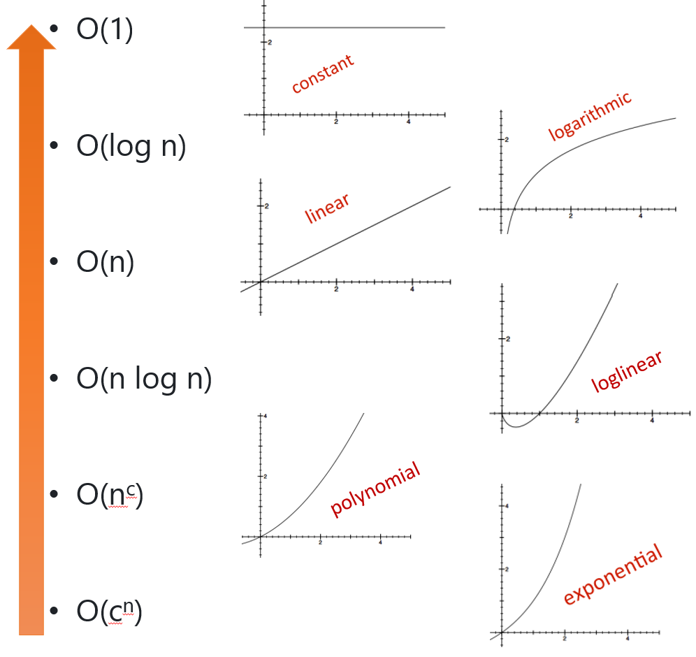
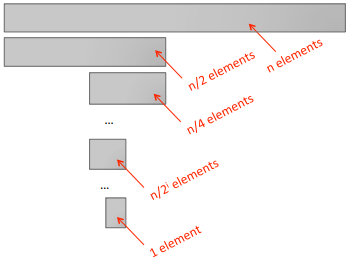
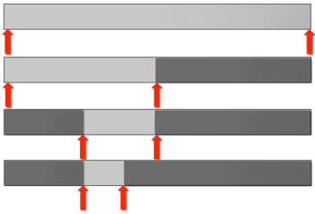

= Module 11: Understanding program efficiency part 1

== Today

* 복잡도 분류
* 각 분류의 특징 예제

== 프로그램의 효율성을 이해해야 하는 이유

* 특정 규모의 문제를 해결하는데 필요한 시간을 예측하기 위한 알고리즘 추론
* 알고리즘 설계의 선택과 결과 알고리즘의 시간 효율성 연관
** 특정 문제를 해결하는데 필요한 시간에 대한 제약

== ORDERS OF GROWTH: RECAP

목표:

* **입력이 매우 클 때** 프로그램의 효율성을 측정
* 입력 크기가 증가함에 따라 **프로그램의 실행 시간이 늘어나는 것**을 표현
* 향상의 **상한선(upper bound)**을 최대한 엄격하게 정함
* 정확할 필요는 없음(it's "order of", ot "exact")
* 런타임에서 **가장 큰 요소**를 살펴봄 (프로그램의 어떤 부분이 실행에 가장 오랜 시간을 소요하는가?)
* **따라서 일반적으로 최악의 경우 입력 크기의 함수로서 향상의 상한선을 정함**

== 복잡성 분류(Complexity class): RECAP

* O(1)은 일정한 실행 시간을 나타냄
* O(log n)은 로그 실행 시간을 나타냄
* O(n)은 선형 실행 시간을 나타냄
* O(n log n)은 로그 선형 실행 시간을 나타냄
* O(n^c^)는 다항식 실행 시간을 나타냄(c는 상수)
* O(c^n^)은 지수 실행 시간을 나타냅니다. (c는 입력 크기에 따라 거듭제곱되는 상수)

== Complexity classes ordered low to high

== 복잡성 증가

[cols="1,1,1,1,1" options=header]
|===
|class|n=10|=100|=1000|=1000000
|O(1) | 1 | 1 | 1| 1
|O(log n)| 1 | 2 | 3| 6
|O(n)| 10 | 100 | 1000 | 1000000
|O(n log n) | 10 | 200 |  3000| 6000000
|O(n^2^)| 100 | 10000| 1000000| 1000000000000
|O(2^n^) |1024| 1267650600228229
401496703205376|
10715086071862673
20948425049060001
81056140481170553
36074437503883703
51051124936122493
19837881569585812
75946729175531468
25187145285692314
04359845775746985
74803934567774824
23098542107460506
23711418779541821
53046474983581941
26739876755916554
39460770629145711
96477686542167660
42983165262438683
7205668069376| good luck!
|===

== Constant Complexity

* 입력과 무관한 복잡성
* 이 클래스에는 흥미로운 알고리즘이 거의 없지만, 이 클래스에 맞는 부분이 있는 경우가 많음
* 반복 또는 재귀 호출이 있을 수 있으나 입력 크기와 관계 없이 반복 또는 호출 횟수가 있는 경우에 해당

== 로그 복잡도(Logarithmic complexity)

* 입력 중 하나의 크기에 대한 로그만큼 복잡성이 증가
* 예:
** 이분 검색(bisection search)
** list의 이진 검색

== 이분 검색(bisection search)

* 특정 요소가 list에 있는지 알고 싶다고 가정
* 지난번에는 list를 "아래로 내려가면서" 각 요소를 확인할 수 있다는 것을 확인
* 복잡성은 list의 크기에 따라 선형적
* list가 가장 작은 것 부터 가장 큰 것 순으로 정렬되어 있다는 것을 알고 있다고 가정
** 순차 검색이 목잡성 면에서 선형일 것이라는 것을 확인
** 더 나은 방법?

== 이분 검색(bisection search)

. list를 반으로 나누는 인덱스를 선택
. `L[i] == e` 인지 확인
. 아니면, `L[i]` 이 'e' 보다 큰지 또는 작은지 확인

새 버전의 분할과 정복(divide-and-conqure) 알고리즘

* 작은 버전의 문제로 파고 들어감(작은 list), 간단한 동작을 추가
* 작은 버전의 해답은 원래 문제의 해답이 됨

== 이분 검색 복잡도 분석

* 아래에 해당하면 검색이 종료됨
+
`1 = N / 2^i^`
+
`그러므로 i = log n`
* 재귀 복잡도는
+
`O(log n)` - 여기서 n은 `n이 len(L)`

== 이분 검색 구현 1

[source, python]
----
def bisect_search1(L, e):
    if L == []:         # constant O(1)
        return False
    elif len(L) == 1:   # constant O(1)
        return L[0] == e
    else:
        half = len(L) // 2  # constant O(1)
        if L[half] > e:
            return bisect_search1(L[:half], e)  # not constant
        else:
            return bisect_search1(L[half:], e)  # not constant
----

== 다른 방법의 이분 검색

* 각 단계에서 문제의 크기를 2배로 줄임
* 검색할 목록의 낮은 부분과 높은 부분만 추적
* list 복사 회피
* 재귀 복잡성은 
+
`O(log n)` - 여기서 n은 `n이 len(L)`

== 이분 검색 구현 2

[source, python]
----
def bisect_search2(L, e):
    def bisect_search_helper(L, e, low, high):
        if high == low:
            return L[low] == e
        mid = (low + high)//2
        if L[mid] == e:
            return True
        elif L[mid] > e:
            if low == mid: #nothing left to search
               return False
            else:
                return bisect_search_helper(L, e, low, mid - 1) # constant other than recursive call
        else:
            return bisect_search_helper(L, e, mid + 1, high)    # constant other than recursive call
    if len(L) == 0:
        return False
    else:
        return bisect_search_helper(L, e, 0, len(L) - 1)
----

== 두 번째 이분 검색 방법 복잡도

* 두 번째 구현 - `bisect_search2` 와 helper
* `O(log n)` 이분법 검색 호춣
* 각 재귀 호출 마다 검색 범위 크기가 절반으로 줄어듬
* 원래 범위의 크기가 n 이면 최악의 경우 `n(2^k^)` 일 때, 또는 `k = log n` 일때 크기 1의 범위까지 내려감
* list과 index를 파라미터로 전달
* list는 복사되지 않고 포인터로 다시 전달됨
* 따라서 `O(1)` 은 각 재귀 호출에 대해 작업
* `O(log n) * O(1)` -> **`O(log n)`**

== 로그 복잡도

[source, python]
----
def intToStr(i):
    digits = '0123456789'
    if i == 0:
        return '0'
    result = ''
    while i > 0:
        result = digits[i % 10] + result
        i = i // 10
    return result
----

== 로그 복잡도

* 함수 호출이 없는 반복만 살펴보면 됨
* while 반복 내에서 일정한 단계 수
* 루프를 몇 번이나 통과할까?
** i를 10으로 몇 번 나눌 수 있나?
** `O(log(i))`

== 선형 복잡도

* 이미 살펴 보았음
* 요소가 존재하는지 확인하기 위해 순서대로 list 검색
* iterative loop

== iterative factorial의 `O()`

* 복잡도는 iterative call의 수에 좌우됨

[source, python]
----
def fact_iter(n):
    prod = 1
    for i in range(1, n + 1):
        prod *= i
    return prod
----

* 전체적으로  `O(n)` - n 번의 round loop, 매번 일정한 비용

== recursive factorial의 `O(n)`

[source, python]
----
def fact_recur(n):
    """ n >= 0 이라고 가정 """
    if n <= 1:
        return 1
    else:
        return n * fact_recur(n)
----

* factorial을 재귀적으로 계산
* 시간을 측정하면 기능으로 인해 iterative 버전보다 조금 느리게 실행됨
* 함수 호출 수가 n 에서 선형이고 지속적으로 호출하므로 `O(n)`
* **iterative와 recursive factorial**은 **같은 증가 기준(Order of growth)**을 가짐

== 로그-선형(log-linear) 복잡도

* 많은 실용적인 알고리즘은 로그-선형적임
* 매우 일반적으로 사용되는 로그-선형 알고리즘은 병합 정렬

== 다항식 복잡성(Polynomial complexity)

* 가장 일반적인 다항식 알고리즘은 2차 알고리즘으로, 입력 크기의 제곱에 따라 복잡성이 증가함
* 중첩 루프나 재귀 함수 호출이 있을 때 일반적으로 발생함

== 기하 급수적 복잡성(Exponential complexity)

* 각 문제에 대해 둘 이상의 재귀 호출이 있는 재귀 함수
** 하노이 타워
* 많은 중요한 문제는 본질적으로 기하 급수적
** 비용이 많이 듦
** 보다 신속하게 합리적인 답을 제공할 수 있는 대략적인 솔루션을 고려하도록 유도

